# 第一章 计算机系统基础知识

> **学习提示**：本章作为基础章节，主要介绍计算机系统的基本概念。虽然考试中分值不高，但这些基础知识是理解后续章节（操作系统、数据库、网络等）的前提。

---

## 📚 章节结构导览

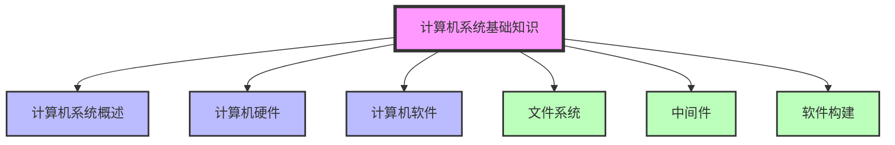

**重点标注**：
- ⭐ 基础了解（考试较少涉及）
- ⭐⭐ 重要考点（需要理解掌握）
- ⭐⭐⭐ 核心考点（会在后续章节深入扩展）

---

## 一、计算机系统概述 ⭐

### 1.1 什么是计算机系统？

计算机系统 = **硬件** + **软件** + **网络**

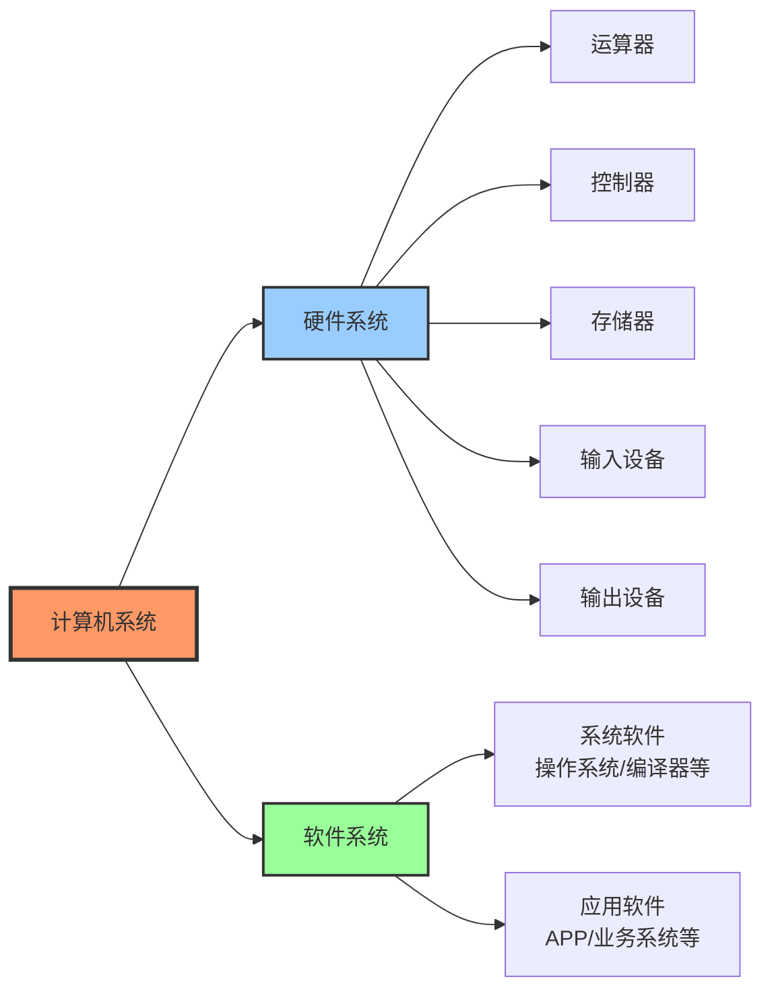

### 1.2 冯·诺依曼五大部件

| 部件 | 功能 | 说明 |
|------|------|------|
| **控制器** | 指令控制、时序控制 | CPU的核心中的核心，相当于大脑 |
| **运算器** | 算术运算、逻辑运算 | 执行所有计算操作 |
| **存储器** | 存储数据和程序 | 内存（易失）+ 外存（非易失） |
| **输入设备** | 向计算机输入数据 | 键盘、鼠标、扫描仪等 |
| **输出设备** | 展示计算结果 | 显示器、打印机、投影仪等 |

> **记忆要点**：控制器 + 运算器 = CPU（中央处理单元）

---

## 二、计算机硬件 ⭐

### 2.1 处理器（CPU）

#### 2.1.1 指令集分类

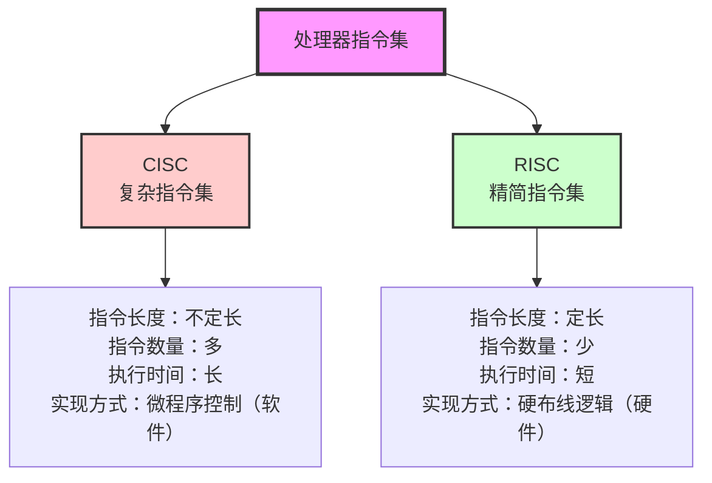

**对比记忆**：

| 特性 | CISC（复杂指令集） | RISC（精简指令集） |
|------|-------------------|-------------------|
| 英文全称 | Complex Instruction Set Computer | Reduced Instruction Set Computer |
| 指令长度 | 不定长 | 定长 |
| 指令数量 | 多而复杂 | 少而精简 |
| 执行时间 | 较长 | 较短 |
| 实现方式 | 微程序控制（软件实现） | 硬布线逻辑（硬件实现） |
| 特点 | 大量使用微指令 | 大量使用寄存器和组合电路 |

#### 2.1.2 处理器芯片类型

| 芯片类型 | 英文全称 | 主要用途 | 应用场景 |
|---------|---------|---------|---------|
| **CPU** | Central Processing Unit | 通用计算处理 | 各类计算机 |
| **GPU** | Graphics Processing Unit | 图形处理 | 显卡、3D渲染、AI训练 |
| **DSP** | Digital Signal Processor | 数字信号处理 | 军工、航天、通信 |
| **FPGA** | Field Programmable Gate Array | 现场可编程 | 嵌入式开发板 |

> **扩展知识**：DSP 采用哈佛架构（与冯·诺依曼架构不同），对数字信号的处理速度比普通 CPU 快 10-15 倍。

### 2.2 存储器

#### 2.2.1 存储器层次结构（按与CPU距离）

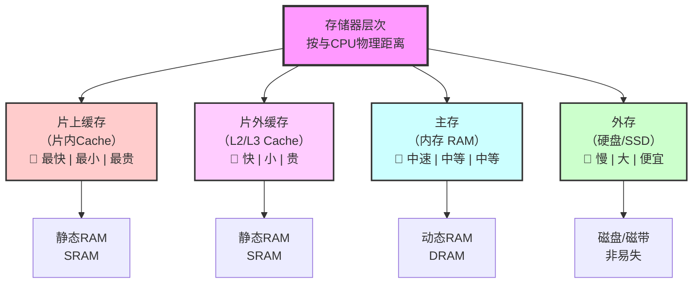

**记忆规律**：
- 🏃 **速度**：离CPU越近 → 速度越快
- 💾 **容量**：离CPU越近 → 容量越小
- 💰 **价格**：离CPU越近 → 单位成本越高
- ⚡ **易失性**：片上/片外/主存都是易失的，外存是非易失的

### 2.3 总线

#### 2.3.1 总线分类

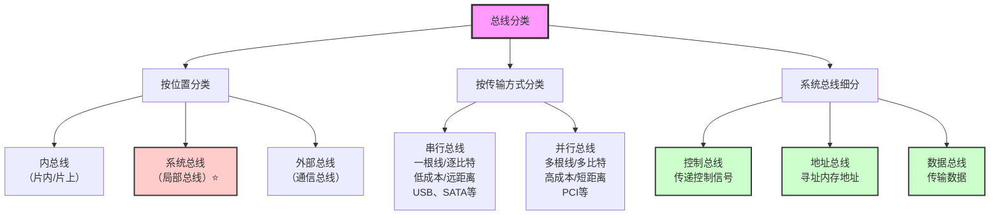

**考点提示**：
- 系统总线的三种类型（控制总线、地址总线、数据总线）是重要考点
- 地址总线宽度决定了可寻址的内存大小（如 32 位地址总线 → 最多支持 2³² = 4GB 内存）

#### 2.3.2 常见总线对照表

| 总线类型 | 传输方式 | 位置 | 常见实例 |
|---------|---------|------|---------|
| USB | 串行 | 外部 | USB 2.0/3.0/Type-C |
| SATA | 串行 | 外部/系统 | 硬盘接口 |
| PCI | 并行 | 系统（内部） | 主板扩展槽 |
| HDMI | 串行 | 外部 | 显示器接口 |
| RJ-45 | 串行 | 外部 | 网络接口 |

### 2.4 接口

**接口与总线的关系**：
- 总线是"路"，接口是"站"
- 总线负责数据传输，接口负责连接设备
- 通常是一一对应的关系（如 USB 总线 ↔ USB 接口）

---

## 三、计算机软件 ⭐⭐⭐

### 3.1 软件分类

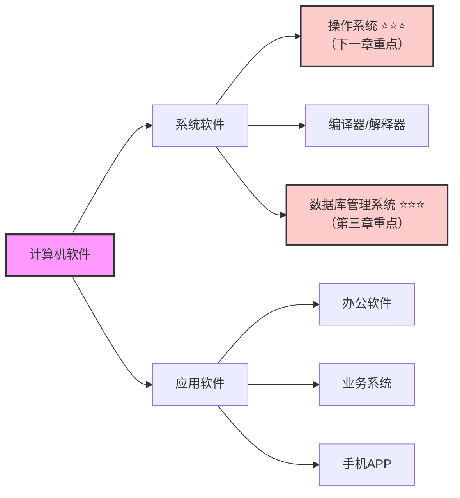

| 软件类型 | 特点 | 典型代表 |
|---------|------|---------|
| **系统软件** | 不依赖特定应用领域，通用性强 | Windows、Linux、MySQL、GCC |
| **应用软件** | 针对特定问题和应用领域 | Office、微信、业务管理系统 |

---

## 四、文件系统 ⭐⭐

### 4.1 文件的基本概念

**文件** = 文件体（内容） + 文件说明（元数据）

**文件元数据包括**：
- 文件名
- 文件类型（扩展名）
- 文件大小
- 创建/修改时间
- 访问权限
- 物理存储位置

### 4.2 文件类型分类

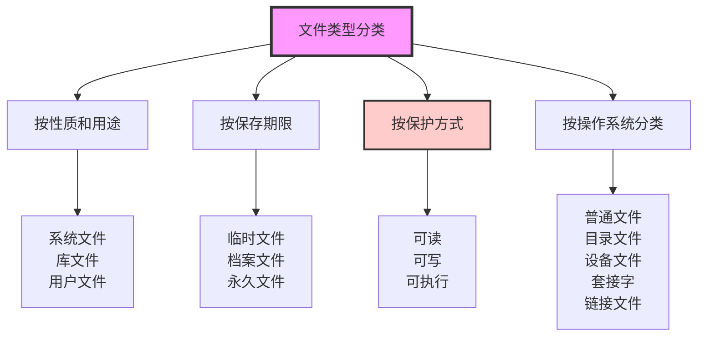

### 4.3 文件结构 ⭐⭐

#### 4.3.1 逻辑结构（用户视角）

| 结构类型 | 特点 | 举例 |
|---------|------|------|
| **有结构的记录式文件** | 由固定或可变长度的记录组成 | Excel 表格（单元格）、数据库表（记录） |
| **无结构的流式文件** | 字节流形式，无固定记录 | 文本文件（.txt）、日志文件 |

#### 4.3.2 物理结构（存储方式）⭐⭐

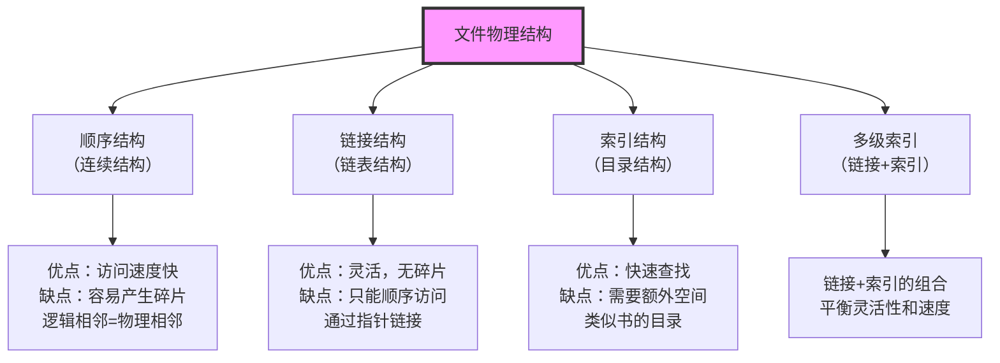

### 4.4 文件存取方式

| 存取方式 | 特点 | 适用场景 |
|---------|------|---------|
| **顺序存取** | 按顺序读写，从头到尾 | 日志文件、磁带备份 |
| **随机存取** | 可以直接访问任意位置 | 数据库文件、程序文件 |

### 4.5 空闲空间管理 ⭐⭐（近年考点）

#### 4.5.1 位示图（Bitmap）⭐⭐

**核心考点：位示图大小计算**

```
公式：位示图大小 = 物理块总数（比特）

示例：
- 假设磁盘有 10,000 个物理块
- 位示图大小 = 10,000 bit = 1,250 字节 ≈ 1.22 KB

原理：
- 用 1 个比特表示 1 个物理块
- 0 = 空闲，1 = 占用
```

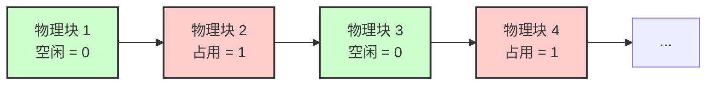

#### 4.5.2 其他管理方式

| 方法 | 特点 | 适用场景 |
|------|------|---------|
| **空闲区表法** | 记录连续空闲区域的起始位置和长度 | 大块连续空闲空间 |
| **空闲块链法** | 用指针链接不连续的空闲块 | 碎片化严重的情况 |
| **成组链接法** | 空闲区表 + 空闲块链的组合 | 兼顾连续和非连续场景 |

### 4.6 文件共享

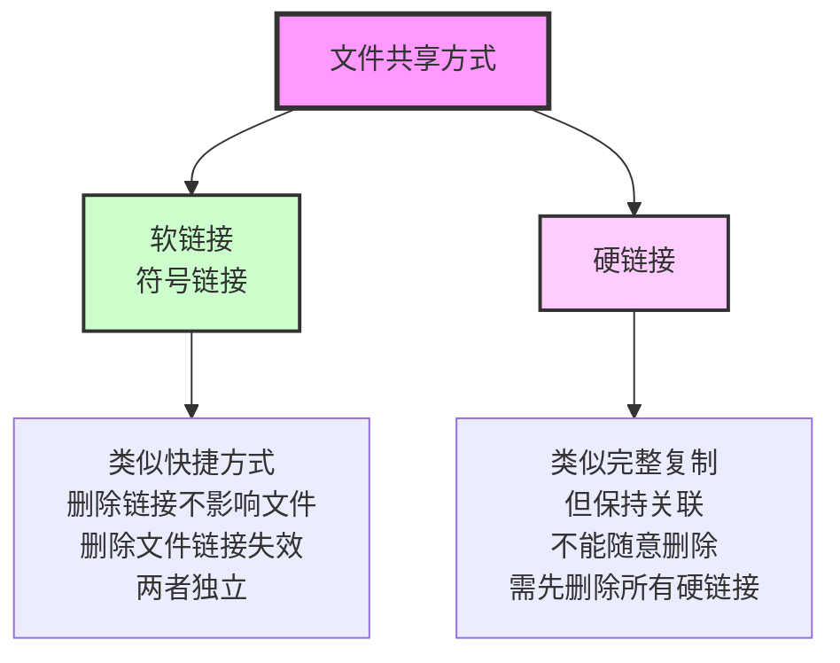

### 4.7 文件访问控制 ⭐

#### 4.7.1 访问控制方式

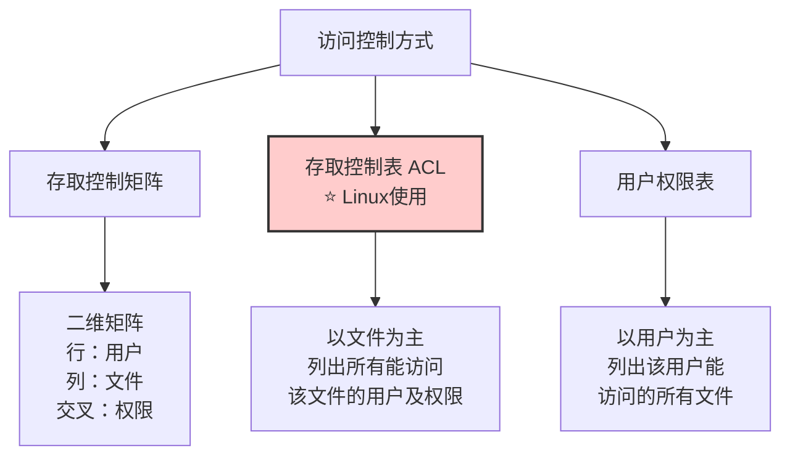

#### 4.7.2 Linux 文件权限

```bash
# 示例：ls -l 输出
-rwxr-xr--  1 user group 1024 Jan 01 12:00 example.txt

# 权限解读
-          文件类型（- 普通文件，d 目录）
rwx        所有者权限（读/写/执行）
r-x        所属组权限（读/执行）
r--        其他用户权限（只读）
```

**权限说明**：
- `r` (read) = 4：可读
- `w` (write) = 2：可写
- `x` (execute) = 1：可执行

---

## 五、中间件 ⭐

### 5.1 中间件的定义和作用

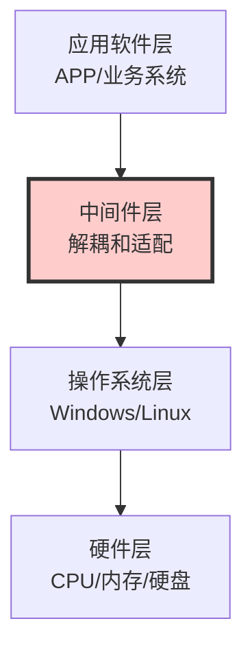

**中间件的核心价值**：
- 分隔应用软件和操作系统
- 提供跨平台能力
- 增强应用的可移植性
- 屏蔽底层硬件和系统细节

### 5.2 中间件分类

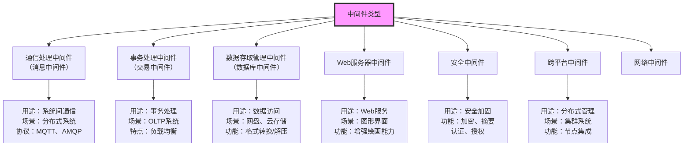

### 5.3 中间件对照表

| 中间件类型 | 主要用途 | 典型产品 | 应用场景 |
|-----------|---------|---------|---------|
| 消息中间件 | 系统间异步通信 | RabbitMQ、Kafka、ActiveMQ | 微服务、消息队列 |
| 事务中间件 | 事务处理和调度 | Tuxedo | 银行、证券交易系统 |
| 数据库中间件 | 数据访问管理 | MyCAT、ShardingSphere | 数据库分库分表 |
| Web中间件 | Web服务托管 | Tomcat、Nginx、IIS | Web应用服务器 |
| 安全中间件 | 安全防护 | CA认证系统 | 加密、认证、授权 |

---

## 六、软件构建（组件） ⭐⭐

### 6.1 构建的基本概念

**构建（Component）= 组件**

**两大核心特性**：
1. **自包容**：功能完整，可独立存在
2. **可复用**：可以在多个系统中重复使用


### 6.2 基于构建的开发 vs 传统开发

| 对比项 | 传统开发 | 基于构建开发 |
|-------|---------|-------------|
| **开发方式** | 从零开始编写代码 | 组装已有构建 |
| **核心工作** | 编码实现 | 寻找、适配、组装 |
| **复用性** | 较低 | 高 |
| **开发效率** | 较慢 | 快 |
| **技术门槛** | 需要专业程序员 | 可能实现"积木式"开发 |
| **类比** | 手工打造 | 搭积木/组装家具 |

### 6.3 构建开发流程


**核心流程**：
1. **设计构建**：确定需要哪些构建
2. **构建库**：准备可复用的构建（复用优先，不足再开发）
3. **组装**：通过接口将构建组装成系统
4. **测试与发布**：确保系统功能完整

### 6.4 商用构建标准规范 ⭐

#### 6.4.1 三大主流标准

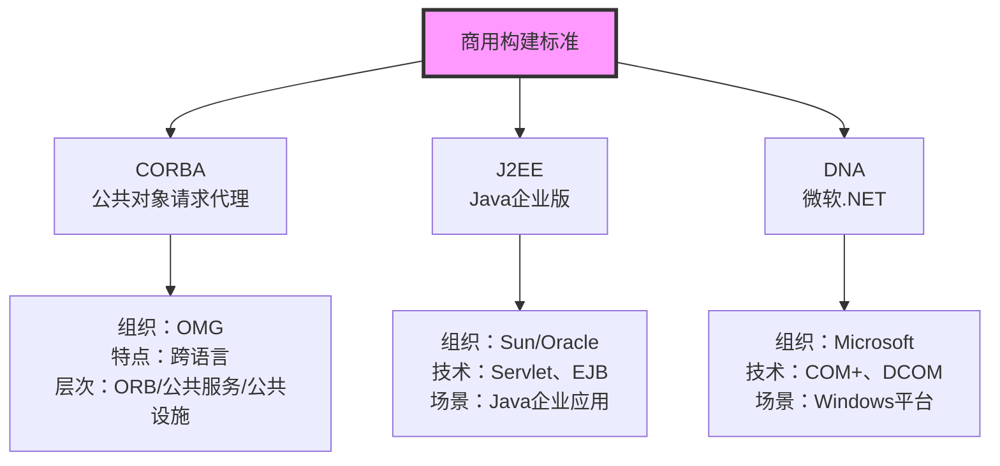

#### 6.4.2 CORBA 三层架构 ⭐

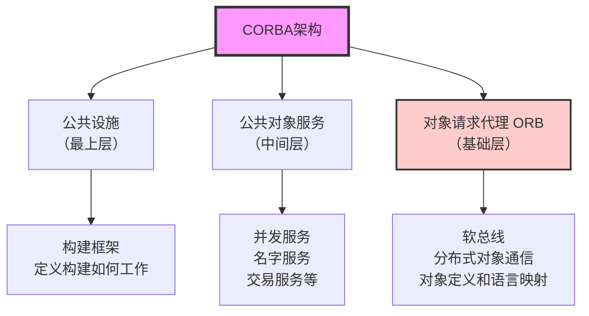

| 层次 | 名称 | 作用 |
|------|------|------|
| **第1层** | 对象请求代理（ORB） | 分布式对象通信的"软总线" |
| **第2层** | 公共对象服务 | 提供并发、命名、事务等基础服务 |
| **第3层** | 公共设施 | 定义构建框架和开发规范 |

#### 6.4.3 CORBA 构建模型（CCM）

**CCM = CORBA Component Model**

**三大规范**：
1. **抽象构建模型**：定义构建的结构和组成
2. **构建容器**：封装构建，实现跨平台运行
3. **配置和打包规范**：定义构建的部署方式

#### 6.4.4 J2EE 技术栈

| 技术组件 | 全称 | 作用 |
|---------|------|------|
| **Servlet** | Java Servlet | 接收HTTP请求，调用业务逻辑 |
| **EJB** | Enterprise JavaBean | 封装业务逻辑的企业级组件 |
| **RMI** | Remote Method Invocation | Java远程方法调用 |
| **IIOP** | Internet Inter-ORB Protocol | 对象请求代理协议 |

**EJB 三种类型**：
- **Session Bean**：会话Bean，处理业务逻辑
- **Entity Bean**：实体Bean，映射数据库表
- **Message-Driven Bean**：消息驱动Bean，异步消息处理

---

## 📊 本章知识脉络图

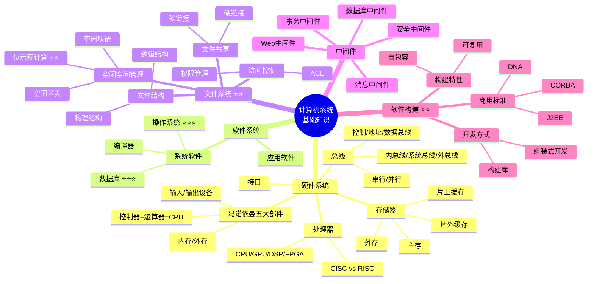

---

## 💡 学习建议

### 本章学习重点

1. **⭐ 了解层面**（考试较少，但需要知道）：
   - 计算机硬件基础（五大部件）
   - 处理器类型（CISC/RISC）
   - 存储器层次结构
   - 总线和接口基本概念

2. **⭐⭐ 理解层面**（可能会考选择题）：
   - 文件的逻辑结构和物理结构
   - 文件共享（软链接/硬链接）
   - 空闲空间管理方法
   - 中间件分类和作用
   - 构建的基本概念

3. **⭐⭐⭐ 重点掌握**（后续章节会深入）：
   - **操作系统**：下一章深入学习
   - **数据库**：第三章深入学习
   - **计算机网络**：后续章节扩展
   - **位示图计算**：近年考点，需要掌握计算方法

### 考试题型预测

| 知识点 | 题型 | 分值 | 难度 |
|-------|------|------|------|
| 冯诺依曼体系结构 | 选择题 | 1-2分 | ⭐ |
| CISC vs RISC | 选择题 | 1分 | ⭐ |
| 存储器层次 | 选择题 | 1分 | ⭐ |
| 文件物理结构 | 选择题 | 1-2分 | ⭐⭐ |
| 位示图计算 | 选择/计算 | 2-3分 | ⭐⭐ |
| 文件访问控制 | 选择题 | 1分 | ⭐⭐ |
| 中间件类型 | 选择题 | 1分 | ⭐ |
| 构建标准（CORBA） | 选择题 | 1-2分 | ⭐⭐ |

### 记忆技巧

1. **对比记忆**：CISC vs RISC（复杂 vs 精简）
2. **层次记忆**：存储器（片上→片外→主存→外存）
3. **形象记忆**：总线就是"路"，接口就是"站"
4. **联想记忆**：中间件的名字就体现了它的功能（消息中间件→传递消息）
5. **类比记忆**：构建开发 = 搭积木

---

## ✅ 自测题

### 选择题

1. 冯·诺依曼体系结构中，CPU 的核心组成部分包括？
   - A. 运算器和存储器
   - B. 控制器和运算器 ✓
   - C. 控制器和存储器
   - D. 输入设备和输出设备

2. 以下哪个不是RISC（精简指令集）的特点？
   - A. 指令长度固定
   - B. 采用硬布线逻辑实现
   - C. 采用微程序控制 ✓
   - D. 大量使用寄存器

3. 在存储器层次结构中，速度最快的是？
   - A. 主存（内存）
   - B. 外存（硬盘）
   - C. 片外缓存（L2 Cache）
   - D. 片上缓存（L1 Cache）✓

4. 32位地址总线最多可以寻址多大的内存空间？
   - A. 2GB
   - B. 4GB ✓
   - C. 8GB
   - D. 16GB

5. 在Linux系统中，以文件为中心列出所有能访问该文件的用户及其权限的方式称为？
   - A. 用户权限表
   - B. 存取控制矩阵
   - C. 存取控制表（ACL）✓
   - D. 密码控制

### 简答题

1. **请简述软链接和硬链接的区别。**

<details>
<summary>点击查看答案</summary>

- **软链接（符号链接）**：
  - 类似于Windows的快捷方式
  - 删除链接不影响原文件
  - 删除原文件会导致链接失效
  - 链接和文件相互独立

- **硬链接**：
  - 类似于完整复制但保持关联
  - 文件和硬链接共享相同的物理存储
  - 必须先删除所有硬链接才能删除文件
  - 不能随意删除
</details>

2. **如果一个磁盘有 20,480 个物理块,采用位示图管理空闲空间,计算位示图需要占用多少字节的存储空间？**

<details>
<summary>点击查看答案</summary>

- 位示图大小 = 物理块数量（比特）
- 20,480 个物理块 = 20,480 bit
- 20,480 bit ÷ 8 = 2,560 字节 = 2.5 KB

**答案：2,560 字节（或 2.5 KB）**
</details>

---

## 📚 扩展阅读

- 《计算机组成原理》：深入了解硬件架构
- 《操作系统概念》（恐龙书）：为下一章做准备
- 《深入理解计算机系统》（CSAPP）：系统性理解计算机

---

## 📝 总结

本章作为**基础章节**，主要介绍了计算机系统的基本构成和核心概念：

1. **硬件部分**：冯诺依曼五大部件、处理器、存储器、总线（⭐ 考试较少）
2. **软件部分**：系统软件和应用软件的分类（为后续章节铺垫）
3. **文件系统**：文件结构、空闲空间管理、访问控制（⭐⭐ 重要）
4. **中间件**：理解中间件的作用和分类（⭐ 了解即可）
5. **软件构建**：组件化开发思想、商用标准（⭐⭐ 重要概念）

**下一章预告**：操作系统（⭐⭐⭐ 核心考点，内容丰富，分值高）

---

> **文档生成信息**
> 📅 生成时间：2026-02-02
> 🤖 生成方式：基于课程文稿系统化梳理
> 📖 适用对象：软考高级系统架构师考试备考
> ✍️ 建议：结合教材和真题进行学习
