# 第一章 计算机系统基础知识（详解版）

> **📌 学习指南**
> 本章节是软考高级系统架构师的基础章节，虽然直接考点不多（约5-8分），但这些知识是理解后续章节（操作系统、数据库、网络）的基石。
> **学习建议**：理解为主，记忆为辅，重点掌握概念和分类。

---

## 📖 目录导航

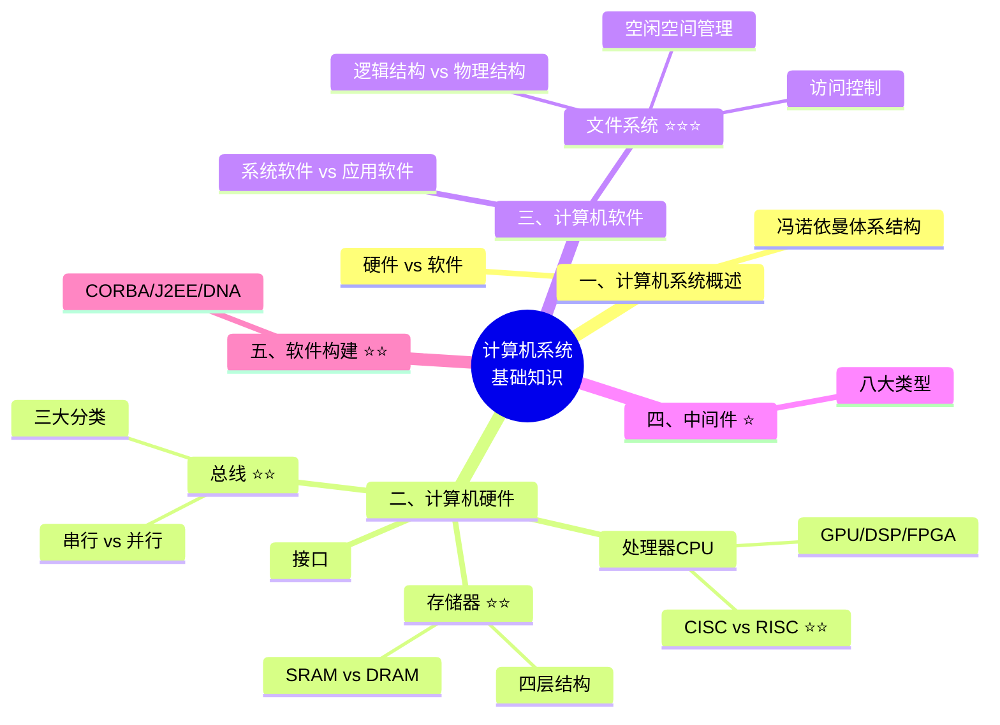

**考试重要程度标注**：
- ⭐ 了解即可（选择题可能涉及）
- ⭐⭐ 理解掌握（选择题常考）
- ⭐⭐⭐ 重点掌握（选择题+案例分析）

---

## 第一部分：计算机系统概述

### 1.1 什么是计算机系统？🖥️

**最简单的理解**：计算机系统 = 硬件 + 软件 + 网络

就像人体一样：
- **硬件** = 身体（大脑、心脏、四肢）
- **软件** = 思想和技能（知识、经验）
- **网络** = 社交关系（与其他人交流）

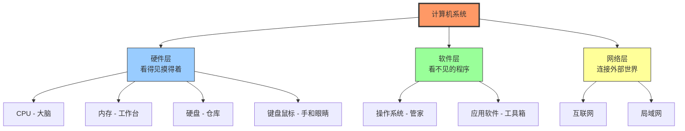

### 1.2 冯·诺依曼五大部件 ⭐

这是计算机硬件的经典架构，就像五脏六腑一样重要！

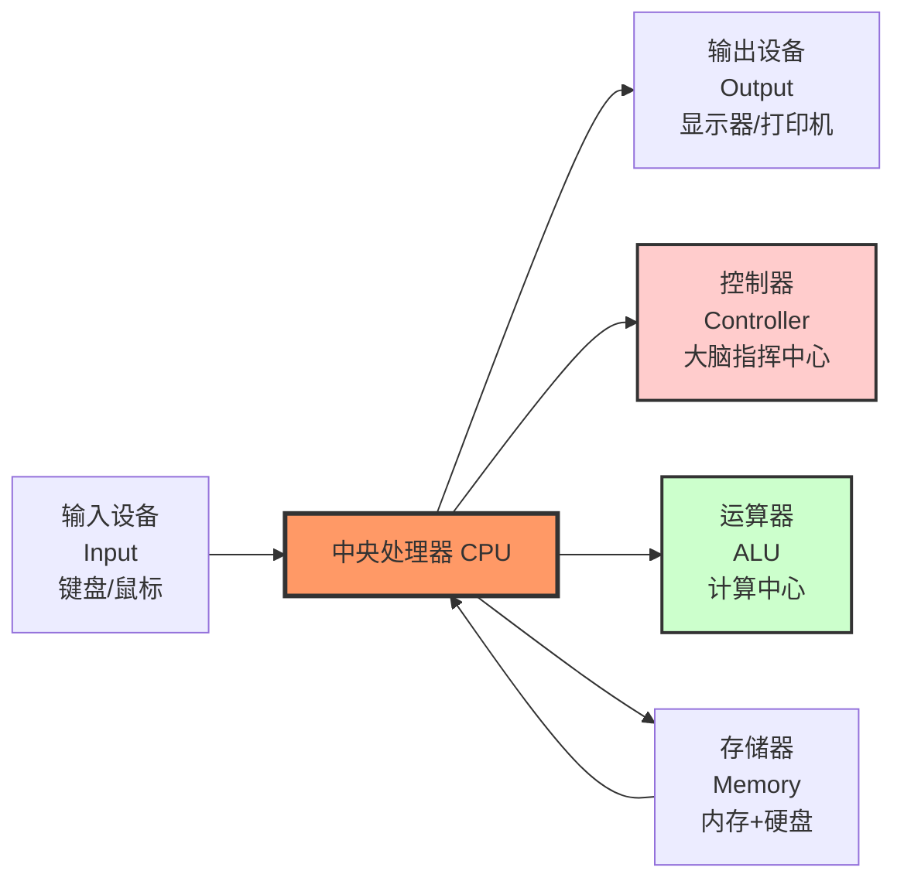

**五大部件详解**：

| 部件 | 英文名 | 通俗比喻 | 主要功能 |
|------|--------|---------|---------|
| **控制器** | Controller | 公司CEO | 发出指令，协调各部件工作 |
| **运算器** | ALU (Arithmetic Logic Unit) | 财务部门 | 进行加减乘除、逻辑判断 |
| **存储器** | Memory | 办公室+仓库 | 存储数据和程序 |
| **输入设备** | Input Device | 员工的眼睛和耳朵 | 向计算机输入信息 |
| **输出设备** | Output Device | 员工的嘴和手 | 显示计算结果 |

> **💡 记忆口诀**：控运存输输（控制、运算、存储、输入、输出）
> **核心理解**：**控制器 + 运算器 = CPU**（中央处理单元）

---

## 第二部分：计算机硬件

### 2.1 处理器（CPU）深度解析 ⭐⭐

#### 2.1.1 指令集：CISC vs RISC（重要考点！）

**什么是指令集？**
就像人类的语言一样，CPU也有自己的"语言"。指令集就是CPU能听懂的命令集合。

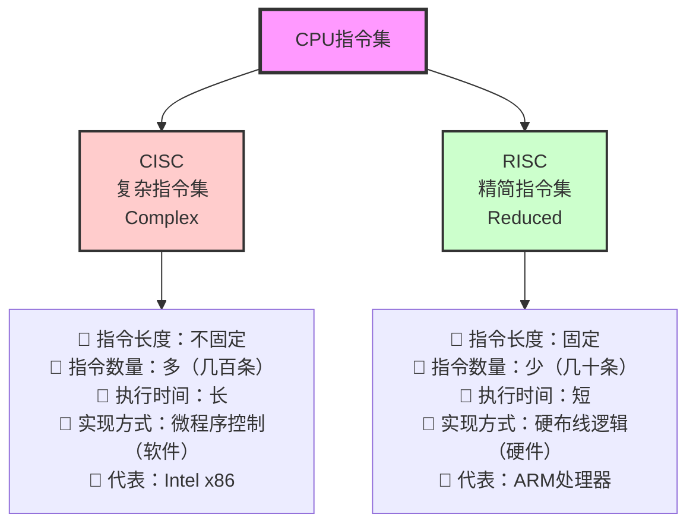

**详细对比表**：

| 对比维度 | CISC（复杂指令集） | RISC（精简指令集） |
|---------|-------------------|-------------------|
| **全称** | Complex Instruction Set Computer | Reduced Instruction Set Computer |
| **设计思想** | 一条指令做很多事 | 一条指令只做一件事 |
| **指令长度** | 不定长（1-15字节） | 定长（通常4字节） |
| **指令数量** | 多（200-300条） | 少（50-100条） |
| **执行周期** | 多个时钟周期 | 单个时钟周期 |
| **实现方式** | **微程序控制**（软件方式）⭐ | **硬布线逻辑**（硬件方式）⭐ |
| **寄存器** | 较少 | 大量使用（提高速度） |
| **代表产品** | Intel x86（台式机/笔记本） | ARM（手机/平板）、MIPS |
| **优点** | 功能强大，兼容性好 | 速度快，功耗低 |
| **缺点** | 复杂，功耗高 | 需要编译器优化 |

**🎯 考试记忆技巧**：
1. **看名字记特点**：
   - **C**omplex（复杂）→ 什么都复杂（指令多、时间长、不定长）
   - **R**educed（精简）→ 什么都精简（指令少、时间短、定长）

2. **关键区别**（⭐⭐ 必考）：
   - CISC用**微程序控制**（软件实现）
   - RISC用**硬布线逻辑**（硬件实现，用大量寄存器）

**🌰 生活化例子**：
- **CISC** = 瑞士军刀（功能多，什么都能干，但笨重）
- **RISC** = 专业工具（每个工具只干一件事，但很快）

#### 2.1.2 其他处理器类型

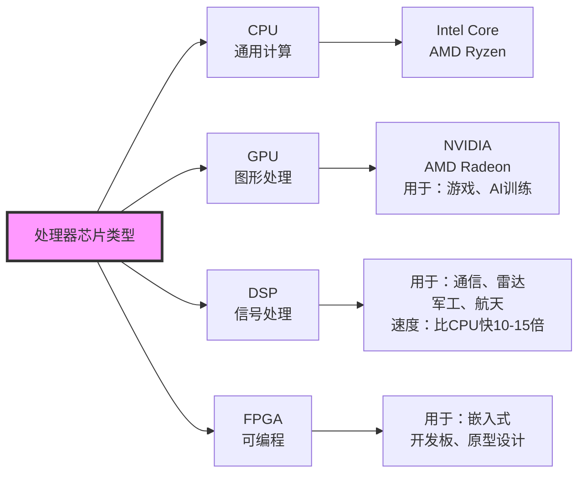

| 芯片 | 全称 | 主要用途 | 核心特点 |
|------|------|---------|---------|
| **CPU** | Central Processing Unit | 通用计算 | 万能选手，什么都能做 |
| **GPU** | Graphics Processing Unit | 图形渲染、AI计算 | 数百或数千核心并行计算 |
| **DSP** | Digital Signal Processor | 数字信号处理 | 处理音频、视频、通信信号，采用**哈佛架构**（与冯诺依曼不同） |
| **FPGA** | Field Programmable Gate Array | 可现场编程的逻辑门阵列 | 硬件级可编程，用于快速原型开发 |

**🔥 GPU为什么这么火？**
- 传统用途：玩游戏，渲染3D画面
- 现代用途：训练AI模型（如ChatGPT）、挖比特币、科学计算
- 原因：GPU有成百上千个小核心，适合做大量重复的简单计算

---

### 2.2 存储器：四层金字塔 ⭐⭐

**核心原则**：离CPU越近 → 速度越快、容量越小、价格越贵！

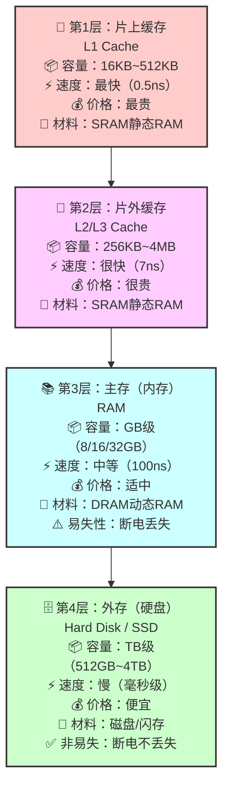

**详细对比表**：

| 层次 | 名称 | 位置 | 容量 | 速度 | 材料 | 易失性 |
|------|------|------|------|------|------|--------|
| **L1** | 片上缓存 | CPU芯片内部 | 16KB-512KB | 最快（0.5ns） | SRAM | 易失 |
| **L2/L3** | 片外缓存 | CPU芯片外部 | 256KB-4MB | 很快（7ns） | SRAM | 易失 |
| **主存** | 内存RAM | 主板上 | 8GB-64GB | 中速（100ns） | DRAM | 易失 |
| **外存** | 硬盘/SSD | 独立设备 | 512GB-4TB | 慢（毫秒） | 磁盘/Flash | 非易失 |

**🌰 生活化比喻**：

想象你在图书馆写作业：

1. **L1缓存** = 你脑子里记住的内容（最快，但很少）
2. **L2/L3缓存** = 你桌子上的书（翻一下就能看，但桌子很小）
3. **内存RAM** = 你借的书在书包里（走几步拿出来，容量一般）
4. **外存硬盘** = 图书馆的书架（要去找很久，但能存海量的书）

**💡 关键知识点**：

1. **SRAM vs DRAM**：
   - **SRAM（静态RAM）**：速度快、不需要刷新、贵 → 用于缓存
   - **DRAM（动态RAM）**：需要不断刷新、便宜 → 用于内存

2. **易失性**：
   - 易失：断电数据就没了（缓存、内存）
   - 非易失：断电数据还在（硬盘、U盘）

3. **32位系统为什么只支持4GB内存？**
   - 原因：地址总线是32位
   - 可寻址空间 = 2³² = 4,294,967,296字节 = 4GB
   - 64位系统理论上可以支持 2⁶⁴ = 16EB（亿亿字节）

---

### 2.3 总线：计算机的"高速公路" ⭐⭐

**什么是总线？**
总线就是计算机各部件之间传输数据的"道路"。

#### 2.3.1 按位置分类

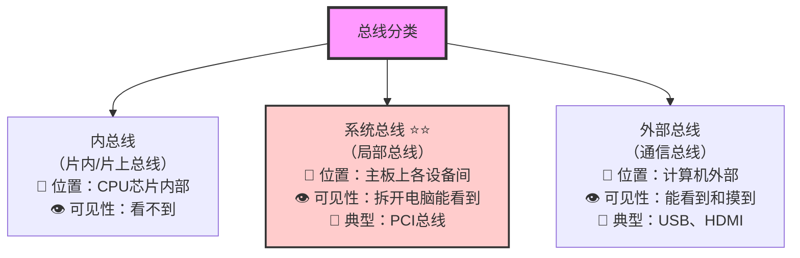

**🎯 考试重点：系统总线的三种类型**（⭐⭐⭐ 必考）

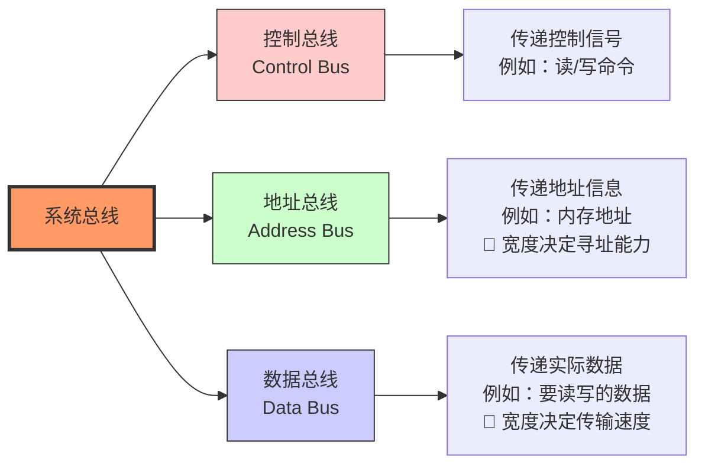

| 总线类型 | 作用 | 举例说明 |
|---------|------|---------|
| **控制总线** | 传递控制命令和状态信号 | "读取数据"、"写入数据"、"中断请求" |
| **地址总线** | 传递内存或I/O设备的地址 | "从内存地址0x1000读数据"<br/>宽度决定最大内存：32位→4GB，64位→16EB |
| **数据总线** | 传递实际的数据 | 传输具体的数字、文字、图片等数据<br/>宽度决定传输速度：32位、64位 |

**🌰 生活化例子**：就像快递系统

- **控制总线** = 快递单上的"加急"、"签收"等指令
- **地址总线** = 收货地址（决定能送到哪里）
- **数据总线** = 快递车（决定一次能运多少货）

#### 2.3.2 按传输方式分类

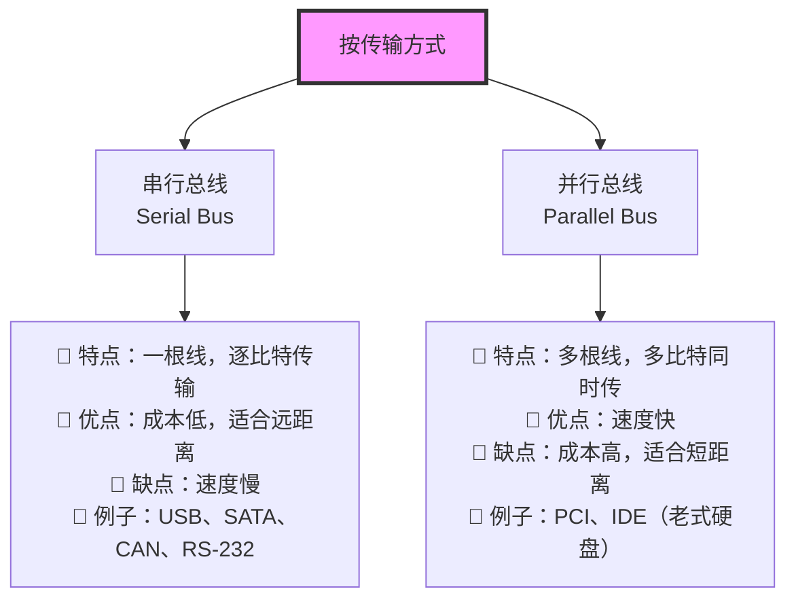

**常见总线对照表**：

| 总线名称 | 类型 | 位置 | 主要用途 | 传输速度 |
|---------|------|------|---------|---------|
| **USB** | 串行 | 外部 | 连接键盘、鼠标、U盘等 | USB 2.0: 480Mbps<br/>USB 3.0: 5Gbps<br/>USB 3.1: 10Gbps |
| **SATA** | 串行 | 内部 | 连接硬盘、光驱 | SATA 3: 6Gbps |
| **PCI** | 并行 | 内部 | 连接显卡、网卡等扩展卡 | 133MB/s~533MB/s |
| **PCIe** | 串行 | 内部 | 连接显卡、SSD等高速设备 | PCIe 4.0 x16: 32GB/s |
| **HDMI** | 串行 | 外部 | 连接显示器、电视 | 18Gbps（4K@60Hz） |
| **RJ-45** | 串行 | 外部 | 网络连接（网线接口） | 1Gbps（千兆网） |
| **CAN** | 串行 | 特殊 | 汽车电子、工业控制 | 1Mbps |

**🤔 为什么现在串行总线更流行？**

以前大家觉得并行更快（多根线同时传），但实际上：
- 并行总线有**信号同步问题**（不同线的信号到达时间不一致）
- 串行总线**抗干扰能力强**，可以跑更高的频率
- 串行总线**成本低**，布线简单

所以现代高速总线（USB 3.0、SATA 3、PCIe）都是串行的！

---

### 2.4 接口：总线的"车站" ⭐

**接口 vs 总线**：
- **总线** = 道路（数据传输通道）
- **接口** = 车站（设备连接点）

**一一对应关系**：
- USB总线 ↔ USB接口
- SATA总线 ↔ SATA接口
- HDMI总线 ↔ HDMI接口

**常见接口分类**：

| 接口类型 | 用途 | 外观特征 |
|---------|------|---------|
| **USB接口** | 连接各种外设 | Type-A（方形）、Type-C（椭圆可正反插） |
| **HDMI/DVI** | 视频输出 | 梯形接口 |
| **TRS/RCA/XLR** | 音频接口 | 圆形插孔 |
| **RJ-45** | 网络接口 | 方形，8针 |
| **PS/2** | 老式键盘鼠标 | 圆形，紫色（键盘）/绿色（鼠标） |
| **SATA接口** | 内部硬盘连接 | 扁平7针 |

---

## 第三部分：计算机软件

### 3.1 软件分类：系统软件 vs 应用软件 ⭐

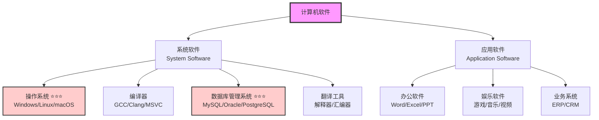

**核心区别**：

| 对比项 | 系统软件 | 应用软件 |
|-------|---------|---------|
| **依赖性** | 不依赖特定应用领域 | 针对特定问题和领域 |
| **通用性** | 通用，所有计算机都需要 | 专用，根据需求选择 |
| **主要功能** | 管理和控制计算机硬件和软件资源 | 解决特定的业务问题 |
| **典型代表** | 操作系统、编译器、数据库 | Office、微信、游戏 |
| **用户** | 面向开发者和管理员 | 面向最终用户 |

---

### 3.2 文件系统 ⭐⭐⭐（重点！）

**什么是文件（File）？**
- 文件 = 一组相关信息的集合
- 文件 = **文件体**（内容） + **文件说明**（元数据）

**文件元数据包括**：
- 文件名
- 文件类型/扩展名（.txt、.jpg、.exe）
- 文件大小
- 创建时间、修改时间、访问时间
- 访问权限（可读/可写/可执行）
- 物理存储位置

#### 3.2.1 文件类型分类

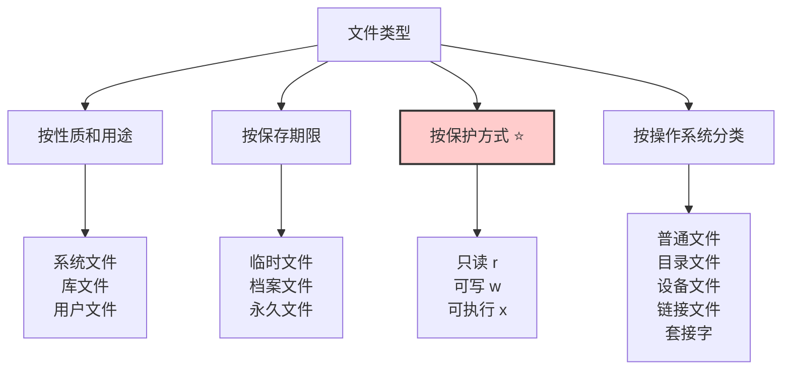

#### 3.2.2 文件结构 ⭐⭐⭐（必考！）

**文件有两种结构视角**：

1. **逻辑结构**（用户视角）：用户看到的样子
2. **物理结构**（存储视角）：实际存在硬盘上的样子

---

##### （1）逻辑结构

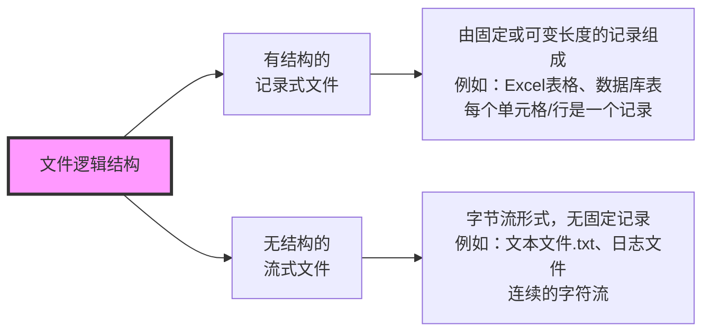

**🌰 生活化例子**：

- **记录式文件** = 表格本（有格子，每个格子是一个记录）
- **流式文件** = 白纸（连续的内容，没有固定格式）

---

##### （2）物理结构 ⭐⭐⭐（重点考点！）

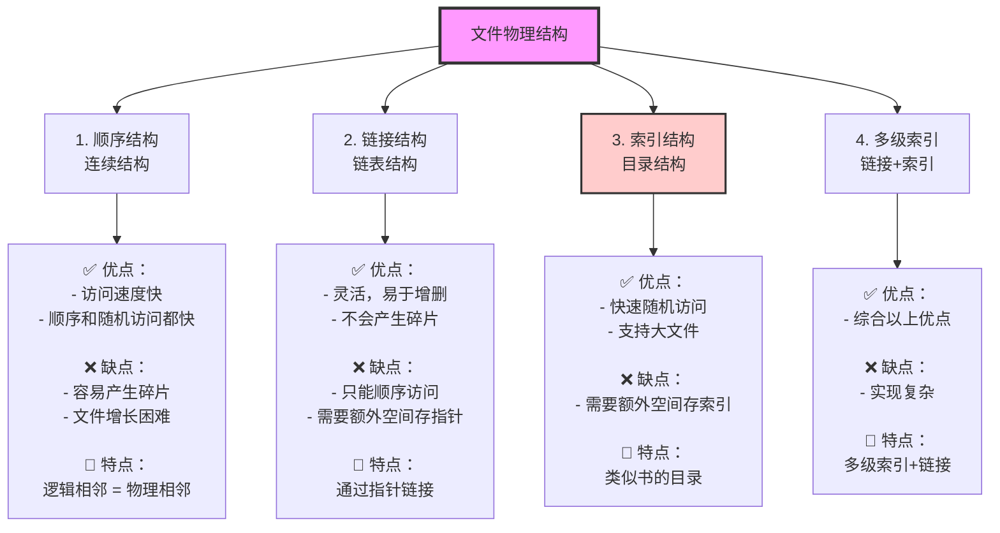

**详细对比表**：

| 物理结构 | 原理 | 优点 | 缺点 | 适用场景 |
|---------|------|------|------|---------|
| **顺序结构** | 逻辑上相邻的数据，物理上也相邻 | 访问速度快 | 产生碎片，难扩展 | 文件大小固定 |
| **链接结构** | 用指针链接各个数据块 | 灵活，无碎片 | 只能顺序访问 | 文件频繁增删 |
| **索引结构** | 建立索引表，记录数据块位置 | 快速随机访问 | 需要额外空间 | 大文件，频繁随机访问 |
| **多级索引** | 多层索引+链接 | 综合优点 | 复杂 | 超大文件 |

**🌰 生活化例子**：

1. **顺序结构** = 排队买票（按顺序排，效率高，但插队很难）
2. **链接结构** = 火车车厢（每节车厢有个挂钩连到下一节，可以随时加车厢）
3. **索引结构** = 图书馆目录卡（先查目录，再去书架拿书）
4. **多级索引** = 超市导航（先看楼层指南，再看区域指南，再找具体货架）

---

#### 3.2.3 文件存取方式

| 存取方式 | 特点 | 应用场景 |
|---------|------|---------|
| **顺序存取** | 从头到尾按顺序读写 | 日志文件、磁带备份 |
| **随机存取** | 可以直接访问任意位置 | 数据库文件、程序文件 |

---

#### 3.2.4 空闲空间管理 ⭐⭐⭐（近年必考！）

**问题**：硬盘上哪些块是空闲的？如何快速找到空闲块？

##### 方法1：空闲区表法

适用于**连续空闲**的情况。

```
例如：物理块 5-15 是空闲的
空闲区表：
| 起始块号 | 块数 |
|---------|------|
| 5       | 11   |
```

##### 方法2：位示图法 ⭐⭐⭐（重点计算题！）

**原理**：用1个比特（bit）表示1个物理块
- 0 = 空闲
- 1 = 占用

```
例如：磁盘有8个物理块
位示图：0 1 0 1 0 0 1 0
含义：   空 占 空 占 空 空 占 空
```

**💯 考试必考计算题**：

**题型1：计算位示图大小**

```
题目：某磁盘有10,000个物理块，采用位示图管理空闲空间，
      计算位示图需要占用多少字节的存储空间？

解答：
1. 位示图大小 = 物理块总数（比特）
2. 10,000个物理块 = 10,000 bit
3. 10,000 bit ÷ 8 = 1,250 字节
4. 1,250 字节 ÷ 1024 ≈ 1.22 KB

答案：1,250字节（或1.22KB）
```

**题型2：计算某物理块在位示图中的位置**

```
题目：某磁盘用位示图管理，每字节表示8个物理块。
      第100号物理块在位示图的哪个字节的哪一位？

解答：
1. 字节号 = 100 ÷ 8 = 12（第12个字节）
2. 位号 = 100 % 8 = 4（该字节的第4位）

答案：第12个字节的第4位
```

**🎯 记忆口诀**：
- **位示图大小** = 物理块数 ÷ 8（字节）
- **字节号** = 物理块号 ÷ 8
- **位号** = 物理块号 % 8

##### 方法3：空闲块链法

用指针链接所有空闲块（适用于不连续的空闲块）。

##### 方法4：成组链接法

空闲区表 + 空闲块链的组合（UNIX使用）。

---

#### 3.2.5 文件共享：硬链接 vs 软链接 ⭐⭐

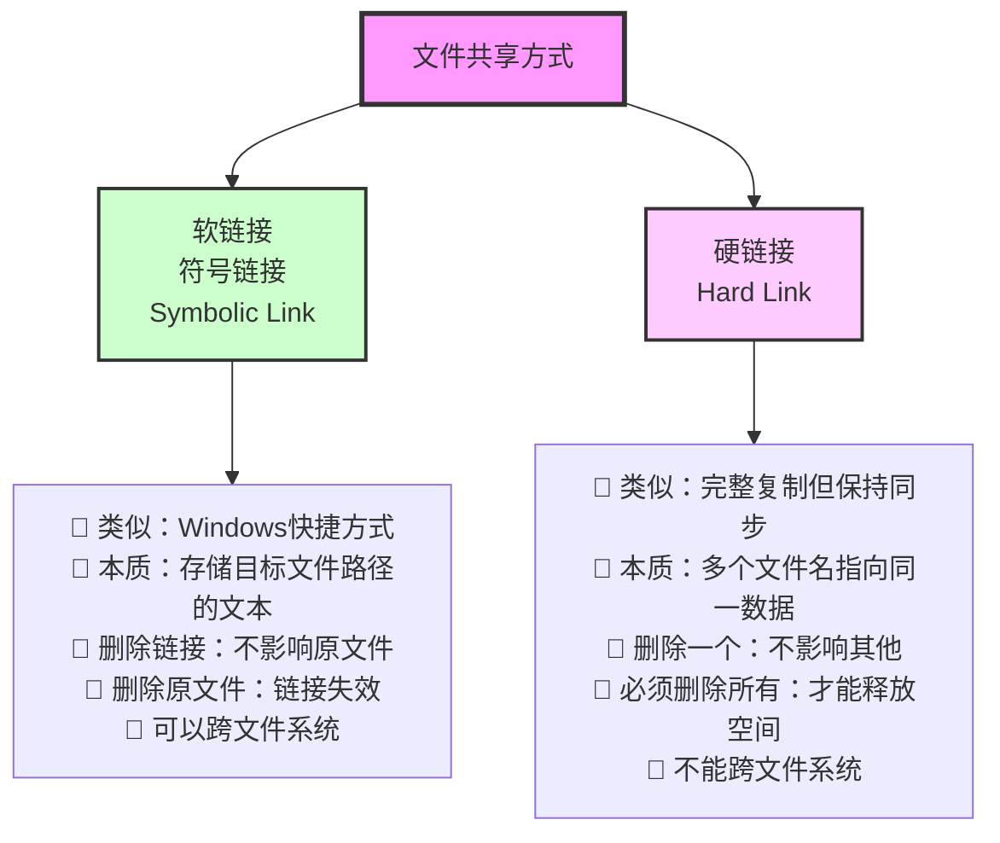

**详细对比表**：

| 对比项 | 软链接（符号链接） | 硬链接 |
|-------|------------------|--------|
| **Windows类比** | 快捷方式 | 镜像文件（但占用极小空间） |
| **存储内容** | 目标文件的路径字符串 | 与原文件共享同一数据块 |
| **删除链接** | 不影响原文件 | 不影响原文件 |
| **删除原文件** | 链接失效，打不开 | 其他硬链接仍然可用 |
| **文件大小** | 很小（只存路径） | 与原文件显示相同大小 |
| **跨文件系统** | 可以 | 不可以 |
| **目录** | 可以链接目录 | 通常不能链接目录 |
| **inode** | 不同的inode | 相同的inode |

**🌰 生活化例子**：

- **软链接** = 地址本（记录了朋友家的地址，朋友搬家了地址本就过时了）
- **硬链接** = 双胞胎（两个人共享同一套基因，一个人"消失"了另一个还在）

**Linux命令**：
```bash
# 创建软链接
ln -s /path/to/original /path/to/link

# 创建硬链接
ln /path/to/original /path/to/link
```

---

#### 3.2.6 文件访问控制 ⭐⭐

##### （1）访问控制方式

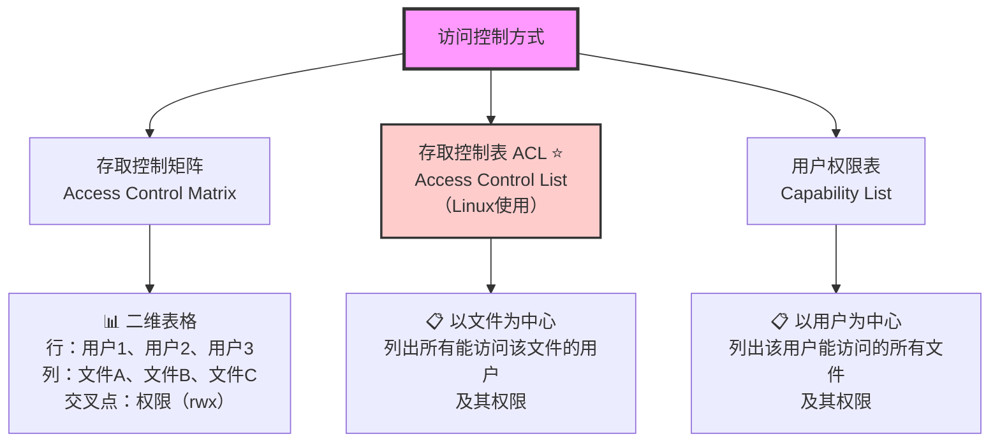

**简单记忆**：
- **存取控制表（ACL）** = 以**文件**为主角（这个文件，谁能访问？）
- **用户权限表** = 以**用户**为主角（这个用户，能访问哪些文件？）

##### （2）Linux文件权限 ⭐⭐（实用知识）

```bash
# ls -l 查看文件详细信息
-rwxr-xr--  1  user  group  1024  Jan 01 12:00  example.txt
 ↓↓↓↓↓↓↓↓↓↓
 类型和权限
```

**权限位解读**：

```
-  rwx  r-x  r--
↓   ↓    ↓    ↓
│   │    │    └── 其他用户权限（others）：只读
│   │    └─────── 所属组权限（group）：读+执行
│   └──────────── 所有者权限（owner）：读+写+执行
└──────────────── 文件类型：- 普通文件，d 目录，l 链接
```

**权限符号**：

| 符号 | 含义 | 数字表示 | 说明 |
|------|------|---------|------|
| **r** | read（读） | 4 | 可以查看文件内容 |
| **w** | write（写） | 2 | 可以修改文件内容 |
| **x** | execute（执行） | 1 | 可以运行该文件（程序） |
| **-** | 无权限 | 0 | 没有该权限 |

**权限组合**：
- `rwx` = 4+2+1 = **7**（所有权限）
- `rw-` = 4+2+0 = **6**（读写）
- `r-x` = 4+0+1 = **5**（读执行）
- `r--` = 4+0+0 = **4**（只读）

**🌰 实例**：
```bash
chmod 755 script.sh
# 含义：
# 7 (rwx) = 所有者：读+写+执行
# 5 (r-x) = 所属组：读+执行
# 5 (r-x) = 其他人：读+执行
```

---

## 第四部分：中间件 ⭐

### 4.1 什么是中间件？

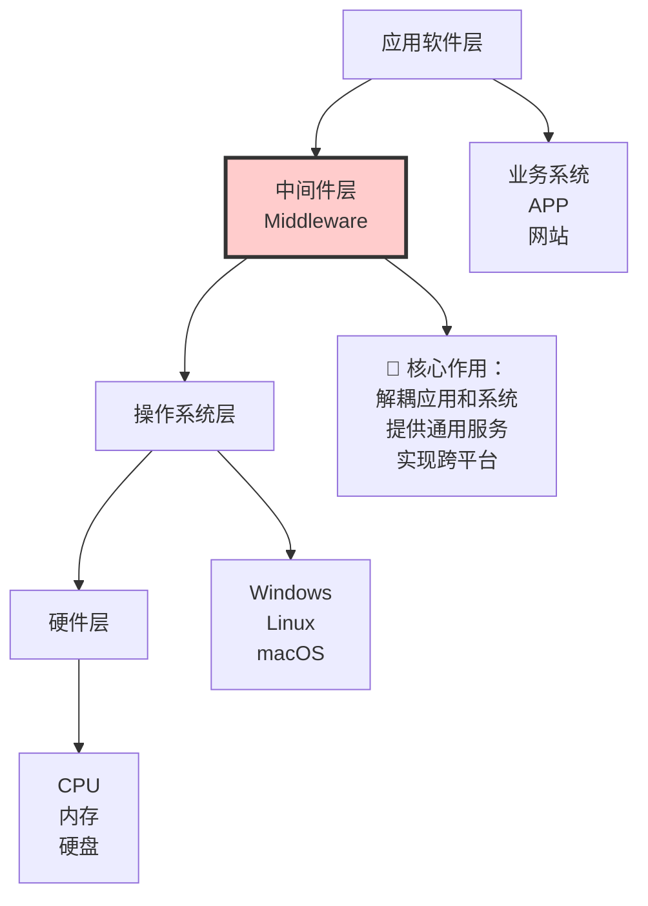

**中间件的核心价值**：
1. **分隔** 应用软件和操作系统
2. **屏蔽** 底层硬件和系统差异
3. **提供** 通用服务（通信、事务、安全等）
4. **实现** 跨平台运行

**🌰 生活化例子**：
- 中间件 = 翻译官（让说不同语言的人能交流）
- 中间件 = 转换插头（让不同国家的电器能用）

---

### 4.2 中间件分类 ⭐

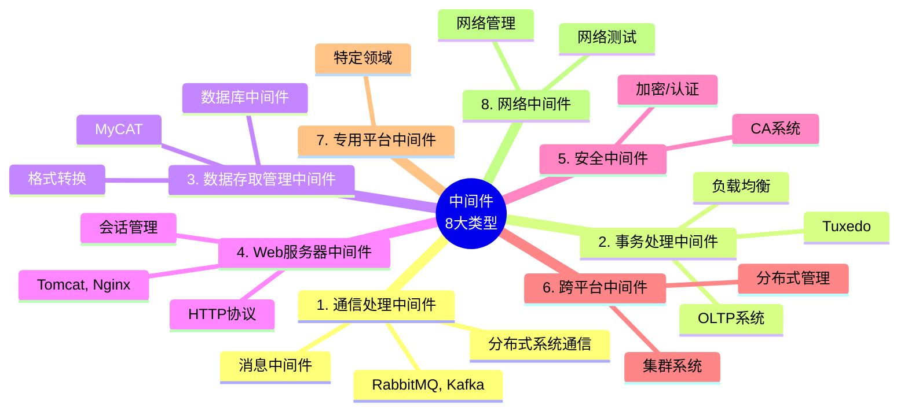

**详细分类表**：

| 中间件类型 | 别名 | 主要功能 | 应用场景 | 典型产品 |
|-----------|------|---------|---------|---------|
| **1. 通信处理中间件** | 消息中间件 | 系统间异步通信 | 微服务、消息队列 | RabbitMQ、Kafka、ActiveMQ |
| **2. 事务处理中间件** | 交易中间件 | 事务处理和调度、负载均衡 | 银行、证券交易系统（OLTP） | Tuxedo |
| **3. 数据存取管理中间件** | 数据库中间件 | 数据访问、格式转换、在线解压 | 网盘、云存储、分库分表 | MyCAT、ShardingSphere |
| **4. Web服务器中间件** | - | 浏览器图形界面、会话管理 | Web应用服务器 | Tomcat、Nginx、IIS、Apache |
| **5. 安全中间件** | - | 加密、摘要、认证、授权 | 安全防护、CA认证 | OpenSSL、CA系统 |
| **6. 跨平台和架构中间件** | - | 分布式系统管理、节点集成 | 集群系统 | CORBA、DCOM |
| **7. 专用平台中间件** | - | 特定领域的中间件 | 各行业应用 | - |
| **8. 网络中间件** | - | 网络管理、测试、接入 | 网络运维 | SNMP工具 |

**🎯 记忆技巧**：
- 名字就是功能！
  - **消息**中间件 → 传递**消息**
  - **事务**中间件 → 处理**事务**
  - **数据存取**中间件 → **数据存取**
  - **Web服务器**中间件 → **Web服务**

---

## 第五部分：软件构建（组件） ⭐⭐

### 5.1 什么是构建（Component）？

**构建 = 组件 = 可复用的程序集合**

**两大核心特性**：
1. **自包容**：功能完整，可独立工作
2. **可复用**：可以在多个系统中重复使用


**🌰 生活化例子**：
- 传统开发 = 手工打造（从零开始做一把椅子）
- 基于构建开发 = 搭积木（用现成的积木块组装）

---

### 5.2 基于构建的开发流程


**关键理念**：
- 核心不是"开发"，而是"组装"
- 优先使用已有构建，不足再开发
- 目标：让非专业人员也能开发软件（图形化拖拽）

---

### 5.3 商用构建标准 ⭐⭐

**三大主流标准**：

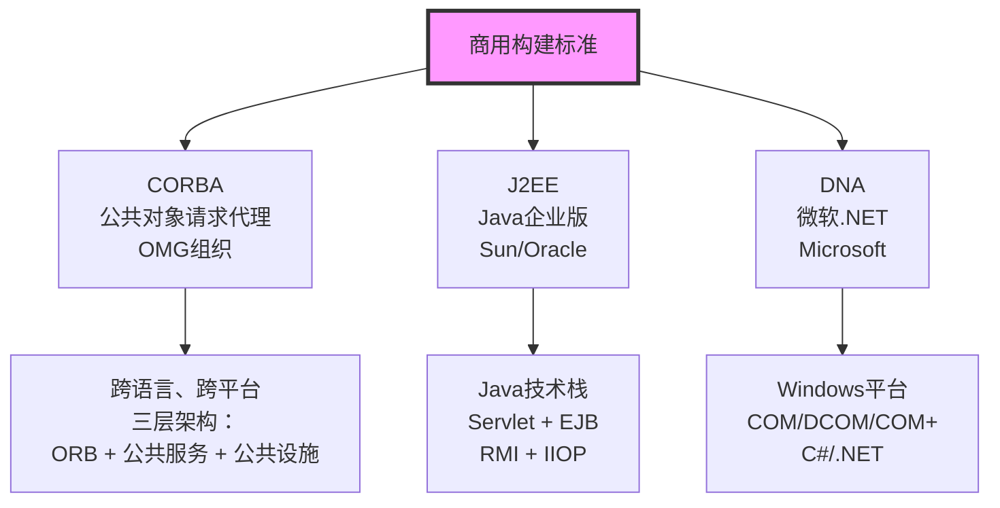

---

#### 5.3.1 CORBA 三层架构 ⭐⭐

```mermaid
graph TB
    A["第3层：公共设施<br/>Common Facilities"] --> B["第2层：公共对象服务<br/>Common Object Services"]
    B --> C["第1层：对象请求代理 ORB<br/>Object Request Broker"]

    A --> A1["构建框架<br/>定义构建如何工作"]
    B --> B1["提供基础服务：<br/>并发服务、命名服务<br/>事务服务、持久化服务"]
    C --> C1["核心层：分布式对象通信的软总线<br/>定义对象如何通信<br/>语言映射"]

    style C fill:#fcc,stroke:#333,stroke-width:2px
```

| 层次 | 名称 | 作用 |
|------|------|------|
| **第1层（基础）** | 对象请求代理（ORB） | 分布式对象间通信的"软总线" |
| **第2层（中间）** | 公共对象服务 | 提供并发、命名、事务等基础服务 |
| **第3层（顶层）** | 公共设施 | 定义构建框架和开发规范 |

**CORBA CCM 构建模型**：

CCM = CORBA Component Model（CORBA构建模型）

**三大规范**：
1. **抽象构建模型**：定义构建的结构（构建应该长什么样）
2. **构建容器结构**：封装构建，实现跨平台运行（容器如何工作）
3. **配置和打包规范**：定义构建的部署方式（如何打包和部署）

---

#### 5.3.2 J2EE 技术栈

```mermaid
graph LR
    A[客户端<br/>浏览器] --> B[Servlet<br/>接收请求]
    B --> C[EJB<br/>业务逻辑]
    C --> D[数据库<br/>MySQL/Oracle]

    style B fill:#cfc,stroke:#333
    style C fill:#fcf,stroke:#333
```

**核心技术**：

| 技术 | 全称 | 作用 |
|------|------|------|
| **Servlet** | Java Servlet | 接收HTTP请求，调用业务逻辑 |
| **JSP** | JavaServer Pages | 动态网页生成 |
| **EJB** | Enterprise JavaBean | 封装业务逻辑的企业级组件 |
| **RMI** | Remote Method Invocation | Java远程方法调用 |
| **IIOP** | Internet Inter-ORB Protocol | 对象请求代理协议 |

**EJB 三种Bean**：
1. **Session Bean**：会话Bean，处理业务逻辑
2. **Entity Bean**：实体Bean，映射数据库表（已过时，现用JPA）
3. **Message-Driven Bean**：消息驱动Bean，异步消息处理

---

#### 5.3.3 DNA（微软.NET）

**核心技术**：
- **COM** (Component Object Model)：组件对象模型
- **DCOM** (Distributed COM)：分布式COM
- **COM+**：COM的增强版

**主要用于**：
- Windows平台
- C#和.NET技术栈
- 企业级应用开发

---

## 📊 本章知识体系总结

### 重点知识回顾

| 知识点 | 重要程度 | 核心内容 |
|-------|---------|---------|
| 冯诺依曼五大部件 | ⭐ | 控制器、运算器、存储器、输入、输出 |
| CISC vs RISC | ⭐⭐ | 微程序控制 vs 硬布线逻辑（必考） |
| 存储器四层结构 | ⭐⭐ | L1、L2、主存、外存；SRAM vs DRAM |
| 系统总线三类型 | ⭐⭐⭐ | 控制总线、地址总线、数据总线（必考） |
| 文件逻辑结构 | ⭐⭐ | 记录式 vs 流式 |
| 文件物理结构 | ⭐⭐⭐ | 顺序、链接、索引、多级索引（重点） |
| 空闲空间管理 | ⭐⭐⭐ | 位示图计算（必考计算题） |
| 硬链接 vs 软链接 | ⭐⭐ | inode相同 vs 不同 |
| Linux文件权限 | ⭐⭐ | rwx = 421，chmod 755 |
| 中间件分类 | ⭐ | 8大类型，顾名思义 |
| CORBA三层架构 | ⭐⭐ | ORB、公共服务、公共设施 |

---

## 💡 学习建议

### 1. 理解为主，记忆为辅

这一章不需要死记硬背，重点是理解概念：
- CISC和RISC的**设计思想**
- 存储器为什么分**四层**
- 文件物理结构各有什么**优缺点**

### 2. 抓住核心考点

**必考内容**（占80%分值）：
1. CISC vs RISC（微程序控制 vs 硬布线逻辑）
2. 系统总线三种类型
3. 文件物理结构四种类型
4. 位示图大小计算
5. CORBA三层架构

### 3. 联系实际应用

- 学CISC/RISC时，想想Intel和ARM的区别
- 学存储器时，想想为什么加内存能提速
- 学文件权限时，实际在Linux上操作一下

### 4. 刷题巩固

这一章的题目通常是选择题，多刷历年真题：
- 2019-2023年真题中的相关选择题
- 重点：文件系统、总线、处理器

---

## ✅ 自测题

### 一、选择题（每题2分）

**1. 以下关于CISC和RISC的说法，正确的是？**
- A. CISC采用硬布线逻辑，RISC采用微程序控制
- B. CISC指令数量少，RISC指令数量多
- C. CISC采用微程序控制，RISC采用硬布线逻辑 ✓
- D. CISC和RISC的指令长度都是固定的

**2. 32位地址总线最多可以寻址的内存空间是？**
- A. 2GB
- B. 4GB ✓
- C. 8GB
- D. 16GB

**3. 系统总线不包括以下哪一种？**
- A. 控制总线
- B. 地址总线
- C. 数据总线
- D. 电源总线 ✓

**4. 在Linux系统中，文件权限 rwxr-xr-- 对应的数字表示是？**
- A. 755
- B. 754 ✓
- C. 644
- D. 744

**5. 以下哪种文件物理结构支持快速随机访问？**
- A. 顺序结构 ✓
- B. 链接结构
- C. 索引结构 ✓
- D. 以上都不对

**6. 某磁盘有20,480个物理块，采用位示图管理空闲空间，位示图需要占用多少字节？**
- A. 1,024字节
- B. 2,048字节
- C. 2,560字节 ✓
- D. 4,096字节

**7. CORBA三层架构中，最底层是？**
- A. 公共设施
- B. 公共对象服务
- C. 对象请求代理（ORB） ✓
- D. 构建框架

**8. 以下哪个不属于中间件？**
- A. 消息中间件
- B. 事务中间件
- C. 数据库管理系统 ✓
- D. Web服务器中间件

### 二、简答题

**1. 请简述硬链接和软链接的区别。（10分）**

<details>
<summary>点击查看答案</summary>

**软链接（符号链接）**：
- 类似Windows的快捷方式
- 存储的是目标文件的路径字符串
- 删除软链接不影响原文件
- 删除原文件会导致软链接失效
- 可以跨文件系统
- 拥有不同的inode号

**硬链接**：
- 多个文件名指向同一数据块
- 与原文件共享相同的inode号
- 删除一个硬链接不影响其他
- 必须删除所有硬链接才能释放磁盘空间
- 不能跨文件系统
- 通常不能链接目录
</details>

**2. 某磁盘容量为100GB，物理块大小为4KB，采用位示图管理空闲空间，计算：**
   **(1) 磁盘总共有多少个物理块？**
   **(2) 位示图需要占用多少MB的存储空间？**

<details>
<summary>点击查看答案</summary>

**(1) 计算物理块总数**：
- 100GB = 100 × 1024 × 1024 × 1024 字节
- 4KB = 4 × 1024 字节
- 物理块总数 = 100 × 1024 × 1024 × 1024 ÷ (4 × 1024)
- = 100 × 1024 × 1024 ÷ 4
- = 26,214,400 个物理块

**(2) 计算位示图大小**：
- 位示图大小 = 26,214,400 bit
- = 26,214,400 ÷ 8 字节
- = 3,276,800 字节
- = 3,276,800 ÷ 1024 ÷ 1024 MB
- = **3.125 MB**

**答案**：
- (1) 26,214,400个物理块
- (2) 3.125MB
</details>

---

## 📚 扩展阅读

### 推荐书籍
1. **《计算机组成原理》**（唐朔飞）- 深入理解硬件
2. **《操作系统概念》**（恐龙书）- 为下一章做准备
3. **《UNIX环境高级编程》**（APUE）- 深入Linux文件系统

### 在线资源
- [Linux文件系统详解](https://www.kernel.org/)
- [CORBA官方文档](https://www.omg.org/)
- [Java EE教程](https://docs.oracle.com/javaee/)

---

## 📝 总结

本章作为**基础章节**，主要介绍了计算机系统的核心概念：

### 五大模块回顾

1. **硬件基础**（⭐）：
   - 冯诺依曼五大部件
   - CISC vs RISC（微程序控制 vs 硬布线逻辑）
   - 存储器四层结构
   - 总线三大类型

2. **软件基础**（⭐）：
   - 系统软件 vs 应用软件

3. **文件系统**（⭐⭐⭐）：
   - 逻辑结构：记录式 vs 流式
   - 物理结构：顺序、链接、索引
   - 空闲空间管理：位示图计算（必考）
   - 文件共享：硬链接 vs 软链接
   - 访问控制：Linux权限管理

4. **中间件**（⭐）：
   - 8大类型，顾名思义

5. **软件构建**（⭐⭐）：
   - 基于构建的开发思想
   - CORBA/J2EE/DNA三大标准

### 考试分值预测

| 模块 | 预计分值 | 题型 |
|------|---------|------|
| 硬件基础 | 1-2分 | 选择题 |
| 文件系统 | 3-4分 | 选择题+计算题 |
| 中间件 | 1分 | 选择题 |
| 软件构建 | 1-2分 | 选择题 |
| **合计** | **6-9分** | - |

**下一章预告**：操作系统（⭐⭐⭐ 核心考点，10-15分）

---

> **📅 文档信息**
> 版本：详解版 v2.0
> 生成时间：2026-02-02
> 适用考试：软考高级系统架构师
> 编写风格：通俗易懂、图文并茂、结合实例
