# 第二章 操作系统知识 - 第一部分：操作系统概述 ⭐⭐

> **学习提示**：本部分介绍操作系统的基础概念，包括定义、组成、作用、特征、功能和分类。虽然不如进程管理考得频繁，但也是必须掌握的基础知识，每年可能出现1-2道选择题。

---

## 📚 本部分内容导览

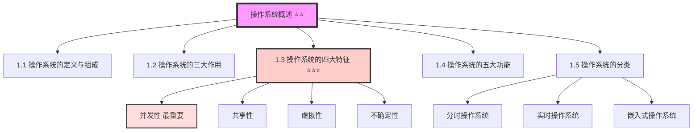

**重点标注**：
- ⭐ 基础了解（偶尔考察）
- ⭐⭐ 重要考点（需要理解掌握）
- ⭐⭐⭐ 核心考点（必考内容，需熟练掌握）

---

## 1.1 什么是操作系统？

**官方定义**：操作系统（Operating System, OS）是计算机系统的**资源管理者**，属于**系统软件**，能够对计算机里面的软硬件资源实施管理。

**通俗理解**：操作系统就像一个"大管家"，负责协调和管理计算机中的所有资源（CPU、内存、硬盘、外设等），让各种程序能够正常运行。

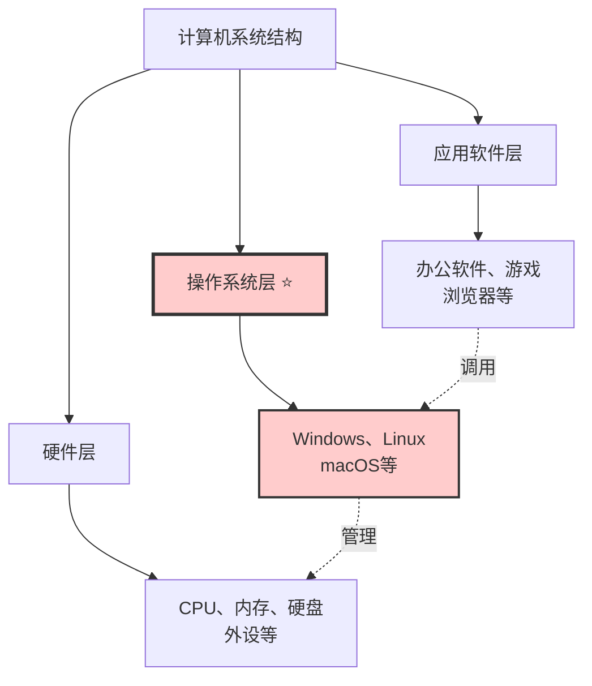

---

## 1.2 操作系统的组成

操作系统由两部分组成：

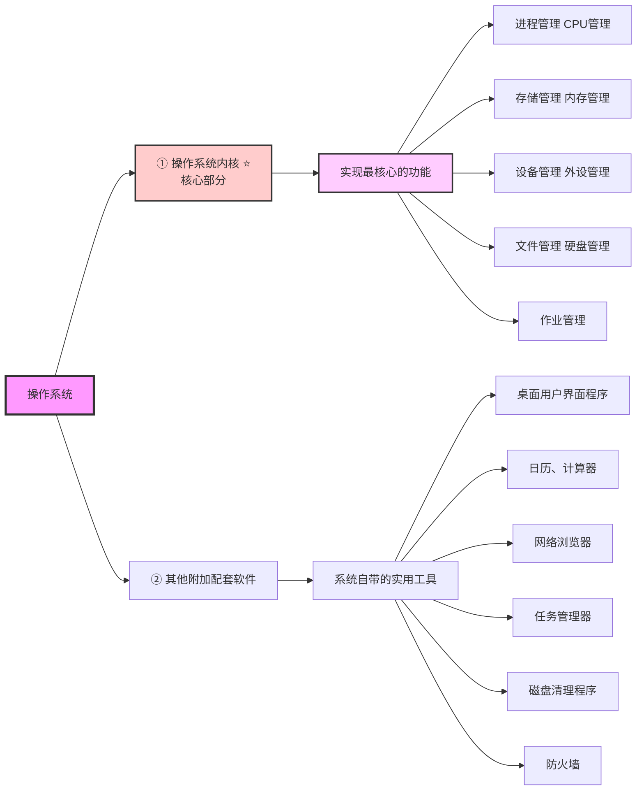

> **考点提示**：操作系统内核实现的五大核心功能（进程、存储、设备、文件、作业管理）是常考知识点。

---

## 1.3 操作系统的三大作用 ⭐⭐（易考选择题）

操作系统有**三个最重要的作用**：

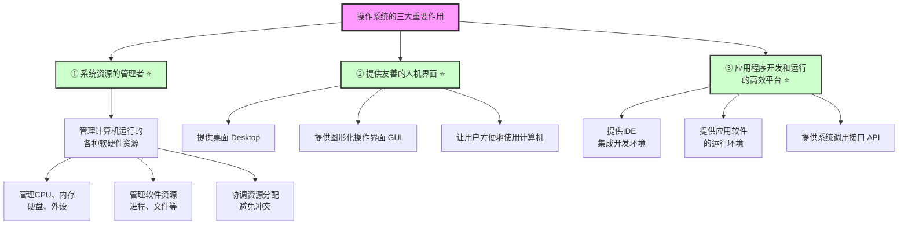

**除了三大重要作用，操作系统还有其他作用**：
- 辅导用户操作（帮助文档）
- 处理软硬件错误
- 监控系统性能
- 保护系统安全

> **考试技巧**：选择题中如果问"操作系统的**重要**作用"，答案是三个；如果问"操作系统的作用"（不强调重要），可能包括其他作用。审题很关键！

---

## 1.4 操作系统的四大特征 ⭐⭐⭐（高频考点）

操作系统有**四个经典特征**，这是理解操作系统运行机制的关键：

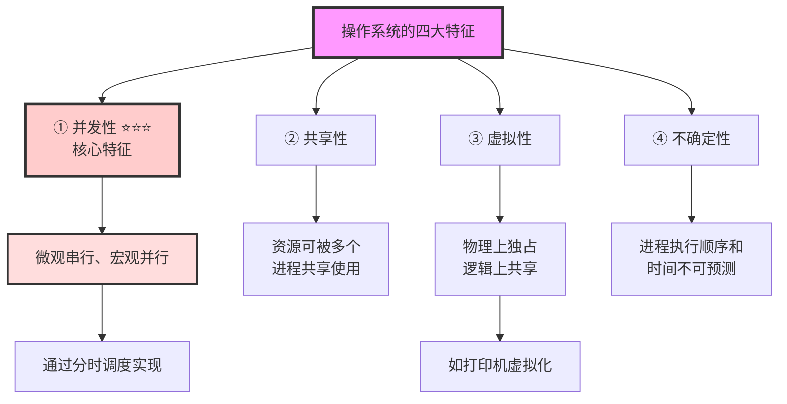

---

### 特征1：并发性 ⭐⭐⭐（最重要）

**核心概念**：并发 ≠ 并行

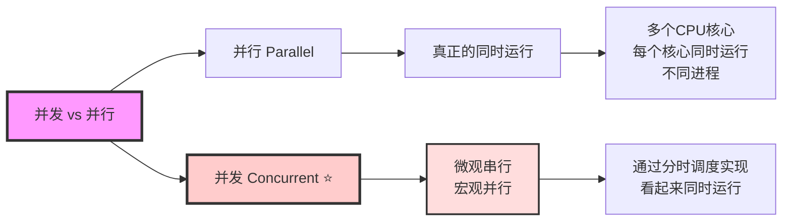

**并发性的实现原理：分时调度**

假设场景：
- CPU有8个核心
- 系统中有100个进程需要运行
- 问题：8个核心如何运行100个进程？

答案：**分时调度**

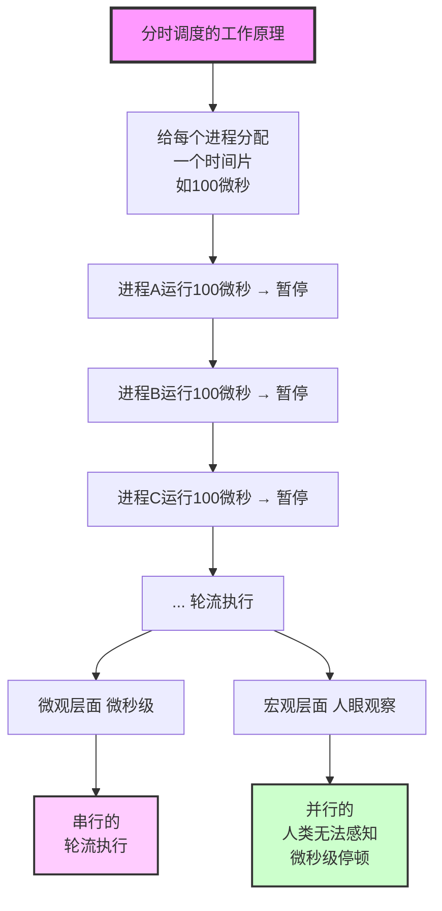

**实例理解**：
- 你同时打开了音乐播放器、浏览器、Word文档
- 实际上CPU在微秒级别快速切换这些程序
- 但你感觉它们在"同时"运行
- 这就是**并发性**

> **记忆口诀**：微观串行、宏观并行

---

### 特征2：共享性

**定义**：操作系统中的资源（软硬件资源）可以被多个进程或线程共享使用，而不是被某个进程独占。

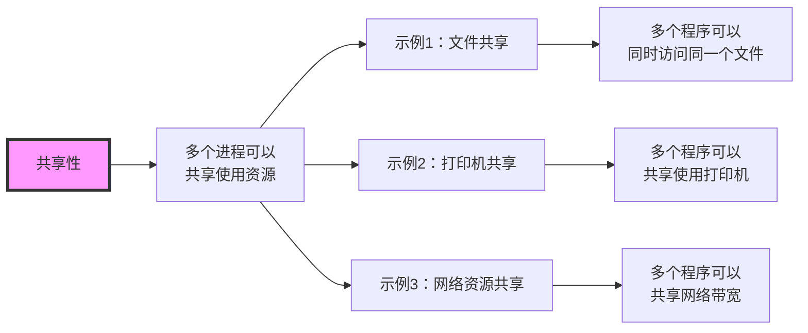

---

### 特征3：虚拟性

**定义**：将物理上独占的设备转变为逻辑上共享的虚拟设备。

**经典案例：打印机的虚拟化**

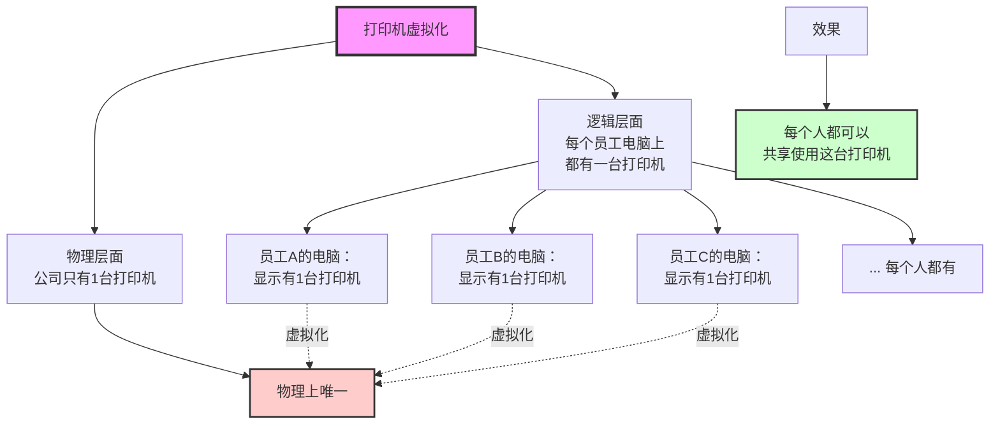

**实现技术**：SPOOLing（假脱机技术）

> **记忆技巧**：虚拟性 = 物理独占 → 逻辑共享

---

### 特征4：不确定性

**定义**：系统中的进程执行顺序和执行时间是不可预测的。

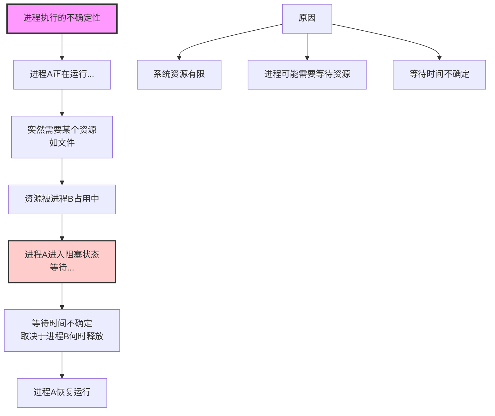

> **形象比喻**：进程运行就像"走走停停"，什么时候停、停多久都不确定。

---

## 1.5 操作系统的五大功能 ⭐⭐（核心功能）

操作系统内核实现的**五大核心功能**：

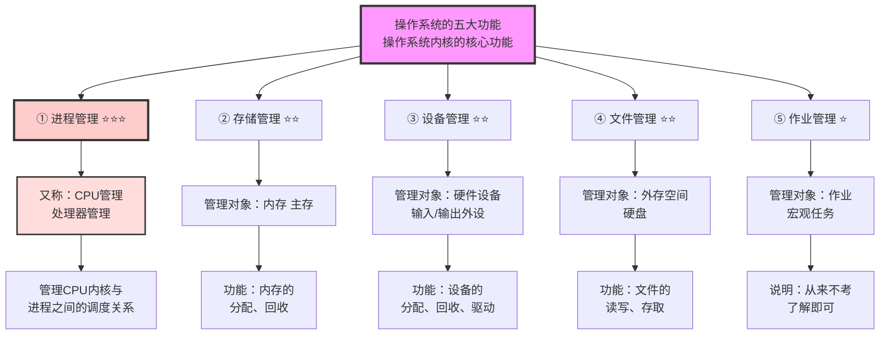

### 功能对比表

| 功能名称 | 管理对象 | 主要职责 | 考试频率 |
|---------|---------|---------|---------|
| **进程管理** | CPU + 进程 | 进程调度、进程同步互斥、死锁处理 | ⭐⭐⭐ 最高 |
| **存储管理** | 内存（主存） | 内存分配回收、分页分段 | ⭐⭐ 高 |
| **设备管理** | 外设（IO设备） | 设备分配、IO工作方式 | ⭐⭐ 中 |
| **文件管理** | 外存（硬盘） | 文件存储、索引、位示图 | ⭐⭐ 中 |
| **作业管理** | 作业 | 作业调度 | ⭐ 几乎不考 |

> **考试重点**：进程管理是操作系统最核心的考点，必须重点掌握！详见《第二章-2-进程管理》文档。

---

## 1.6 操作系统的分类 ⭐

操作系统根据不同的特性和应用场景可以分为多种类型：

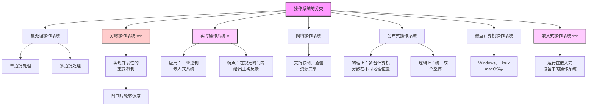

---

### 重点类型详解

**1. 分时操作系统** ⭐⭐

- **核心机制**：时间片轮转
- **实现功能**：并发性
- **现状**：现代操作系统普遍采用分时机制

**2. 实时操作系统** ⭐

- **应用领域**：军工、航天、工业控制、嵌入式
- **核心要求**：
  - ① 在**规定时间**内给出反馈
  - ② 反馈必须**正确**
- **举例**：工业机器人控制系统、飞行控制系统

**3. 嵌入式操作系统** ⭐⭐（重要）

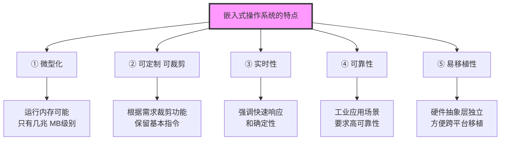

**嵌入式系统的应用**：
- 智能音箱
- 智能家电（电视、冰箱、空调）
- 工业控制设备
- 汽车电子系统
- 智能手表

**嵌入式系统的初始化过程** ⭐（可能考到）：

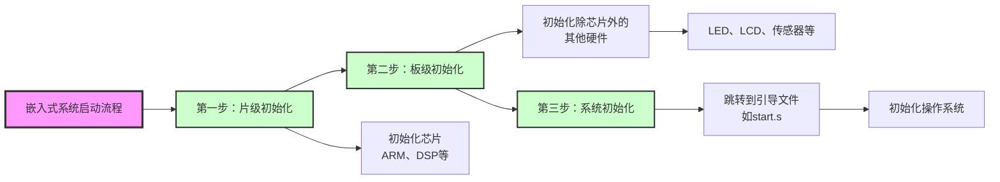

> **记忆口诀**：片级 → 板级 → 系统

---

## 💡 本部分学习要点

### 学习重点

1. **⭐⭐⭐ 必须掌握**（必考内容）：
   - 操作系统的四大特征（并发性是核心）
   - 并发 vs 并行的区别
   - 分时调度的原理

2. **⭐⭐ 重点理解**（高频考点）：
   - 操作系统的三大作用
   - 操作系统的五大功能
   - 虚拟性的实现（SPOOLing技术）

3. **⭐ 了解层面**（偶尔考到）：
   - 操作系统的分类
   - 嵌入式系统初始化过程

---

### 记忆技巧

1. **操作系统三大作用**：管家、界面、平台
2. **操作系统四大特征**：并、共、虚、不
3. **操作系统五大功能**：进程、存储、设备、文件、作业
4. **并发性**：微观串行、宏观并行
5. **嵌入式初始化**：片 → 板 → 系统

---

## ✅ 自测题

### 选择题

1. 操作系统的并发性是指？
   - A. 多个进程同时运行
   - B. 微观串行、宏观并行 ✓
   - C. 一个进程执行完再执行下一个
   - D. 只能单进程运行

2. 以下哪个不属于操作系统的重要作用？
   - A. 系统资源的管理者
   - B. 提供友善的人机界面
   - C. 应用程序开发和运行的平台
   - D. 提供Office办公软件 ✓

3. 操作系统内核的五大功能中，考试频率最高的是？
   - A. 作业管理
   - B. 文件管理
   - C. 进程管理 ✓
   - D. 设备管理

4. 嵌入式系统启动的正确顺序是？
   - A. 系统初始化 → 片级初始化 → 板级初始化
   - B. 板级初始化 → 片级初始化 → 系统初始化
   - C. 片级初始化 → 板级初始化 → 系统初始化 ✓
   - D. 片级初始化 → 系统初始化 → 板级初始化

---

### 简答题

1. **请说明并发和并行的区别。**

点击查看答案

**并行（Parallel）**：
- 真正的同时运行
- 需要多个CPU核心
- 每个核心同时运行不同进程

**并发（Concurrent）**：
- 微观串行、宏观并行
- 通过分时调度实现
- 看起来像同时运行，实际是快速切换

**关键理解**：
- 并行是硬件层面的同时执行
- 并发是操作系统层面的时间片轮转

---

2. **请说明虚拟性的含义，并举例说明。**

点击查看答案

**虚拟性的定义**：
将物理上独占的设备转变为逻辑上共享的虚拟设备。

**经典案例：打印机虚拟化**

- **物理层面**：公司只有1台打印机
- **逻辑层面**：每个员工电脑上都显示有1台打印机
- **效果**：每个人都可以共享使用这台打印机

**实现技术**：SPOOLing（假脱机技术）

**核心**：物理独占 → 逻辑共享

---

## 📚 相关文档

- **下一部分**：[第二章-2-进程管理](./第二章-2-进程管理.md) ⭐⭐⭐（核心考点）
- **扩展阅读**：《操作系统概念》第1-2章

---

## 📝 本部分总结

本部分作为操作系统的**基础概念章节**，主要介绍了：

1. **操作系统的定义与组成**：资源管理者，由内核和附加软件组成
2. **三大作用**：资源管理、人机界面、应用平台
3. **四大特征**（⭐⭐⭐）：并发性（核心）、共享性、虚拟性、不确定性
4. **五大功能**：进程管理（最重要）、存储管理、设备管理、文件管理、作业管理
5. **分类**：分时、实时、嵌入式等

**考试分值**：本部分内容在考试中占1-2分，主要考察选择题。

**重点掌握**：四大特征，尤其是并发性的原理。

---

> **文档生成信息**
> 📅 生成时间：2026-02-05
> 🤖 生成方式：基于思维导图、课程文稿、PDF系统化梳理（Mermaid图解版）
> 📖 适用对象：软考高级系统架构师考试备考
> ✍️ 建议：配合《第二章-2-进程管理》文档学习
> 🎨 图形工具：使用Mermaid绘制，支持在线预览和导出
å