# 第二章 操作系统知识 - 第二部分：进程管理 ⭐⭐⭐

> **重要提示**：进程管理是操作系统考试的**最核心内容**，每年必考，分值占操作系统的60%以上。本节内容需要深入理解并熟练掌握。

---

## 📚 本部分内容导览

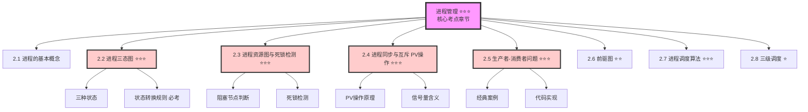
```mermaid
graph TB
    A[进程管理 ⭐⭐⭐<br/>核心考点章节] --> B[2.1 进程的基本概念]
    A --> C[2.2 进程三态图 ⭐⭐⭐]
    A --> D[2.3 进程资源图与死锁检测 ⭐⭐⭐]
    A --> E[2.4 进程同步与互斥 PV操作 ⭐⭐⭐]
    A --> F[2.5 生产者-消费者问题 ⭐⭐⭐]
    A --> G[2.6 前驱图 ⭐⭐]
    A --> H[2.7 进程调度算法 ⭐⭐⭐]
    A --> I[2.8 三级调度 ⭐]

    C --> C1[三种状态]
    C --> C2[状态转换规则 必考]

    D --> D1[阻塞节点判断]
    D --> D2[死锁检测]

    E --> E1[PV操作原理]
    E --> E2[信号量含义]

    F --> F1[经典案例]
    F --> F2[代码实现]

    style A fill:#f9f,stroke:#333,stroke-width:4px
    style C fill:#fcc,stroke:#333,stroke-width:3px
    style D fill:#fcc,stroke:#333,stroke-width:3px
    style E fill:#fcc,stroke:#333,stroke-width:3px
    style F fill:#fcc,stroke:#333,stroke-width:3px
```

**重点标注**：
- ⭐ 基础了解（偶尔考察）
- ⭐⭐ 重要考点（需要理解掌握）
- ⭐⭐⭐ 核心考点（必考内容，需熟练掌握）

---

## 2.1 进程的基本概念

### 什么是进程？

**简单理解**：进程 = 运行中的程序

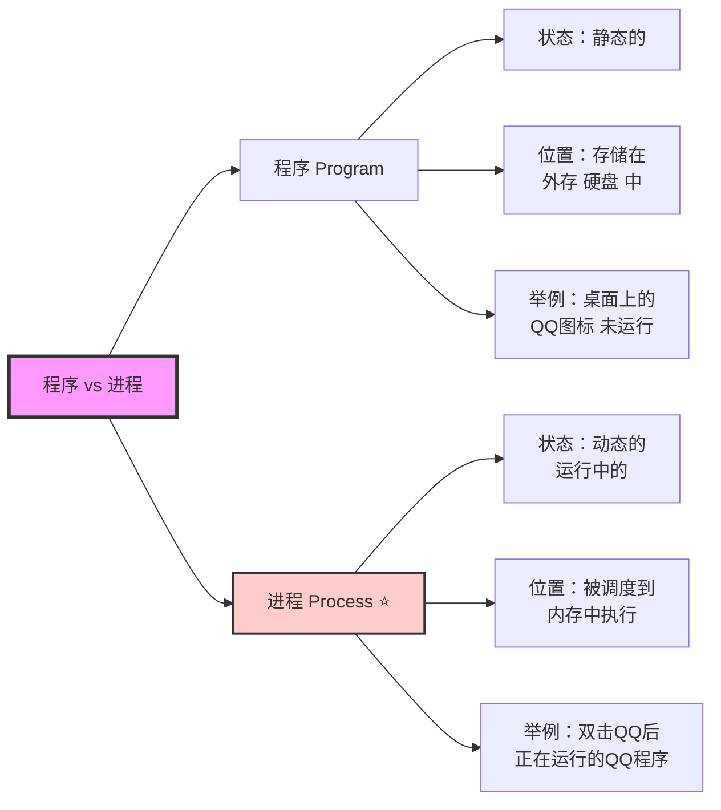
```mermaid
graph LR
    A[程序 vs 进程] --> B[程序 Program]
    A --> C[进程 Process ⭐]

    B --> B1[状态：静态的]
    B --> B2[位置：存储在<br/>外存 硬盘 中]
    B --> B3[举例：桌面上的<br/>QQ图标 未运行]

    C --> C1[状态：动态的<br/>运行中的]
    C --> C2[位置：被调度到<br/>内存中执行]
    C --> C3[举例：双击QQ后<br/>正在运行的QQ程序]

    style A fill:#f9f,stroke:#333,stroke-width:3px
    style C fill:#fcc,stroke:#333,stroke-width:2px
```

---

### 进程的组成

一个进程由**三部分**组成：

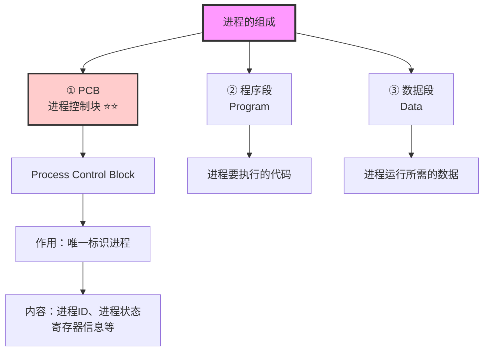
```mermaid
graph TB
    A[进程的组成] --> B[① PCB<br/>进程控制块 ⭐⭐]
    A --> C[② 程序段<br/>Program]
    A --> D[③ 数据段<br/>Data]

    B --> B1[Process Control Block]
    B1 --> B11[作用：唯一标识进程]
    B11 --> B111[内容：进程ID、进程状态<br/>寄存器信息等]

    C --> C1[进程要执行的代码]

    D --> D1[进程运行所需的数据]

    style A fill:#f9f,stroke:#333,stroke-width:3px
    style B fill:#fcc,stroke:#333,stroke-width:2px
```

> **考点提示**：PCB（进程控制块）是进程的核心，用于唯一标识和管理进程。

---

## 2.2 进程的三态图 ⭐⭐⭐（必考知识点）

### 进程的三种基本状态

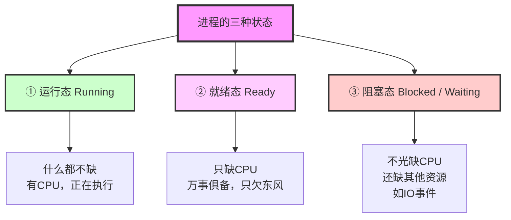
```mermaid
graph TB
    A[进程的三种状态] --> B[① 运行态 Running]
    A --> C[② 就绪态 Ready]
    A --> D[③ 阻塞态 Blocked / Waiting]

    B --> B1[什么都不缺<br/>有CPU，正在执行]

    C --> C1[只缺CPU<br/>万事俱备，只欠东风]

    D --> D1[不光缺CPU<br/>还缺其他资源<br/>如IO事件]

    style A fill:#f9f,stroke:#333,stroke-width:3px
    style B fill:#cfc,stroke:#333,stroke-width:2px
    style C fill:#fcf,stroke:#333,stroke-width:2px
    style D fill:#fcc,stroke:#333,stroke-width:2px
```

---

### 进程三态转换图 ⭐⭐⭐（核心图形）

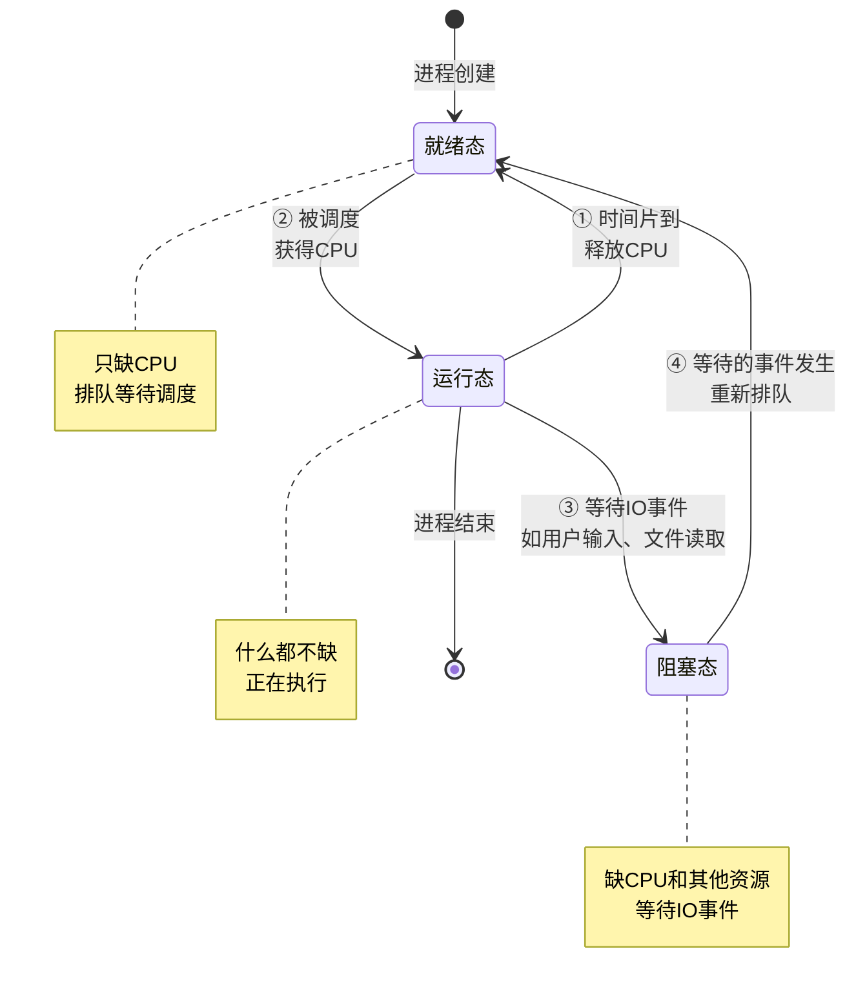
```mermaid
stateDiagram-v2
    [*] --> 就绪态: 进程创建

    就绪态 --> 运行态: ② 被调度<br/>获得CPU
    运行态 --> 就绪态: ① 时间片到<br/>释放CPU

    运行态 --> 阻塞态: ③ 等待IO事件<br/>如用户输入、文件读取
    阻塞态 --> 就绪态: ④ 等待的事件发生<br/>重新排队

    运行态 --> [*]: 进程结束

    note right of 就绪态
        只缺CPU
        排队等待调度
    end note

    note right of 运行态
        什么都不缺
        正在执行
    end note

    note right of 阻塞态
        缺CPU和其他资源
        等待IO事件
    end note
```

---

### 状态转换详解

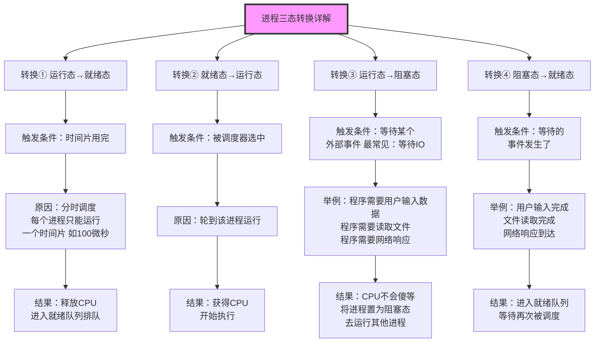
```mermaid
graph TB
    A[进程三态转换详解] --> B[转换① 运行态→就绪态]
    A --> C[转换② 就绪态→运行态]
    A --> D[转换③ 运行态→阻塞态]
    A --> E[转换④ 阻塞态→就绪态]

    B --> B1[触发条件：时间片用完]
    B1 --> B11[原因：分时调度<br/>每个进程只能运行<br/>一个时间片 如100微秒]
    B11 --> B111[结果：释放CPU<br/>进入就绪队列排队]

    C --> C1[触发条件：被调度器选中]
    C1 --> C11[原因：轮到该进程运行]
    C11 --> C111[结果：获得CPU<br/>开始执行]

    D --> D1[触发条件：等待某个<br/>外部事件 最常见：等待IO]
    D1 --> D11[举例：程序需要用户输入数据<br/>程序需要读取文件<br/>程序需要网络响应]
    D11 --> D111[结果：CPU不会傻等<br/>将进程置为阻塞态<br/>去运行其他进程]

    E --> E1[触发条件：等待的<br/>事件发生了]
    E1 --> E11[举例：用户输入完成<br/>文件读取完成<br/>网络响应到达]
    E11 --> E111[结果：进入就绪队列<br/>等待再次被调度]

    style A fill:#f9f,stroke:#333,stroke-width:3px
```

---

### 重要规则（考试常考）⭐⭐⭐

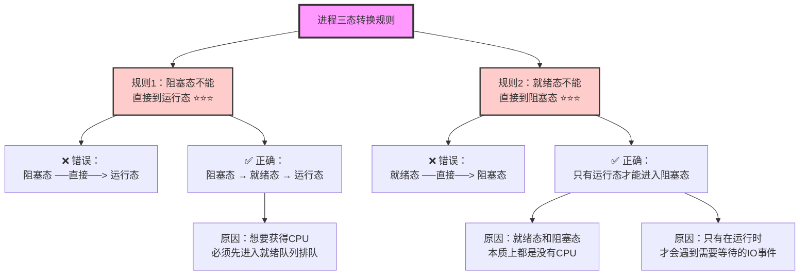
```mermaid
graph TB
    A[进程三态转换规则] --> B[规则1：阻塞态不能<br/>直接到运行态 ⭐⭐⭐]
    A --> C[规则2：就绪态不能<br/>直接到阻塞态 ⭐⭐⭐]

    B --> B1[❌ 错误：<br/>阻塞态 ──直接──> 运行态]
    B --> B2[✅ 正确：<br/>阻塞态 → 就绪态 → 运行态]
    B2 --> B21[原因：想要获得CPU<br/>必须先进入就绪队列排队]

    C --> C1[❌ 错误：<br/>就绪态 ──直接──> 阻塞态]
    C --> C2[✅ 正确：<br/>只有运行态才能进入阻塞态]
    C2 --> C21[原因：就绪态和阻塞态<br/>本质上都是没有CPU]
    C2 --> C22[原因：只有在运行时<br/>才会遇到需要等待的IO事件]

    style A fill:#f9f,stroke:#333,stroke-width:3px
    style B fill:#fcc,stroke:#333,stroke-width:2px
    style C fill:#fcc,stroke:#333,stroke-width:2px
```

---

### 三态图记忆技巧

| 状态 | 记忆口诀 | 是否有CPU | 是否缺其他资源 |
|------|---------|----------|---------------|
| 运行态 | 什么都不缺 | ✅ 有 | ✅ 没缺 |
| 就绪态 | 只缺CPU | ❌ 没有 | ✅ 没缺 |
| 阻塞态 | 啥都缺 | ❌ 没有 | ❌ 缺IO等资源 |

> **考试技巧**：遇到进程状态转换题，先画出三态图，再根据条件判断转换是否合法。

---

## 2.3 进程资源图 ⭐⭐⭐（死锁检测的核心工具）

### 什么是进程资源图？

**定义**：进程资源图用于表示系统中**进程**和**资源**之间的分配和请求关系。

**作用**：
1. 直观展示进程和资源的关系
2. 判断系统是否处于死锁状态
3. 判断系统是否可以化简（避免死锁）

---

### 进程资源图的基本元素

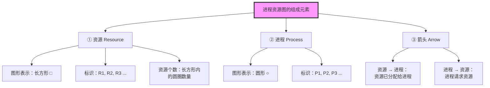
```mermaid
graph TB
    A[进程资源图的组成元素] --> B[① 资源 Resource]
    A --> C[② 进程 Process]
    A --> D[③ 箭头 Arrow]

    B --> B1[图形表示：长方形 □]
    B --> B2[标识：R1, R2, R3 ...]
    B --> B3[资源个数：长方形内<br/>的圆圈数量]

    C --> C1[图形表示：圆形 ○]
    C --> C2[标识：P1, P2, P3 ...]

    D --> D1[资源 → 进程：<br/>资源已分配给进程]
    D --> D2[进程 → 资源：<br/>进程请求资源]

    style A fill:#f9f,stroke:#333,stroke-width:3px
```

---

### 进程资源图示例

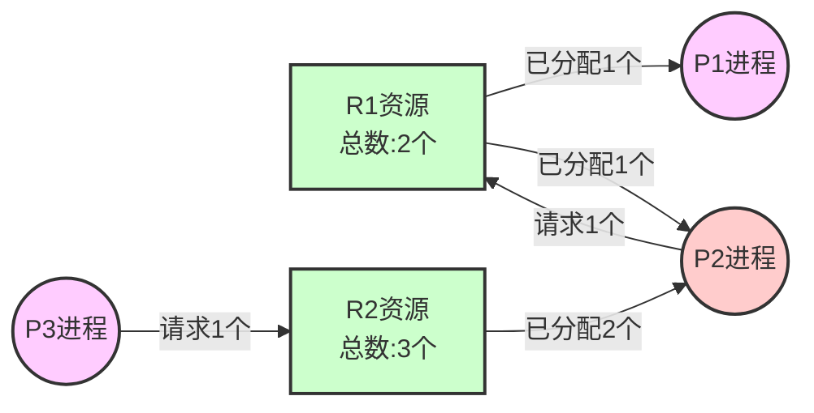
```mermaid
graph LR
    R1[R1资源<br/>总数:2个]
    R2[R2资源<br/>总数:3个]

    P1((P1进程))
    P2((P2进程))
    P3((P3进程))

    R1 -->|已分配1个| P1
    R1 -->|已分配1个| P2

    R2 -->|已分配2个| P2

    P2 -->|请求1个| R1
    P3 -->|请求1个| R2

    style R1 fill:#cfc,stroke:#333,stroke-width:2px
    style R2 fill:#cfc,stroke:#333,stroke-width:2px
    style P1 fill:#fcf,stroke:#333,stroke-width:2px
    style P2 fill:#fcc,stroke:#333,stroke-width:2px
    style P3 fill:#fcf,stroke:#333,stroke-width:2px
```

**分析**：
- R1：总数2个，已分配2个（P1:1, P2:1），剩余0个
- R2：总数3个，已分配2个（P2:2），剩余1个
- P2请求R1：但R1已没有剩余 → P2是**阻塞节点**
- P3请求R2：R2还有1个剩余 → P3是**非阻塞节点**

---

### 如何分析进程资源图？ ⭐⭐⭐（考试重点）

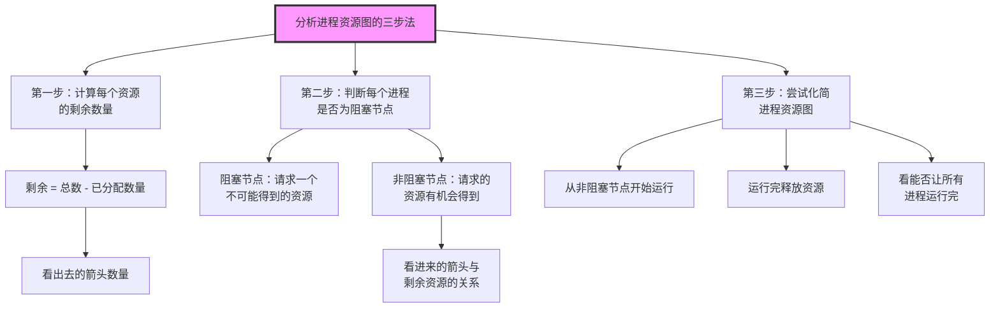
```mermaid
graph TB
    A[分析进程资源图的三步法] --> B[第一步：计算每个资源<br/>的剩余数量]
    A --> C[第二步：判断每个进程<br/>是否为阻塞节点]
    A --> D[第三步：尝试化简<br/>进程资源图]

    B --> B1[剩余 = 总数 - 已分配数量]
    B1 --> B11[看出去的箭头数量]

    C --> C1[阻塞节点：请求一个<br/>不可能得到的资源]
    C --> C2[非阻塞节点：请求的<br/>资源有机会得到]
    C2 --> C21[看进来的箭头与<br/>剩余资源的关系]

    D --> D1[从非阻塞节点开始运行]
    D --> D2[运行完释放资源]
    D --> D3[看能否让所有<br/>进程运行完]

    style A fill:#f9f,stroke:#333,stroke-width:3px
```

---

### 阻塞节点 vs 非阻塞节点 ⭐⭐⭐

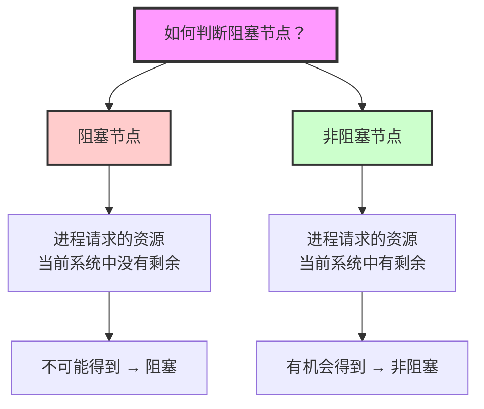
```mermaid
graph TB
    A[如何判断阻塞节点？] --> B[阻塞节点]
    A --> C[非阻塞节点]

    B --> B1[进程请求的资源<br/>当前系统中没有剩余]
    B1 --> B11[不可能得到 → 阻塞]

    C --> C1[进程请求的资源<br/>当前系统中有剩余]
    C1 --> C11[有机会得到 → 非阻塞]

    style A fill:#f9f,stroke:#333,stroke-width:3px
    style B fill:#fcc,stroke:#333,stroke-width:2px
    style C fill:#cfc,stroke:#333,stroke-width:2px
```

**易错点** ⚠️：

假设R2有1个剩余资源，P1和P3都请求R2，它们是阻塞节点吗？

```
情况：
- R2剩余：1个
- P1请求：1个
- P3请求：1个

❌ 错误理解：两个进程抢一个资源，都是阻塞节点
✅ 正确理解：两个进程都是非阻塞节点

原因：
- 虽然不能同时满足
- 但每个进程都有机会得到这个资源
- 调度器可以选择先满足P1或P3
- 所以都是非阻塞节点
```

---

### 死锁检测 ⭐⭐⭐

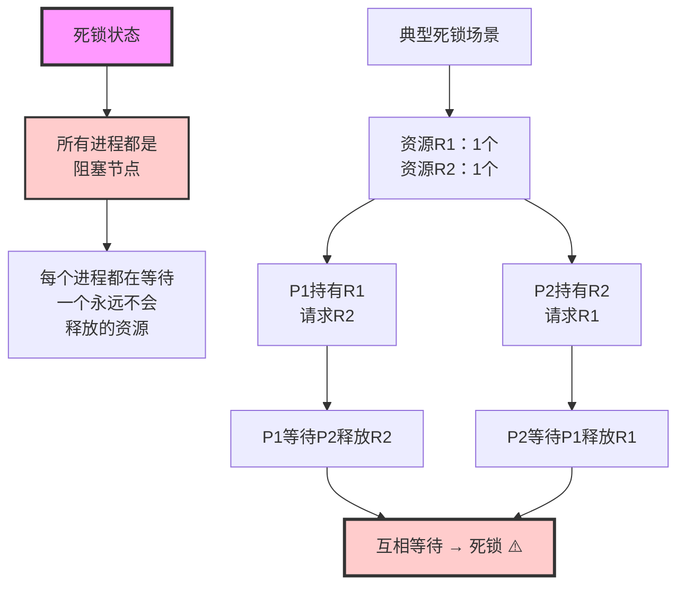
```mermaid
graph TB
    A[死锁状态] --> B[所有进程都是<br/>阻塞节点]
    B --> C[每个进程都在等待<br/>一个永远不会<br/>释放的资源]

    D[典型死锁场景] --> E[资源R1：1个<br/>资源R2：1个]

    E --> F[P1持有R1<br/>请求R2]
    E --> G[P2持有R2<br/>请求R1]

    F --> H[P1等待P2释放R2]
    G --> I[P2等待P1释放R1]

    H --> J[互相等待 → 死锁 ⚠️]
    I --> J

    style A fill:#f9f,stroke:#333,stroke-width:3px
    style B fill:#fcc,stroke:#333,stroke-width:2px
    style J fill:#fcc,stroke:#333,stroke-width:3px
```

---

## 2.4 进程的同步与互斥 ⭐⭐⭐（PV操作）

### 基本概念

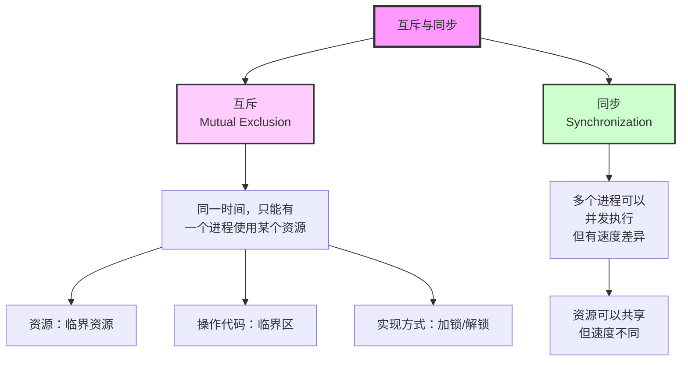
```mermaid
graph TB
    A[互斥与同步] --> B[互斥<br/>Mutual Exclusion]
    A --> C[同步<br/>Synchronization]

    B --> B1[同一时间，只能有<br/>一个进程使用某个资源]
    B1 --> B11[资源：临界资源]
    B1 --> B12[操作代码：临界区]
    B1 --> B13[实现方式：加锁/解锁]

    C --> C1[多个进程可以<br/>并发执行<br/>但有速度差异]
    C1 --> C11[资源可以共享<br/>但速度不同]

    style A fill:#f9f,stroke:#333,stroke-width:3px
    style B fill:#fcf,stroke:#333,stroke-width:2px
    style C fill:#cfc,stroke:#333,stroke-width:2px
```

**临界资源** ⭐：
- 同一时间只能由一个进程访问的资源
- 例如：打印机、共享内存、数据库记录

**临界区** ⭐：
- 对临界资源进行操作的那段程序代码
- 注意：临界区是**程序代码**，临界资源是**资源**

---

### 信号量（Semaphore）⭐⭐⭐

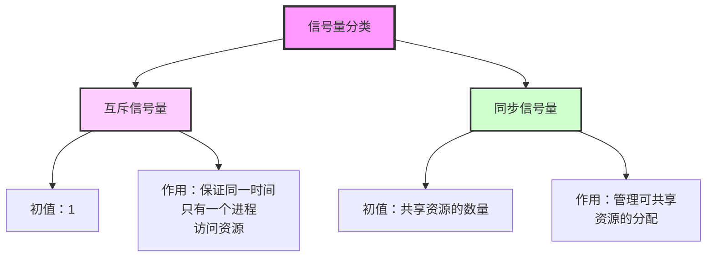
```mermaid
graph TB
    A[信号量分类] --> B[互斥信号量]
    A --> C[同步信号量]

    B --> B1[初值：1]
    B --> B2[作用：保证同一时间<br/>只有一个进程<br/>访问资源]

    C --> C1[初值：共享资源的数量]
    C --> C2[作用：管理可共享<br/>资源的分配]

    style A fill:#f9f,stroke:#333,stroke-width:3px
    style B fill:#fcf,stroke:#333,stroke-width:2px
    style C fill:#cfc,stroke:#333,stroke-width:2px
```

---

**信号量的含义**：

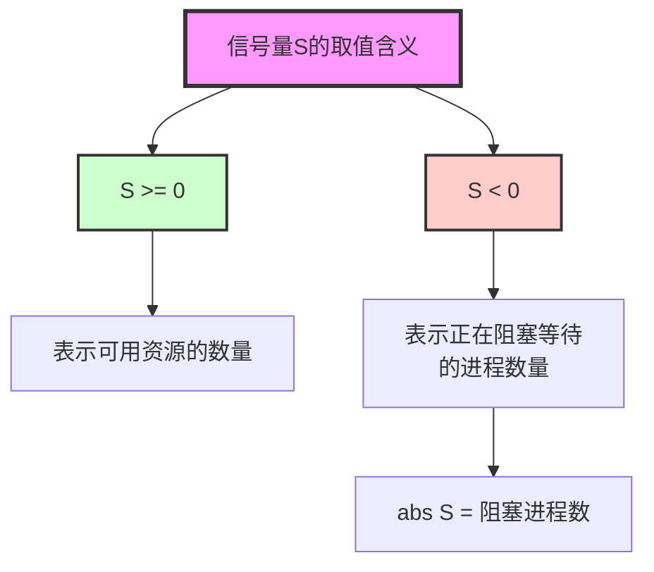
```mermaid
graph TB
    A[信号量S的取值含义] --> B[S >= 0]
    A --> C[S < 0]

    B --> B1[表示可用资源的数量]

    C --> C1[表示正在阻塞等待<br/>的进程数量]
    C1 --> C11[abs S = 阻塞进程数]

    style A fill:#f9f,stroke:#333,stroke-width:3px
    style B fill:#cfc,stroke:#333,stroke-width:2px
    style C fill:#fcc,stroke:#333,stroke-width:2px
```

**示例理解**：

假设公司有3台电脑，5个程序员需要使用：

```
场景分析：
- 初始：S = 3（3台电脑）
- 程序员A申请：S = 2
- 程序员B申请：S = 1
- 程序员C申请：S = 0（3台电脑用完）
- 程序员D申请：S = -1（表示1人在排队）
- 程序员E申请：S = -2（表示2人在排队）
```

> **关键理解**：S < 0时，abs(S)表示有多少人在阻塞队列中排队等待。

---

### PV操作 ⭐⭐⭐（核心考点）

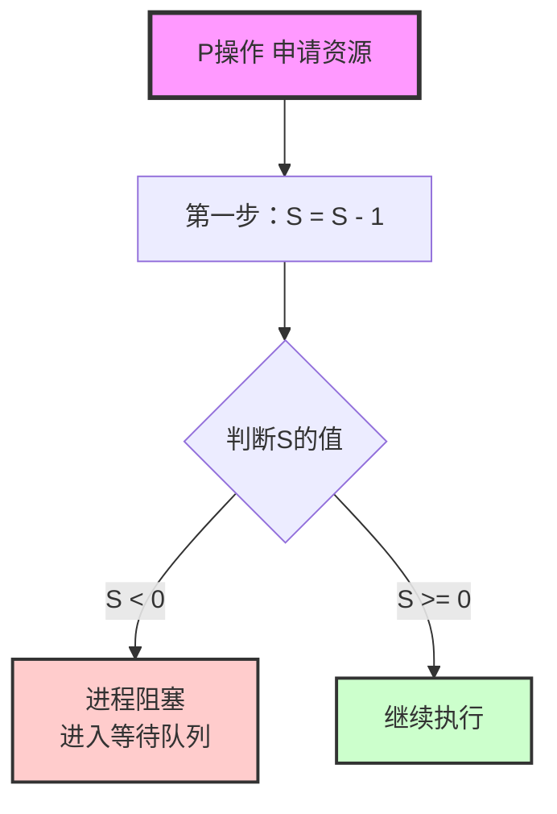
```mermaid
flowchart TD
    A[P操作 申请资源] --> B[第一步：S = S - 1]
    B --> C{判断S的值}
    C -->|S < 0| D[进程阻塞<br/>进入等待队列]
    C -->|S >= 0| E[继续执行]

    style A fill:#f9f,stroke:#333,stroke-width:3px
    style D fill:#fcc,stroke:#333,stroke-width:2px
    style E fill:#cfc,stroke:#333,stroke-width:2px
```

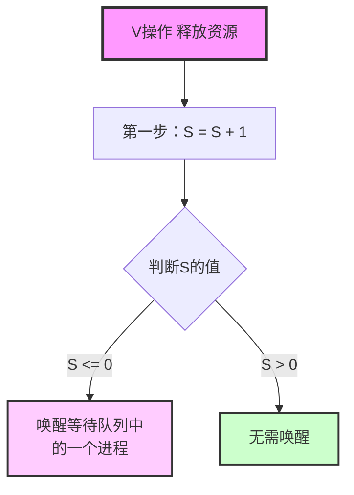
```mermaid
flowchart TD
    A[V操作 释放资源] --> B[第一步：S = S + 1]
    B --> C{判断S的值}
    C -->|S <= 0| D[唤醒等待队列中<br/>的一个进程]
    C -->|S > 0| E[无需唤醒]

    style A fill:#f9f,stroke:#333,stroke-width:3px
    style D fill:#fcf,stroke:#333,stroke-width:2px
    style E fill:#cfc,stroke:#333,stroke-width:2px
```

---

### 为什么V操作要判断S <= 0？ ⭐⭐

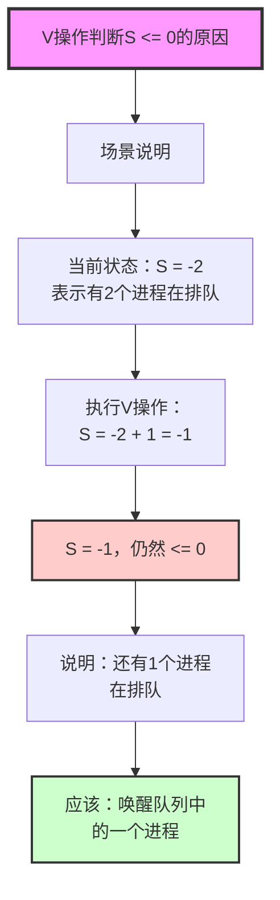
```mermaid
graph TB
    A[V操作判断S <= 0的原因] --> B[场景说明]

    B --> C[当前状态：S = -2<br/>表示有2个进程在排队]

    C --> D[执行V操作：<br/>S = -2 + 1 = -1]

    D --> E[S = -1，仍然 <= 0]

    E --> F[说明：还有1个进程<br/>在排队]

    F --> G[应该：唤醒队列中<br/>的一个进程]

    style A fill:#f9f,stroke:#333,stroke-width:3px
    style E fill:#fcc,stroke:#333,stroke-width:2px
    style G fill:#cfc,stroke:#333,stroke-width:2px
```

**总结**：
- S <= 0 表示有进程在排队
- 释放资源后，应该优先给排队的进程
- 如果S > 0，说明没有进程排队，资源直接放回资源池

---

## 2.5 生产者-消费者问题 ⭐⭐⭐（经典同步互斥问题）

### 问题描述

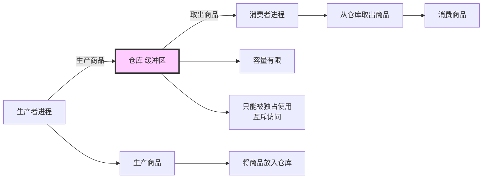
```mermaid
graph LR
    A[生产者进程] -->|生产商品| B[仓库 缓冲区]
    B -->|取出商品| C[消费者进程]

    A --> A1[生产商品]
    A1 --> A2[将商品放入仓库]

    B --> B1[容量有限]
    B --> B2[只能被独占使用<br/>互斥访问]

    C --> C1[从仓库取出商品]
    C1 --> C2[消费商品]

    style B fill:#fcf,stroke:#333,stroke-width:3px
```

---

### 约束条件

1. **互斥约束**：仓库同一时间只能被一个进程使用（生产者或消费者）
2. **同步约束**：
   - 生产者：需要有空位才能放商品
   - 消费者：需要有商品才能取商品

---

### 信号量设置

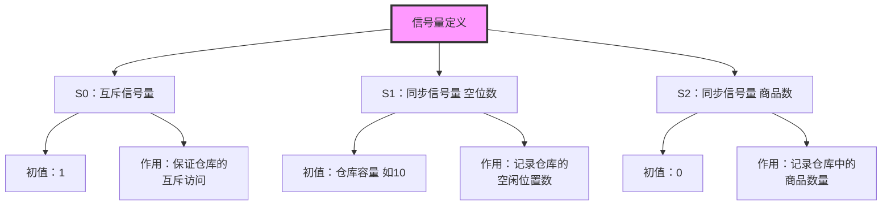
```mermaid
graph TB
    A[信号量定义] --> B[S0：互斥信号量]
    A --> C[S1：同步信号量 空位数]
    A --> D[S2：同步信号量 商品数]

    B --> B1[初值：1]
    B --> B2[作用：保证仓库的<br/>互斥访问]

    C --> C1[初值：仓库容量 如10]
    C --> C2[作用：记录仓库的<br/>空闲位置数]

    D --> D1[初值：0]
    D --> D2[作用：记录仓库中的<br/>商品数量]

    style A fill:#f9f,stroke:#333,stroke-width:3px
```

---

### 生产者和消费者流程图

```mermaid
sequenceDiagram
    participant 生产者
    participant S0互斥信号量
    participant S1空位数
    participant S2商品数
    participant 仓库
    participant 消费者

    Note over 生产者: 生产一个商品

    生产者->>S0互斥信号量: P(S0) 申请仓库使用权
    生产者->>S1空位数: P(S1) 申请一个空位
    生产者->>仓库: 将商品放入仓库
    生产者->>S2商品数: V(S2) 商品数+1
    生产者->>S0互斥信号量: V(S0) 释放仓库

    Note over 消费者: 准备消费

    消费者->>S0互斥信号量: P(S0) 申请仓库使用权
    消费者->>S2商品数: P(S2) 申请一个商品
    消费者->>仓库: 从仓库取出商品
    消费者->>S1空位数: V(S1) 空位数+1
    消费者->>S0互斥信号量: V(S0) 释放仓库

    Note over 消费者: 消费商品
```

---

### 生产者进程代码

```
生产者进程：

    生产一个商品

    P(S0)  ← 申请仓库的独占使用权

    P(S1)  ← 申请一个空位

    将商品放入仓库

    V(S2)  ← 商品数量+1

    V(S0)  ← 释放仓库的使用权
```

---

### 消费者进程代码

```
消费者进程：

    P(S0)  ← 申请仓库的独占使用权

    P(S2)  ← 申请一个商品

    从仓库取出商品

    V(S1)  ← 空位数+1

    V(S0)  ← 释放仓库的使用权

    消费商品
```

---

### 代码对比分析

| 操作 | 生产者 | 消费者 | 说明 |
|------|--------|--------|------|
| **第1步** | 生产商品 | P(S0) | 生产者先生产，消费者先申请仓库 |
| **第2步** | P(S0) | P(S2) | 都申请互斥资源或同步资源 |
| **第3步** | P(S1) | 取出商品 | 生产者申请空位，消费者直接取 |
| **第4步** | 放入商品 | V(S1) | 生产者放入，消费者释放空位 |
| **第5步** | V(S2) | V(S0) | 生产者释放商品数，消费者释放仓库 |
| **第6步** | V(S0) | 消费商品 | 生产者释放仓库，消费者消费 |

---

## 2.6 前驱图 ⭐⭐（进程执行顺序）

### 什么是前驱图？

**定义**：前驱图用于表示进程之间的**执行先后关系**。

```mermaid
graph TB
    A[前驱图的基本元素] --> B[节点：表示进程]
    A --> C[有向边：表示执行顺序]

    B --> B1[A、B、C、D、E...]

    C --> C1[A → B 表示<br/>A执行完后，B才能执行]

    style A fill:#f9f,stroke:#333,stroke-width:3px
```

---

### 前驱图示例

**示例1：简单前驱图**

```mermaid
graph TD
    A[进程A] --> B[进程B]
    B --> C[进程C]

    style A fill:#cfc,stroke:#333,stroke-width:2px
    style B fill:#fcf,stroke:#333,stroke-width:2px
    style C fill:#fcc,stroke:#333,stroke-width:2px
```

说明：
- A执行完 → B才能执行
- B执行完 → C才能执行

---

**示例2：复杂前驱图**

```mermaid
graph TD
    A[进程A] --> D[进程D]
    B[进程B] --> D
    C[进程C] --> D
    D --> E[进程E]

    style A fill:#cfc,stroke:#333,stroke-width:2px
    style B fill:#cfc,stroke:#333,stroke-width:2px
    style C fill:#cfc,stroke:#333,stroke-width:2px
    style D fill:#fcf,stroke:#333,stroke-width:2px
    style E fill:#fcc,stroke:#333,stroke-width:2px
```

说明：
- A、B、C可以并发执行
- A、B、C都执行完后，D才能执行
- D执行完后，E才能执行

---

### 前驱图与PV操作的关系 ⭐⭐⭐

**核心原理**：前驱图中的每一条边对应一个**信号量**

```mermaid
graph TB
    A[前驱图转换为PV操作] --> B[每条边 = 一个信号量]
    A --> C[箭头出去 前驱 → V操作<br/>释放信号量]
    A --> D[箭头进来 后继 → P操作<br/>申请信号量]

    style A fill:#f9f,stroke:#333,stroke-width:3px
    style C fill:#cfc,stroke:#333,stroke-width:2px
    style D fill:#fcf,stroke:#333,stroke-width:2px
```

---

**示例：前驱图转PV操作**

```mermaid
graph LR
    A[进程A] -->|信号量S1| B[进程B]
    B -->|信号量S2| C[进程C]

    A1[进程A代码] --> A2[执行A的代码]
    A2 --> A3[V S1<br/>通知B可以执行了]

    B1[进程B代码] --> B2[P S1<br/>等待A执行完]
    B2 --> B3[执行B的代码]
    B3 --> B4[V S2<br/>通知C可以执行了]

    C1[进程C代码] --> C2[P S2<br/>等待B执行完]
    C2 --> C3[执行C的代码]

    style A fill:#cfc,stroke:#333,stroke-width:2px
    style B fill:#fcf,stroke:#333,stroke-width:2px
    style C fill:#fcc,stroke:#333,stroke-width:2px
```

---

**多前驱情况**：

```mermaid
graph TB
    A[进程A] -->|S1| D[进程D]
    B[进程B] -->|S2| D
    C[进程C] -->|S3| D
    D -->|S4| E[进程E]

    subgraph 进程D的代码
    D1[P S1 等待A]
    D2[P S2 等待B]
    D3[P S3 等待C]
    D4[执行D]
    D5[V S4]
    D1 --> D2 --> D3 --> D4 --> D5
    end

    style D fill:#fcf,stroke:#333,stroke-width:3px
```

**关键理解**：
- D有3个前驱（A、B、C）
- 所以D要执行3次P操作
- 只有A、B、C都执行完，D才能开始

---

## 2.7 进程调度算法 ⭐⭐⭐

### 调度算法概述

```mermaid
graph TB
    A[进程调度算法分类] --> B[① 时间片轮转<br/>分时调度 ⭐⭐]
    A --> C[② 先来先服务 FCFS]
    A --> D[③ 优先级调度]
    A --> E[④ 多级反馈调度 ⭐⭐]

    B --> B1[现代操作系统<br/>普遍采用]

    C --> C1[First Come<br/>First Served]

    D --> D1[根据进程优先级调度]

    E --> E1[时间片轮转 +<br/>优先级的综合]

    style A fill:#f9f,stroke:#333,stroke-width:3px
```

---

### 1. 时间片轮转调度 ⭐⭐（分时调度）

```mermaid
graph TB
    A[时间片轮转] --> B[每个进程分配<br/>固定时间片<br/>如100微秒]

    B --> C[进程轮流执行]
    C --> C1[进程A执行100微秒]
    C --> C2[进程B执行100微秒]
    C --> C3[进程C执行100微秒]
    C --> C4[... 循环]

    D[特点] --> D1[公平：每个进程<br/>时间相同]
    D --> D2[响应时间短：不会<br/>长时间等待]

    E[缺点] --> E1[频繁切换进程<br/>有开销]

    style A fill:#f9f,stroke:#333,stroke-width:3px
    style D1 fill:#cfc,stroke:#333,stroke-width:2px
    style D2 fill:#cfc,stroke:#333,stroke-width:2px
```

---

### 2. 先来先服务（FCFS）

```mermaid
graph LR
    A[先来先服务 FCFS] --> B[按进程到达的<br/>先后顺序执行]

    B --> C[先到先执行]
    B --> D[后到后执行]

    E[优点] --> E1[简单易实现]
    E --> E2[公平 先来先得]

    F[缺点] --> F1[可能导致长作业<br/>阻塞短作业<br/>护航效应]

    style A fill:#f9f,stroke:#333,stroke-width:3px
    style F1 fill:#fcc,stroke:#333,stroke-width:2px
```

**示例**：
```
进程到达顺序：P1（需要10秒）→ P2（需要1秒）→ P3（需要1秒）

执行顺序：
P1执行10秒 → P2执行1秒 → P3执行1秒

问题：
P2和P3等待了10秒才开始执行（虽然它们只需1秒）
```

---

### 3. 优先级调度

```mermaid
graph TB
    A[优先级调度] --> B[根据进程优先级<br/>高低决定执行顺序]

    B --> C[高优先级先执行]
    B --> D[低优先级后执行]

    E[分类] --> F[可剥夺 Preemptive ⭐]
    E --> G[不可剥夺<br/>Non-Preemptive]

    F --> F1[高优先级进程<br/>可以抢占CPU]
    F1 --> F11[正在运行的<br/>低优先级进程被暂停]

    G --> G1[高优先级进程<br/>必须等待]
    G1 --> G11[当前进程运行完<br/>才能执行]

    style A fill:#f9f,stroke:#333,stroke-width:3px
    style F fill:#fcc,stroke:#333,stroke-width:2px
```

---

### 4. 多级反馈调度 ⭐⭐

**原理**：时间片轮转 + 优先级的综合

```mermaid
graph TB
    A[多级反馈调度] --> B[设置多个优先级队列]

    B --> C[队列1：最高优先级]
    B --> D[队列2：次高优先级]
    B --> E[队列3：低优先级]

    C --> C1[时间片：100微秒]
    D --> D1[时间片：200微秒]
    E --> E1[时间片：400微秒]

    F[每个队列内部] --> F1[时间片轮转]

    G[队列之间] --> G1[优先级调度]
    G1 --> G11[只有高优先级队列为空<br/>才执行低优先级队列]

    style A fill:#f9f,stroke:#333,stroke-width:3px
```

---

**执行规则**：

```mermaid
graph TD
    A[多级反馈调度执行流程] --> B[1. 新进程进入<br/>最高优先级队列 队列1]

    B --> C[2. 在队列1中<br/>时间片轮转执行]

    C --> D{时间片用完<br/>还没执行完?}

    D -->|是| E[3. 降级到<br/>下一个队列 队列2]
    D -->|否| F[进程完成]

    E --> G[4. 在队列2中<br/>继续执行]

    G --> H{还没执行完?}

    H -->|是| I[5. 继续降级到<br/>队列3...]
    H -->|否| F

    style A fill:#f9f,stroke:#333,stroke-width:3px
```

**优点**：
- 短作业优先（在高优先级队列快速完成）
- 长作业也不会饿死（最终会执行）
- 兼顾公平性和效率

---

## 2.8 高级调度、中级调度、低级调度 ⭐

```mermaid
graph TB
    A[操作系统的三级调度] --> B[高级调度 作业调度 ⭐]
    A --> C[中级调度 交换调度]
    A --> D[低级调度 进程调度 ⭐⭐⭐]

    B --> B1[外存 → 内存]
    B --> B2[几乎不考]

    C --> C1[交换区 → 内存]
    C --> C2[了解即可]

    D --> D1[内存 → CPU]
    D --> D2[考试重点<br/>就是上面讲的<br/>进程调度算法]

    style A fill:#f9f,stroke:#333,stroke-width:3px
    style D fill:#fcc,stroke:#333,stroke-width:3px
```

**低级调度**（进程调度）：
- 决定内存中哪个进程可以占用CPU
- 这是我们主要学习的内容
- 调度算法：FCFS、优先级、时间片轮转、多级反馈

---

## 💡 学习建议

### 本部分学习重点

1. **⭐⭐⭐ 必须掌握**（必考内容）：
   - 进程三态图及状态转换规则
   - 进程资源图的分析和死锁判断
   - PV操作的原理和应用
   - 生产者-消费者问题
   - 进程调度算法

2. **⭐⭐ 重点理解**（高频考点）：
   - 前驱图与PV操作的转换
   - 多级反馈调度

3. **⭐ 了解层面**（偶尔考到）：
   - 三级调度

---

### 考试题型预测

| 知识点 | 题型 | 分值 | 难度 | 频率 |
|-------|------|------|------|------|
| 进程三态图 | 选择/填空 | 2分 | ⭐⭐ | 很高 |
| 进程资源图与死锁 | 综合题 | 3-4分 | ⭐⭐⭐ | 很高 |
| PV操作 | 选择/填空 | 2-3分 | ⭐⭐⭐ | 很高 |
| 生产者-消费者 | 综合题 | 4-5分 | ⭐⭐⭐ | 高 |
| 前驱图 | 填空题 | 2-3分 | ⭐⭐ | 中 |
| 进程调度算法 | 选择/计算 | 2-3分 | ⭐⭐ | 中 |

---

### 记忆技巧

1. **进程三态**：运行（什么都不缺）、就绪（只缺CPU）、阻塞（啥都缺）
2. **PV操作**：P减申请、V加释放
3. **调度算法**：FCFS（先来）、优先级（高低）、轮转（公平）、多级反馈（综合）

---

## ✅ 自测题

### 选择题

1. 进程从运行态转换到阻塞态的原因是？
   - A. 时间片用完
   - B. 等待某个IO事件 ✓
   - C. 被调度器选中
   - D. 进程优先级降低

2. 以下哪个状态转换是不可能的？
   - A. 运行态 → 就绪态
   - B. 就绪态 → 运行态
   - C. 就绪态 → 阻塞态 ✓
   - D. 阻塞态 → 就绪态

3. 互斥信号量的初值一般设置为？
   - A. 0
   - B. 1 ✓
   - C. 资源数量
   - D. 进程数量

4. 在生产者-消费者问题中，生产者执行P(S1)的含义是？
   - A. 申请仓库使用权
   - B. 申请一个空位 ✓
   - C. 申请一个商品
   - D. 释放一个空位

---

### 简答题

1. **请说明进程三态转换的4种情况及其触发条件。**

<details>
<summary>点击查看答案</summary>

- **运行态 → 就绪态**：时间片用完
- **就绪态 → 运行态**：被调度器选中
- **运行态 → 阻塞态**：等待IO事件
- **阻塞态 → 就绪态**：等待的事件发生

**不可能的转换**：
- 就绪态 → 阻塞态（原因：两者都没有CPU）
- 阻塞态 → 运行态（原因：必须先排队）

</details>

---

2. **什么是阻塞节点？如何判断进程资源图中的阻塞节点？**

<details>
<summary>点击查看答案</summary>

**阻塞节点的定义**：
- 进程请求一个当前系统中没有剩余的资源
- 不可能得到该资源

**判断方法**：
1. 计算资源剩余数量 = 总数 - 已分配数量
2. 查看进程请求的资源数量
3. 如果请求数量 > 剩余数量 → 阻塞节点
4. 如果请求数量 <= 剩余数量 → 非阻塞节点

**注意**：
- 多个进程请求同一个剩余资源时，都是非阻塞节点
- 因为调度器可以选择满足其中任何一个

</details>

---

3. **为什么V操作中要判断S <= 0，而不是S < 0？**

<details>
<summary>点击查看答案</summary>

**原因**：

假设当前S = -2（有2个进程在排队）

执行V操作：
1. S = S + 1 = -2 + 1 = -1
2. 判断：S = -1，仍然 <= 0
3. 说明：还有1个进程在排队等待
4. 操作：应该唤醒队列中的一个进程

**总结**：
- S <= 0 表示有进程在排队
- 释放资源后应优先给排队的进程
- 如果S > 0，说明没有进程排队，资源放回资源池

</details>

---

### 综合题

**题目**：现有系统中资源R1有2个，资源R2有1个。进程P1持有R1(1个)，请求R2(1个)；进程P2持有R2(1个)，请求R1(1个)。请问：

1. 画出进程资源图
2. 判断P1、P2是否为阻塞节点
3. 判断系统是否处于死锁状态

<details>
<summary>点击查看答案</summary>

**1. 进程资源图**（用Mermaid绘制）：

```mermaid
graph LR
    R1[R1资源<br/>总数:2个]
    R2[R2资源<br/>总数:1个]

    P1((P1进程))
    P2((P2进程))

    R1 -->|已分配1个| P1
    P1 -->|请求1个| R2

    R2 -->|已分配1个| P2
    P2 -->|请求1个| R1
```

**2. 判断阻塞节点**：

- **R1分析**：
  - 总数：2个
  - 已分配：1个（给P1）
  - 剩余：1个

- **R2分析**：
  - 总数：1个
  - 已分配：1个（给P2）
  - 剩余：0个

- **P1分析**：
  - 请求R2：1个
  - R2剩余：0个
  - **结论：P1是阻塞节点**

- **P2分析**：
  - 请求R1：1个
  - R1剩余：1个
  - **结论：P2是非阻塞节点**

**3. 是否死锁**：

尝试化简：
1. P2是非阻塞节点，可以运行
2. P2运行完释放R2(1个)
3. P1变成非阻塞节点
4. P1可以运行完

**结论**：系统不是死锁状态 ✅

</details>

---

## 📚 相关文档

- **上一部分**：[第二章-1-操作系统概述](./第二章-1-操作系统概述.md) ⭐⭐
- **扩展阅读**：《操作系统概念》第3-5章

---

## 📝 本部分总结

本部分作为操作系统的**核心考点章节**，主要介绍了：

1. **进程基本概念**：进程 = 运行中的程序，由PCB + 程序段 + 数据段组成
2. **进程三态图**（⭐⭐⭐必考）：运行态、就绪态、阻塞态及状态转换规则
3. **进程资源图与死锁检测**（⭐⭐⭐必考）：阻塞节点判断、系统化简
4. **进程同步与互斥**（⭐⭐⭐必考）：PV操作、信号量含义
5. **生产者-消费者问题**（⭐⭐⭐经典案例）：完整代码实现
6. **前驱图**（⭐⭐）：与PV操作的转换关系
7. **进程调度算法**（⭐⭐⭐）：FCFS、优先级、时间片轮转、多级反馈

**考试分值**：本部分内容在考试中占2-4分，是操作系统的核心内容。

**重点掌握**：进程三态图、进程资源图与死锁、PV操作、生产者-消费者问题。

---

> **文档生成信息**
> 📅 生成时间：2026-02-05
> 🤖 生成方式：基于思维导图、课程文稿、PDF系统化梳理（Mermaid图解版）
> 📖 适用对象：软考高级系统架构师考试备考
> ✍️ 建议：反复练习真题，重点掌握PV操作和死锁检测
> 🎨 图形工具：使用Mermaid绘制，支持在线预览和导出
