# 第二章 操作系统知识 - 中断机制 ⭐⭐

> **学习提示**：中断机制是操作系统实现多任务、并发执行的核心机制之一。需要掌握中断的五种分类及其区别，理解用户态与内核态的切换。

---

## 📚 内容导览

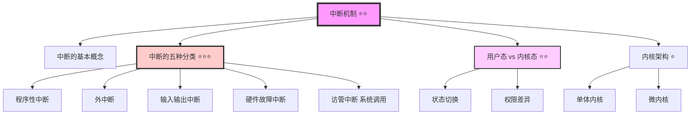

**重点标注**：
- ⭐ 基础了解（偶尔考察）
- ⭐⭐ 重要考点（需要理解掌握）
- ⭐⭐⭐ 核心考点（必考内容，需熟练掌握）

---

## 什么是中断？

**定义**：某些事件的发生，导致当前正在运行的进程被暂停，转而去处理这些事件。

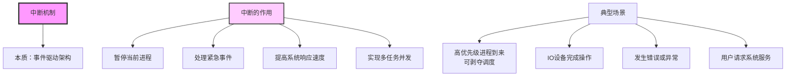

> **形象理解**：中断就像你正在工作时突然有人敲门，你需要暂停工作去开门，处理完后再回来继续工作。

---

## 中断的基本概念 ⭐⭐

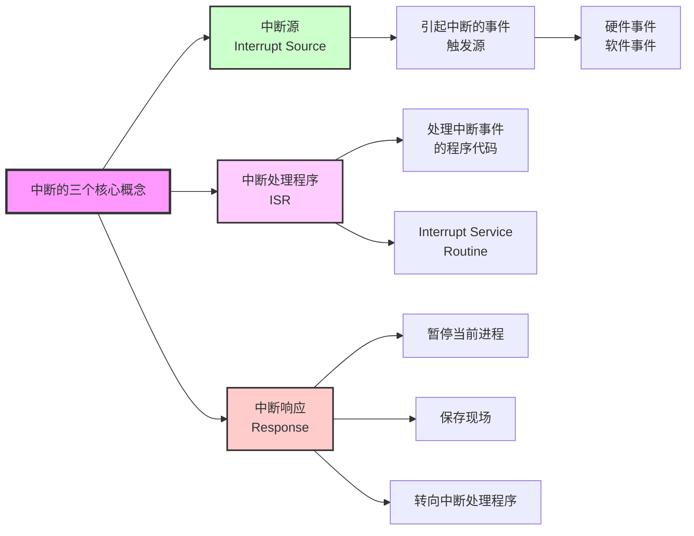

**三个核心概念**：

1. **中断源（Interrupt Source）**：
   - 引起中断的事件或触发源
   - 可以是硬件事件（如IO完成、定时器到期）
   - 也可以是软件事件（如程序错误、系统调用）

2. **中断处理程序（ISR，Interrupt Service Routine）**：
   - 对出现的中断事件进行处理的程序代码
   - 每种中断类型都有对应的处理程序

3. **中断响应（Interrupt Response）**：
   - 暂停当前进程的运行
   - 让操作系统的中断处理程序去响应的过程

---

## 中断处理流程 ⭐

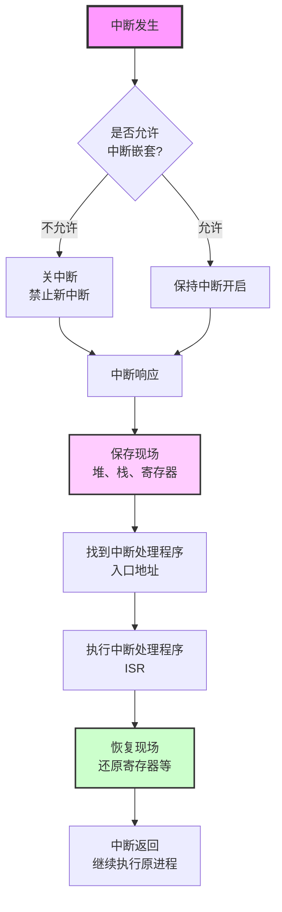

**关键步骤详解**：

1. **关中断**（如果不允许嵌套）：
   - 防止中断处理过程中被新中断打断
   - 保证中断处理的原子性

2. **保存现场**：
   - 保存当前进程的堆、栈、寄存器等状态
   - 确保恢复时能继续执行

3. **执行中断处理程序（ISR）**：
   - 运行对应的中断处理代码
   - 处理具体的中断事件

4. **恢复现场**：
   - 恢复被中断进程的状态
   - 包括寄存器、栈指针等

5. **中断返回**：
   - 继续执行原进程
   - 从中断点继续运行

---

## 中断的五种分类 ⭐⭐⭐（考试重点）

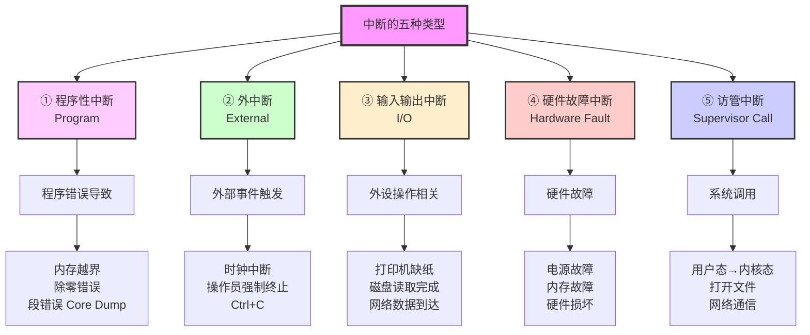

---

## 1. 程序性中断 ⭐⭐

**特点**：由程序自身的错误或特定状态引起

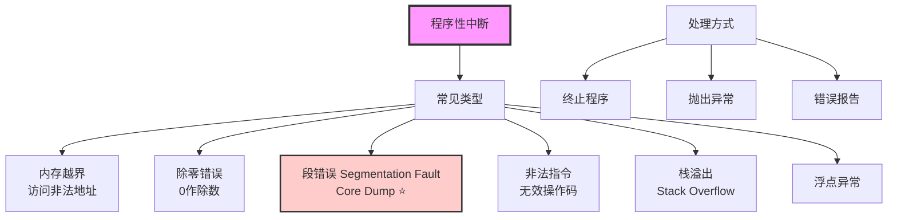

**典型示例**：

1. **内存越界**：
   ```c
   int arr[10];
   arr[100] = 5;  // 访问越界，触发程序性中断
   ```

2. **除零错误**：
   ```c
   int x = 10 / 0;  // 除零操作，触发中断
   ```

3. **段错误（Core Dump）**：
   ```c
   int *p = NULL;
   *p = 5;  // 空指针解引用，触发段错误
   ```

> **开发经验**：程序员最怕的就是Core Dump（核心转储），因为这意味着程序崩溃了，需要调试修复。

---

## 2. 外中断 ⭐

**特点**：由外部事件触发，与当前进程无关

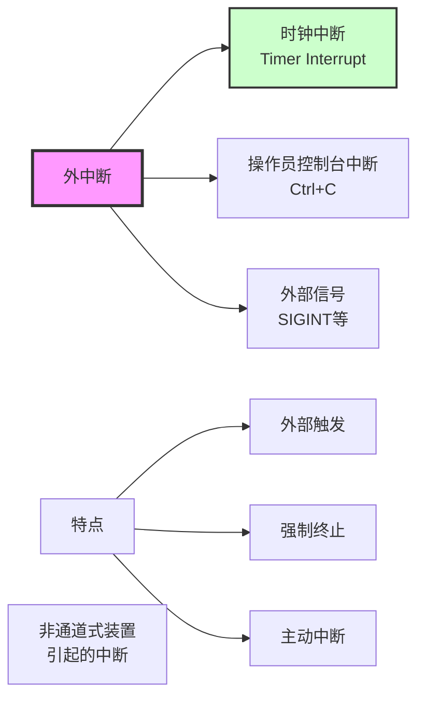

**典型示例**：

1. **时钟中断**：
   - 定时器到期触发
   - 用于时间片轮转调度
   - 系统时间更新

2. **Ctrl+C 强制终止**：
   - 用户按下Ctrl+C
   - 发送SIGINT信号
   - 终止当前运行的程序

3. **操作员控制台中断**：
   - 系统管理员kill进程
   - 任务管理器强制结束

> **关键理解**：外中断是外部主动触发的，程序本身没有问题，只是被外部强制打断。

---

## 3. 输入输出中断 ⭐⭐

**特点**：外设操作完成或发生异常

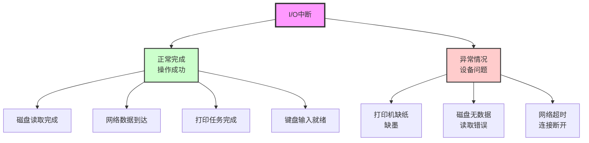

**重要理解**：

- I/O中断**不一定是故障**
- 更多是设备操作的**完成通知**
- 异常情况（如缺纸）不算硬件故障，是可恢复的

**典型场景**：

1. **正常完成**：
   - 磁盘读取完成 → 通知CPU数据已准备好
   - 网络数据包到达 → 通知CPU处理数据
   - 打印完成 → 通知CPU打印机空闲

2. **异常情况**：
   - 打印机缺纸 → 通知CPU等待补纸
   - 磁盘读取失败 → 通知CPU重试或报错

---

## 4. 硬件故障中断 ⭐

**特点**：硬件出现真正的故障

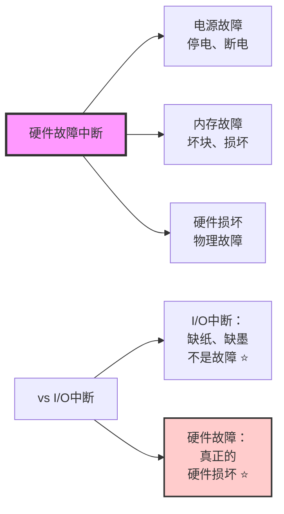

**区分要点** ⭐⭐⭐：

| 情况 | 类型 | 是否可恢复 |
|------|------|-----------|
| 打印机缺纸 | I/O中断 ✓ | 可恢复（补纸即可）|
| 打印机损坏 | 硬件故障中断 ✓ | 需要维修 |
| 磁盘无数据 | I/O中断 | 正常情况 |
| 磁盘损坏 | 硬件故障中断 | 需要更换 |
| 网络超时 | I/O中断 | 可重试 |
| 网卡烧坏 | 硬件故障中断 | 需要更换 |

> **考试技巧**：I/O中断和硬件故障中断的区别是常考点，记住"缺纸不是故障，损坏才是故障"。

---

## 5. 访管中断（系统调用）⭐⭐⭐（重要）

**定义**：用户程序请求操作系统服务时产生的中断

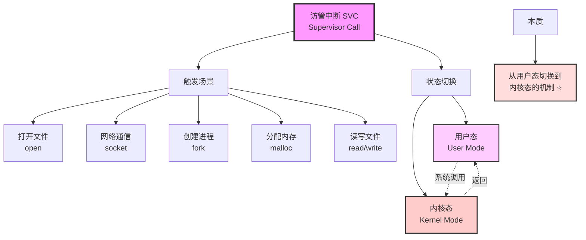

**访管中断的作用**：

1. **提供用户程序访问系统资源的接口**
2. **实现用户态到内核态的切换**
3. **保证系统安全性**（用户不能直接操作硬件）

**常见系统调用**：

| 类型 | 系统调用示例 | 说明 |
|------|------------|------|
| 文件操作 | open, read, write, close | 打开、读写、关闭文件 |
| 进程管理 | fork, exec, exit, wait | 创建、执行、终止进程 |
| 内存管理 | malloc, free, mmap | 分配、释放内存 |
| 网络通信 | socket, bind, listen, accept | 网络编程 |
| 设备管理 | ioctl | 设备控制 |

---

## 用户态 vs 内核态 ⭐⭐

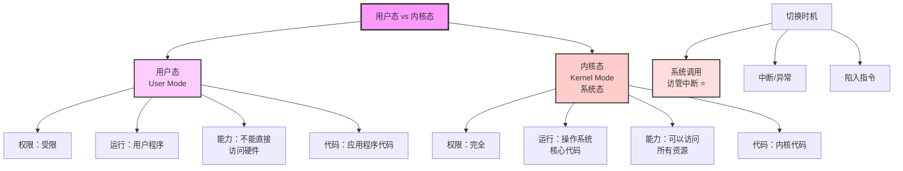

### 详细对比表

| 特性 | 用户态（User Mode） | 内核态（Kernel Mode） |
|------|-------------------|---------------------|
| **权限级别** | 受限权限（低特权级） | 完全权限（高特权级）⭐ |
| **运行内容** | 用户程序、应用软件 | 操作系统核心代码 |
| **硬件访问** | 不能直接访问硬件 ⭐ | 可以访问所有硬件资源 ⭐ |
| **指令集** | 只能执行非特权指令 | 可以执行所有指令（含特权指令） |
| **内存访问** | 只能访问用户空间 | 可以访问所有内存空间 |
| **安全性** | 隔离保护，安全 | 完全控制，风险高 |
| **崩溃影响** | 只影响当前进程 | 可能导致系统崩溃 |

---

### 为什么需要两种状态？

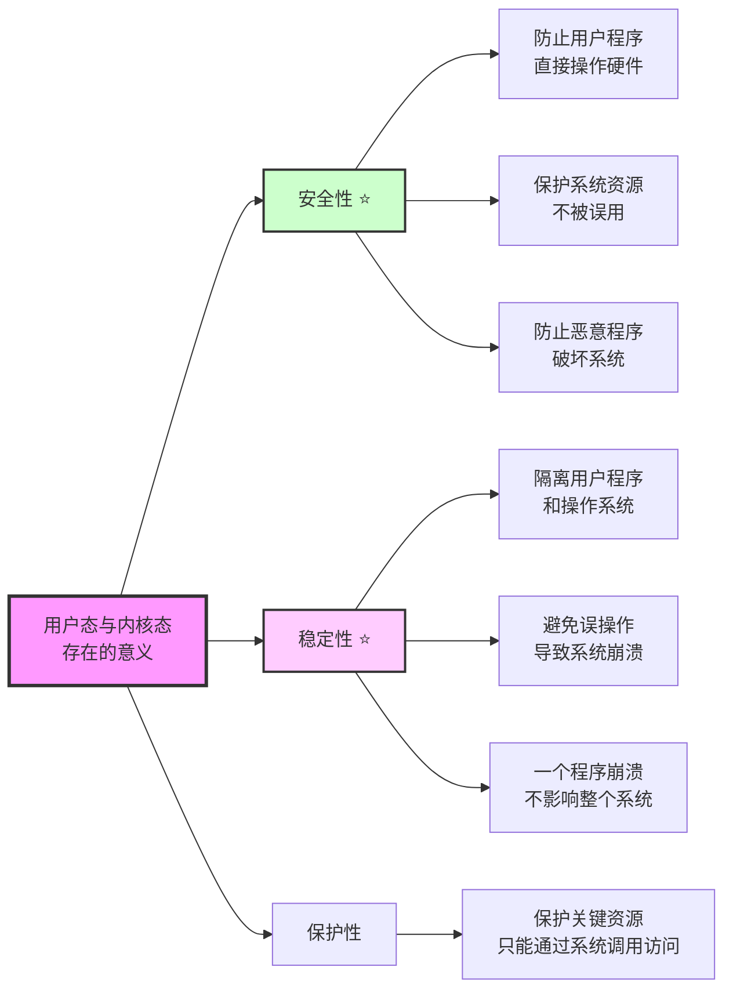

---

### 状态切换时机 ⭐⭐

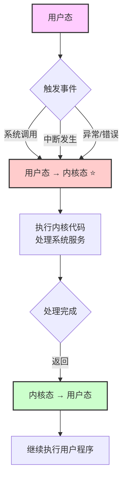

**切换详解**：

**用户态 → 内核态**（3种方式）：
1. **系统调用**（主动）：用户程序主动请求系统服务
2. **中断**（被动）：外部事件触发（如IO完成）
3. **异常**（被动）：程序错误（如除零、越界）

**内核态 → 用户态**：
1. 系统调用返回
2. 中断处理完成
3. 进程调度（切换到用户进程）

---

### 形象比喻

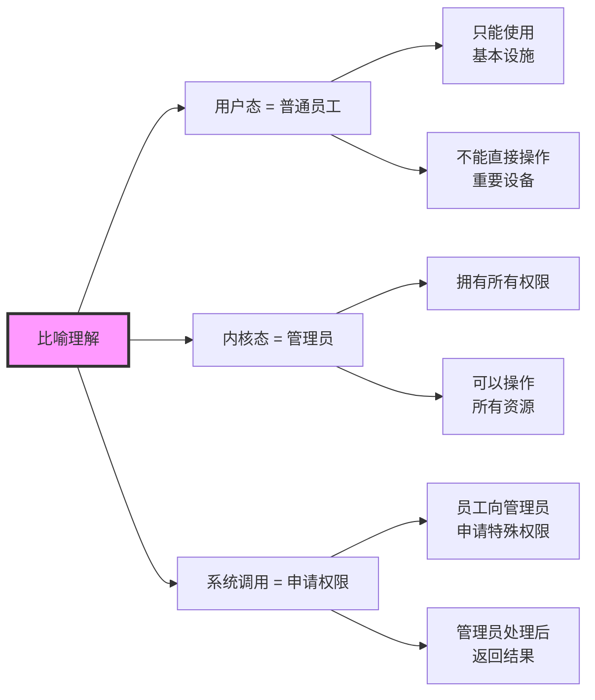

---

## 内核架构：单体内核 vs 微内核 ⭐

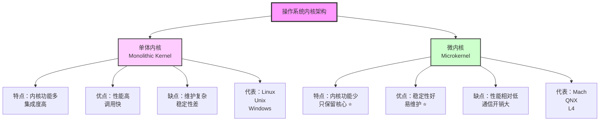

### 详细对比表

| 特性 | 单体内核 | 微内核 |
|------|---------|--------|
| **内核大小** | 大（功能多） | 小（功能少）⭐ |
| **集成度** | 高（功能集中） | 低（功能分散） |
| **性能** | 高（直接调用） | 相对低（通信开销） |
| **稳定性** | 低（牵一发动全身） | 高（模块独立）⭐ |
| **维护性** | 复杂（代码耦合） | 简单（模块化）⭐ |
| **扩展性** | 困难（修改影响大） | 容易（模块独立） |
| **安全性** | 风险高（权限集中） | 风险低（权限分散） |
| **典型系统** | Linux, Unix, Windows | Mach, QNX, L4 |

---

### 单体内核架构

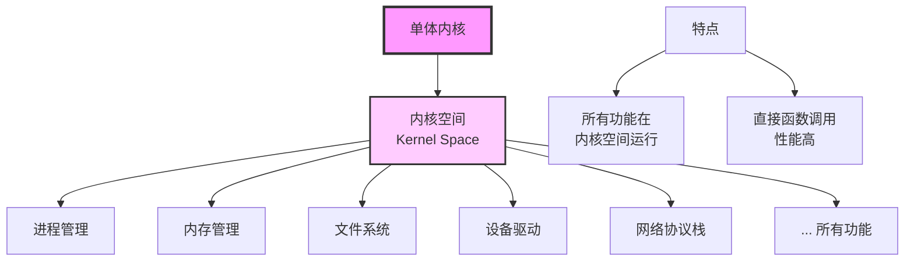

---

### 微内核架构

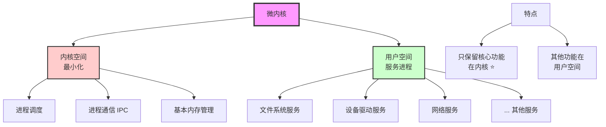

---

## 中断机制的重要性

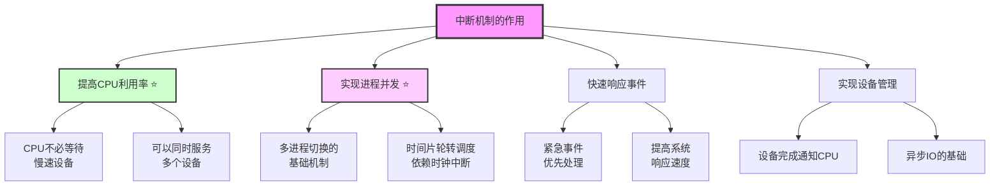

> **关键理解**：中断机制是操作系统实现多任务、并发执行的核心机制之一。没有中断，就没有现代操作系统的高效率。

---

## 💡 学习要点

### 必须掌握的知识点 ⭐⭐⭐

1. **中断的五种分类及区别**：
   - 程序性中断：代码错误
   - 外中断：外部强制
   - I/O中断：设备操作
   - 硬件故障：真正损坏
   - 访管中断：系统调用

2. **I/O中断 vs 硬件故障中断**：
   - 打印机缺纸 → I/O中断
   - 打印机损坏 → 硬件故障中断

3. **用户态 vs 内核态**：
   - 权限不同
   - 切换时机（系统调用）

### 记忆口诀

- **中断五类**：程序（代码错）、外部（强制停）、IO（设备事）、硬件（真故障）、访管（系统调用）
- **内核架构**：单体（大而全）、微内核（小而精）
- **状态切换**：系统调用上，中断处理下

---

## ✅ 自测题

### 选择题

1. 以下哪种中断类型是由程序错误引起的？
   - A. 外中断
   - B. 程序性中断 ✓
   - C. 访管中断
   - D. 输入输出中断

2. 打印机缺纸属于哪种中断类型？
   - A. 硬件故障中断
   - B. 输入输出中断 ✓
   - C. 外中断
   - D. 程序性中断

3. 用户程序调用系统函数打开文件时，会产生什么中断？
   - A. 程序性中断
   - B. 外中断
   - C. 访管中断（系统调用）✓
   - D. 输入输出中断

4. 以下关于用户态和内核态的说法，错误的是？
   - A. 用户态权限受限
   - B. 内核态可以访问所有资源
   - C. 系统调用会从用户态切换到内核态
   - D. 用户态可以直接访问硬件 ✓

5. 微内核相比单体内核的主要优势是？
   - A. 性能更高
   - B. 稳定性更好 ✓
   - C. 调用速度更快
   - D. 集成度更高

---

### 简答题

**题目1**：请说明中断的五种分类及其区别。

<details>
<summary>点击查看答案</summary>

**中断的五种分类**：

1. **程序性中断**：
   - 原因：程序代码错误或特定状态
   - 举例：内存越界、除零错误、段错误（Core Dump）
   - 特点：由程序自身引起

2. **外中断**：
   - 原因：外部事件触发
   - 举例：时钟中断、Ctrl+C强制终止、操作员控制台中断
   - 特点：外部强制触发，与当前进程无关

3. **输入输出中断**：
   - 原因：外设操作完成或异常
   - 举例：打印机缺纸、磁盘读取完成、网络数据到达
   - 特点：设备相关，但不一定是故障

4. **硬件故障中断**：
   - 原因：硬件真正出现故障
   - 举例：电源故障、内存故障、硬件损坏
   - 特点：真正的硬件损坏，需要维修

5. **访管中断（系统调用）**：
   - 原因：用户程序请求操作系统服务
   - 举例：打开文件、网络通信、创建进程
   - 特点：从用户态切换到内核态的机制 ⭐

**区分要点**：
- I/O中断 vs 硬件故障中断：
  - 打印机缺纸 → I/O中断（可以补充解决）
  - 打印机损坏 → 硬件故障中断（需要维修）

**记忆口诀**：程序（代码错）、外部（强制停）、IO（设备事）、硬件（真故障）、访管（系统调用）

</details>

---

**题目2**：请说明用户态和内核态的区别及切换时机。

<details>
<summary>点击查看答案</summary>

**用户态 vs 内核态**：

| 特性 | 用户态（User Mode） | 内核态（Kernel Mode） |
|------|-------------------|---------------------|
| **权限** | 受限 | 完全权限 |
| **运行内容** | 用户程序 | 操作系统核心代码 |
| **访问能力** | 不能直接访问硬件 | 可以访问所有资源 |
| **安全性** | 隔离保护 | 完全控制 |

**为什么需要两种状态？**

1. **安全性**：
   - 防止用户程序直接操作硬件
   - 保护系统资源不被误操作

2. **稳定性**：
   - 隔离用户程序和操作系统
   - 避免用户程序错误导致系统崩溃

**切换时机**：

1. **用户态 → 内核态**：
   - 系统调用（访管中断）⭐
   - 中断发生
   - 异常/错误发生

2. **内核态 → 用户态**：
   - 系统调用返回
   - 中断处理完成
   - 进程调度（切换到用户进程）

**形象比喻**：
- 用户态 = 普通员工（只能使用基本设施）
- 内核态 = 管理员（拥有所有权限）
- 系统调用 = 向管理员申请特殊权限

</details>

---

**题目3**：请说明单体内核和微内核的主要区别。

<details>
<summary>点击查看答案</summary>

**单体内核 vs 微内核**：

| 特性 | 单体内核 | 微内核 |
|------|---------|--------|
| **内核大小** | 大（功能多） | 小（功能少）⭐ |
| **性能** | 高（直接调用） | 相对低（通信开销） |
| **稳定性** | 低（牵一发动全身） | 高（模块独立）⭐ |
| **维护性** | 复杂 | 简单 ⭐ |
| **扩展性** | 困难 | 容易 |
| **典型系统** | Linux, Unix, Windows | Mach, QNX, L4 |

**单体内核**：
- 所有功能集成在内核空间
- 直接函数调用，性能高
- 代码耦合度高，维护复杂
- 一个模块出错可能影响整个系统

**微内核**：
- 只保留最核心功能在内核（进程调度、IPC、基本内存管理）
- 其他功能在用户空间作为服务进程运行
- 模块独立，稳定性好，易维护
- 模块间通信需要IPC，有一定开销

**选择建议**：
- 追求性能：单体内核
- 追求稳定性和可维护性：微内核

**记忆口诀**：单体（大而全）、微内核（小而精）

</details>

---

## 📚 相关文档

- **主文档**：[第二章-2-进程管理](./第二章-2-进程管理.md)
- **相关主题**：
  - [第二章-2.9-进程与线程](./第二章-2.9-进程与线程.md)
  - [第二章-2.2-进程三态图](./第二章-2-进程管理.md#22-进程的三态图)

---

## 📝 总结

**核心要点**：

1. **中断是事件驱动的暂停机制** ⭐⭐
2. **五种中断分类要清楚区分** ⭐⭐⭐
3. **I/O中断 ≠ 硬件故障中断**（缺纸不是故障）⭐⭐⭐
4. **访管中断实现用户态→内核态切换** ⭐⭐⭐
5. **中断是实现多任务并发的基础** ⭐⭐

**记忆口诀**：
- 中断五类：程序（代码错）、外部（强制停）、IO（设备事）、硬件（真故障）、访管（系统调用）
- 内核架构：单体（大而全）、微内核（小而精）

**考试重点**：
- 中断的分类及区别（必考）
- I/O中断 vs 硬件故障中断（高频）
- 用户态和内核态的切换（重要）

---

> **文档生成信息**
> 📅 生成时间：2026-02-06
> 🤖 生成方式：从进程管理文档中独立拆分
> 📖 适用对象：软考高级系统架构师考试备考
> ✍️ 建议：重点掌握中断的五种分类，特别是I/O中断和硬件故障中断的区别
