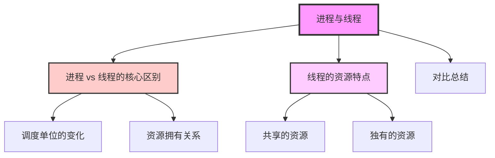
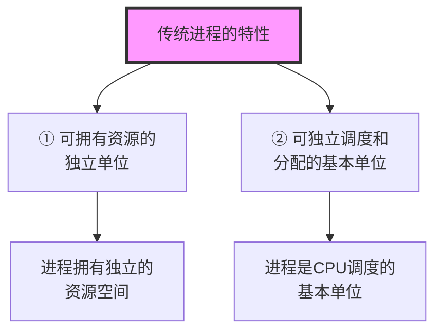
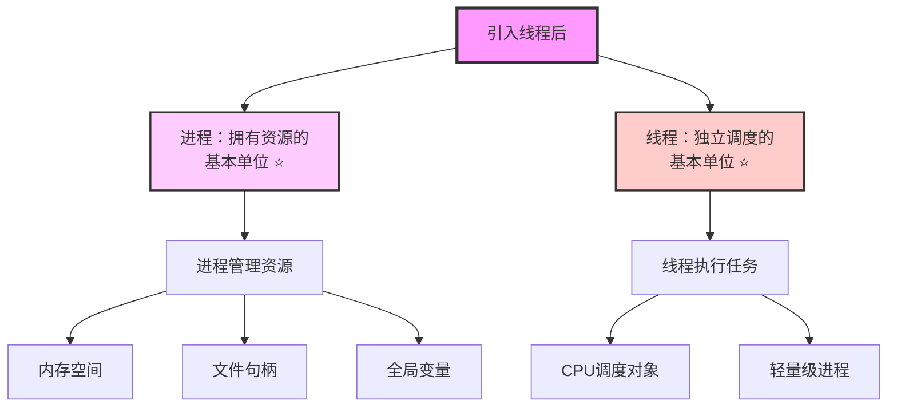
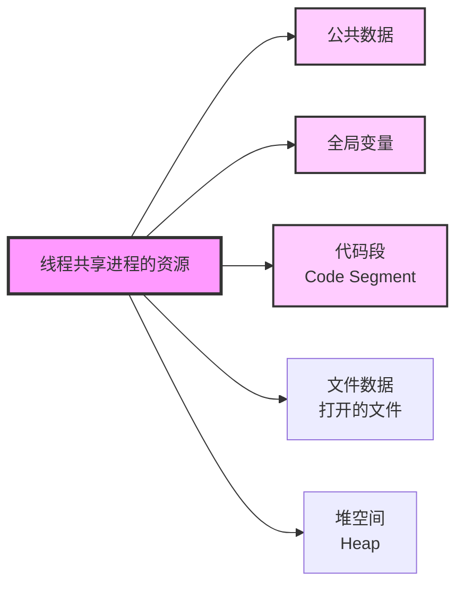
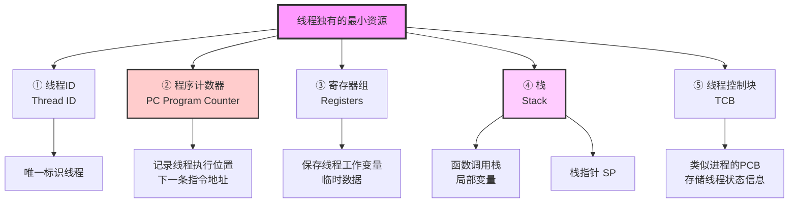
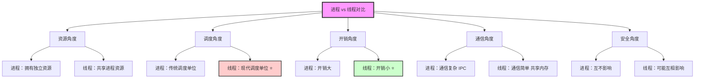
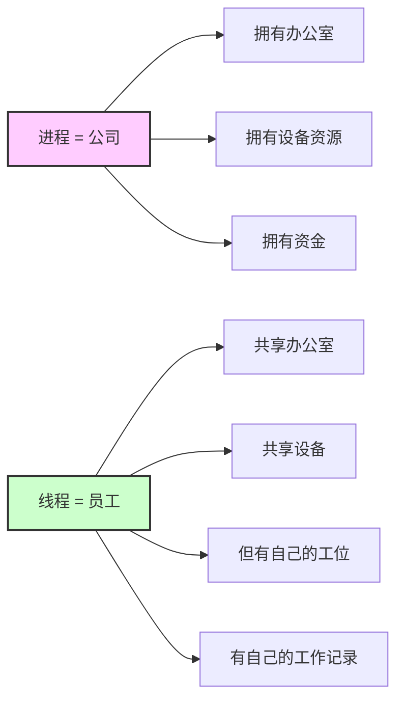
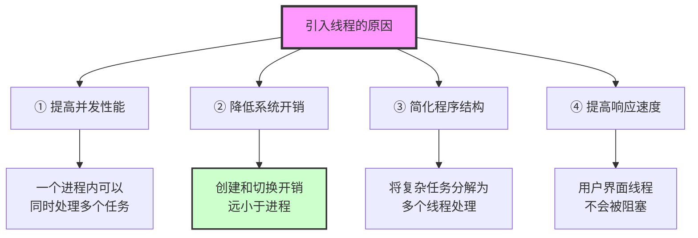
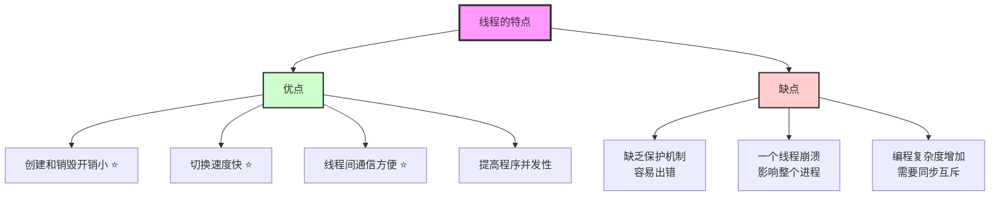

# 第二章 操作系统知识 - 进程与线程 ⭐⭐

> **学习提示**：进程与线程的区别是操作系统的重要考点，需要清楚理解两者在资源拥有和调度方面的差异。

---

## 📚 内容导览

---

## 进程 vs 线程 ⭐⭐（重要对比）

### 传统进程的两个特性

---

### 引入线程后的变化 ⭐⭐⭐

**核心变化**：
- **传统进程**：既拥有资源，又是调度单位
- **引入线程后**：
  - 进程：只负责拥有资源
  - 线程：成为独立调度的单位

---

## 线程的资源特点 ⭐⭐

### 线程不拥有的资源（与进程共享）

**重要理解**：
- 线程本身**不拥有**系统资源
- 与同一进程的其他线程**共享**进程的全部资源
- 这是线程开销小、切换快的根本原因

---

### 线程拥有的资源（线程独有）

**为什么线程需要这些资源？**

1. **线程ID**：操作系统需要唯一标识每个线程
2. **程序计数器（PC）**：线程切换时需要记住执行到哪里
3. **寄存器组**：保存线程的工作变量和临时数据
4. **栈（Stack）**：
   - 每个线程有独立的函数调用栈
   - 存储函数的局部变量和返回地址
   - 保证线程间的调用不会相互干扰
5. **线程控制块（TCB）**：存储线程的状态、优先级等信息

---

## 进程与线程对比表 ⭐⭐⭐

### 详细对比表

| 特性 | 进程 Process | 线程 Thread |
|------|-------------|-------------|
| **定义** | 资源分配的基本单位 | CPU调度的基本单位 ⭐ |
| **资源拥有** | 拥有独立的资源空间 | 不拥有资源，共享进程资源 ⭐ |
| **独立性** | 进程间相互独立 | 线程间共享进程资源 |
| **地址空间** | 独立的地址空间 | 共享进程的地址空间 |
| **创建开销** | 创建开销大（需要分配资源） | 创建开销小（共享资源）⭐ |
| **切换开销** | 切换开销大（需要切换上下文） | 切换开销小（上下文简单）⭐ |
| **通信方式** | 进程间通信较复杂 （管道、消息队列、共享内存等） | 线程间通信简单 （直接访问共享数据）⭐ |
| **并发性** | 进程间并发执行 | 同一进程内的线程并发执行 |
| **崩溃影响** | 一个进程崩溃不影响其他进程 | 一个线程崩溃可能导致整个进程崩溃 |
| **控制块** | PCB（进程控制块） | TCB（线程控制块） |
| **系统开销** | 系统开销大 | 系统开销小 ⭐ |

---

## 形象理解

### 比喻1：公司与员工

- **进程** = 一个公司（拥有办公室、设备等资源）
- **线程** = 公司里的员工（共享公司资源，但每个人有自己的工位和工作记录）

### 比喻2：餐厅与服务员

- **进程** = 一个餐厅（拥有厨房、餐具、食材等资源）
- **线程** = 餐厅里的服务员（共享餐厅资源，但每个人有自己的订单记录）

---

## 为什么引入线程？⭐⭐

**典型应用场景**：

1. **Web服务器**：
   - 一个进程处理多个客户端请求
   - 每个请求一个线程
   - 线程间共享缓存数据

2. **GUI应用程序**：
   - 主线程：处理用户界面
   - 工作线程：执行耗时任务
   - 避免界面冻结

3. **多媒体应用**：
   - 一个线程：解码视频
   - 一个线程：解码音频
   - 一个线程：显示画面

---

## 线程的优缺点

---

## 💡 学习要点

### 必须掌握的知识点 ⭐⭐⭐

1. **核心区别**：
   - 进程：拥有资源的基本单位
   - 线程：独立调度的基本单位

2. **资源关系**：
   - 线程共享进程资源（代码、数据、文件）
   - 线程独有最小资源（ID、PC、寄存器、栈、TCB）

3. **开销对比**：
   - 线程创建和切换开销远小于进程

### 考试常见题型

1. **选择题**：
   - 线程是什么的基本单位？（调度）
   - 进程是什么的基本单位？（资源拥有）
   - 线程共享哪些资源？

2. **简答题**：
   - 进程和线程的主要区别
   - 为什么引入线程？
   - 线程有哪些独立的资源？

---

## ✅ 自测题

### 选择题

1. 引入线程后，以下说法正确的是？
   - A. 线程是拥有资源的基本单位
   - B. 线程是独立调度的基本单位 ✓
   - C. 线程拥有独立的资源空间
   - D. 进程是独立调度的基本单位

2. 以下哪个资源是线程独有的？
   - A. 全局变量
   - B. 代码段
   - C. 栈空间 ✓
   - D. 堆空间

3. 线程相比进程的主要优势是？
   - A. 更安全
   - B. 更独立
   - C. 创建和切换开销小 ✓
   - D. 资源更丰富

4. 同一进程内的线程共享以下哪个资源？
   - A. 程序计数器（PC）
   - B. 寄存器组
   - C. 栈
   - D. 全局变量 ✓

---

### 简答题

**题目1**：请说明进程和线程的主要区别。

点击查看答案

**核心区别**：

1. **调度单位的变化**：
   - 传统进程：既拥有资源，又是调度单位
   - 引入线程后：进程只拥有资源，线程成为调度单位 ⭐

2. **资源拥有关系**：
   - 进程：拥有独立的资源空间
   - 线程：不拥有资源，与同进程的其他线程共享进程资源

3. **线程共享的资源**：
   - 公共数据
   - 全局变量
   - 代码段
   - 文件数据

4. **线程独有的资源**：
   - 线程ID（标识）
   - 程序计数器（PC）
   - 寄存器组
   - 栈（Stack）
   - 线程控制块（TCB）

**对比表**：

| 特性 | 进程 | 线程 |
|------|------|------|
| 资源拥有 | 拥有独立资源 | 共享进程资源 |
| 调度 | 传统上是调度单位 | 现代系统的调度单位 ⭐ |
| 开销 | 创建和切换开销大 | 创建和切换开销小 |
| 通信 | 进程间通信复杂 | 线程间通信简单 |
| 崩溃影响 | 互不影响 | 可能导致整个进程崩溃 |

**记忆口诀**：进程拥有资源，线程负责调度

---

**题目2**：为什么线程的创建和切换开销比进程小？

点击查看答案

**原因分析**：

1. **创建开销对比**：
   - **进程创建**：
     - 需要分配独立的地址空间
     - 需要分配各种资源（内存、文件句柄等）
     - 需要创建PCB（进程控制块）
     - 开销大 ⚠️

   - **线程创建**：
     - 共享进程的地址空间和资源
     - 只需要创建简单的TCB（线程控制块）
     - 只需要分配栈空间和少量资源
     - 开销小 ✓

2. **切换开销对比**：
   - **进程切换**：
     - 需要切换地址空间（切换页表）
     - 需要保存和恢复大量的上下文信息
     - 可能导致缓存失效
     - 开销大 ⚠️

   - **线程切换**：
     - 在同一地址空间内切换（无需切换页表）
     - 只需保存和恢复少量上下文（PC、寄存器、栈指针）
     - 缓存可以继续使用
     - 开销小 ✓

3. **根本原因**：
   - 线程共享进程资源，不需要重复分配和切换资源
   - 线程切换不涉及地址空间的切换

---

**题目3**：线程有哪些独立的资源？为什么需要这些资源？

点击查看答案

**线程独有的资源**：

1. **线程ID（Thread ID）**：
   - 作用：唯一标识线程
   - 原因：操作系统需要区分和管理不同的线程

2. **程序计数器（PC，Program Counter）**：
   - 作用：记录线程当前执行到哪条指令
   - 原因：线程切换时需要记住执行位置，恢复时从正确的地方继续

3. **寄存器组（Registers）**：
   - 作用：保存线程的工作变量和临时数据
   - 原因：线程切换时需要保存当前的工作状态

4. **栈（Stack）**：
   - 作用：存储函数调用信息、局部变量、返回地址
   - 原因：每个线程需要独立的函数调用栈，避免相互干扰
   - 包含：栈指针（SP）

5. **线程控制块（TCB，Thread Control Block）**：
   - 作用：存储线程的状态、优先级、调度信息
   - 原因：操作系统需要管理和调度线程
   - 类似于进程的PCB，但更简单

**为什么需要这些资源？**

这些是线程能够独立执行和被调度所必需的**最小资源集合**。没有这些资源，线程就无法：
- 被正确标识和管理
- 记住执行状态
- 独立执行函数调用
- 被操作系统调度

---

## 📚 相关文档

- **主文档**：[第二章-2-进程管理](./第二章-2-进程管理.md)
- **相关主题**：
  - [第二章-2.2-进程三态图](./第二章-2-进程管理.md#22-进程的三态图)
  - [第二章-2.7-进程调度算法](./第二章-2-进程管理.md#27-进程调度算法)
  - [第二章-2.10-中断机制](./第二章-2.10-中断机制.md)

---

## 📝 总结

**核心要点**：

1. **进程是资源拥有的基本单位** ⭐⭐⭐
2. **线程是独立调度的基本单位** ⭐⭐⭐
3. **线程共享进程资源，开销小** ⭐⭐⭐
4. **线程独有最小资源：ID、PC、寄存器、栈、TCB** ⭐⭐

**记忆口诀**：
- 进程拥有资源，线程负责调度
- 线程共享多，独有少，开销小

**考试重点**：
- 进程与线程的区别（必考）
- 线程共享和独有的资源（高频）
- 线程的优势（开销小）

---

> **文档生成信息**
> 📅 生成时间：2026-02-06
> 🤖 生成方式：从进程管理文档中独立拆分
> 📖 适用对象：软考高级系统架构师考试备考
> ✍️ 建议：重点理解进程和线程在资源和调度上的区别
