# 第二章 操作系统知识 - 第三、四部分：存储管理与设备管理 ⭐⭐⭐

> **学习提示**：存储管理和设备管理是操作系统的重要组成部分。存储管理（特别是页式存储）是高频考点，设备管理相对考得较少。本文档详细梳理两部分内容，帮助考生系统掌握考试要点。

---

## 📚 本部分内容导览

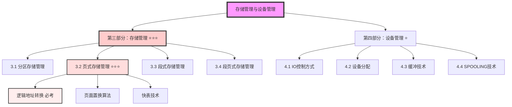

**重点标注**：
- ⭐ 基础了解（偶尔考察）
- ⭐⭐ 重要考点（需要理解掌握）
- ⭐⭐⭐ 核心考点（必考内容，需熟练掌握）

---

## 第三部分：存储管理 ⭐⭐⭐

> **核心提示**：存储管理主要管理**内存（主存）**资源，是操作系统五大功能之一。页式存储管理是本部分的核心考点。

---

## 3.1 分区存储管理

### 基本概念

**分区存储管理**：一种**整存整取**的内存管理方式。

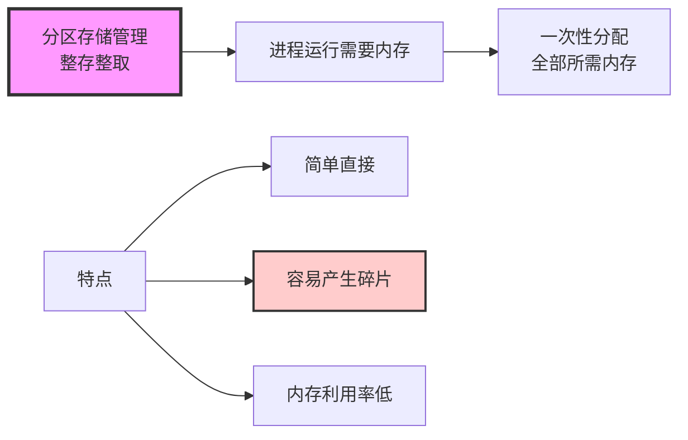

> **形象比喻**：就像租房子，要么给你整套房子，不能只租一个房间。

---

### 分区存储的三种方式

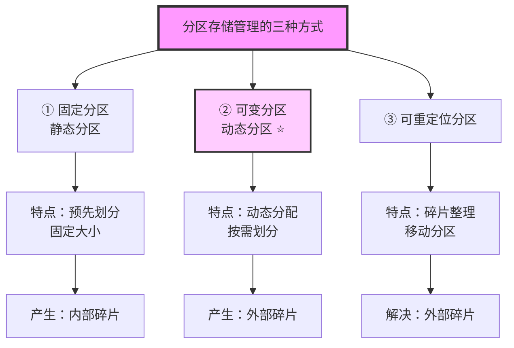

---

### 方式1：固定分区（静态分区）

**原理**：预先将内存划分成若干个**固定大小**的分区。

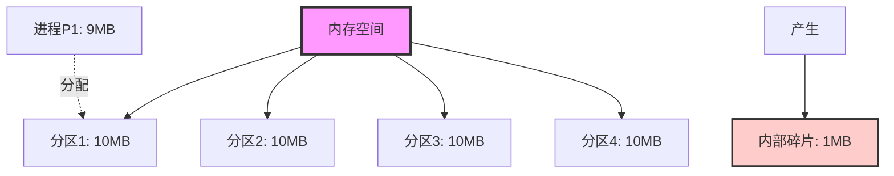

**问题：内部碎片**

```
场景：
- 分区大小：10MB
- 进程需要：9MB
- 结果：浪费1MB（内部碎片）

定义：分区内部未被利用的空间
```

---

### 方式2：可变分区（动态分区）⭐

**原理**：进程装入内存时，**动态划分**所需大小的分区。

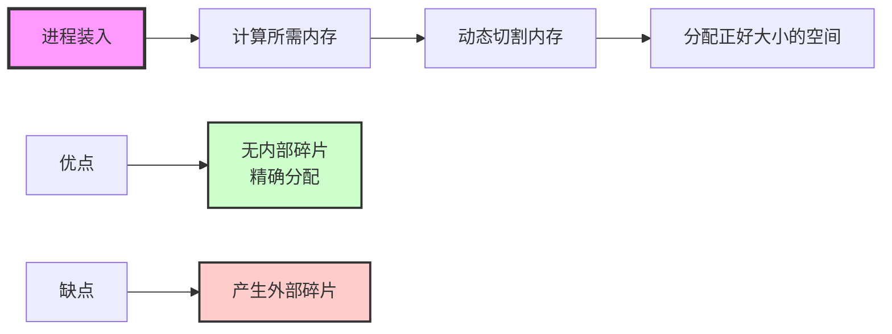

**问题：外部碎片**

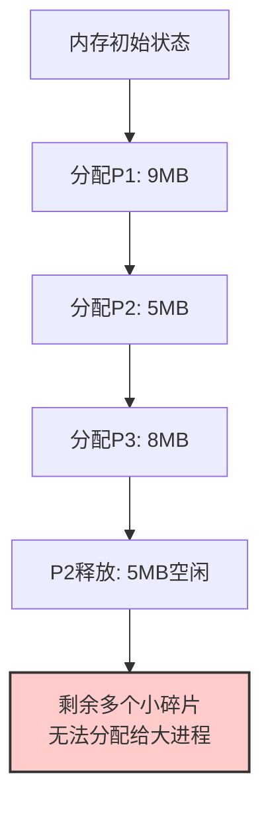

**定义**：分区之间产生的、无法利用的小空闲块。

> **形象比喻**：像切肉一样，切来切去剩下一些边角料，单个边角料太小无法使用。

---

### 方式3：可重定位分区

**原理**：通过**移动**和**整理**分区，将外部碎片合并成大的连续空间。

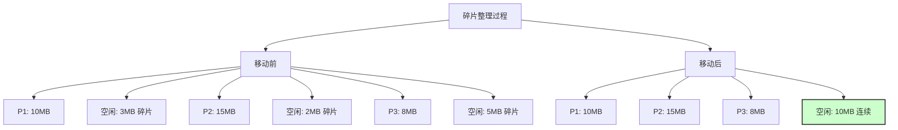

**效果**：
- 消除外部碎片
- 形成连续的大空闲区

**代价**：
- 需要移动内存数据
- 有一定开销

---

### 内部碎片 vs 外部碎片

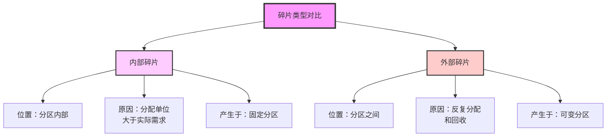

| 类型 | 位置 | 原因 | 解决方法 |
|------|------|------|----------|
| **内部碎片** | 分区内部 | 分配过大 | 减小分区单位 |
| **外部碎片** | 分区之间 | 反复分配回收 | 碎片整理、紧缩 |

---

## 3.2 页式存储管理 ⭐⭐⭐（核心考点）

### 为什么需要页式存储？

**分区存储的根本问题**：整存整取导致内存永远不够用。

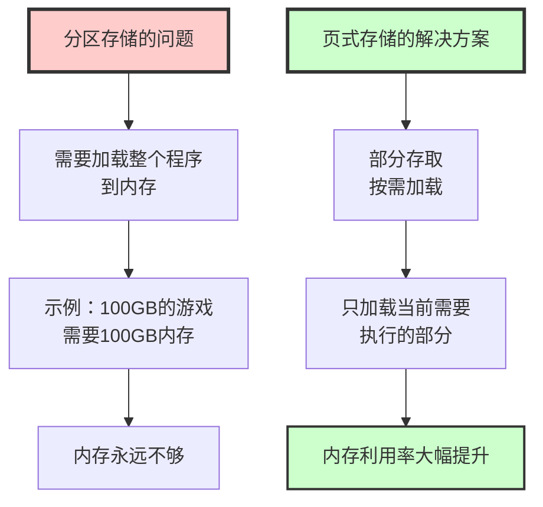

> **核心思想**：程序不是所有部分都要同时运行，按需加载即可！

---

### 页式存储基本原理

**核心机制**：将程序和内存都分成固定大小的"页"。

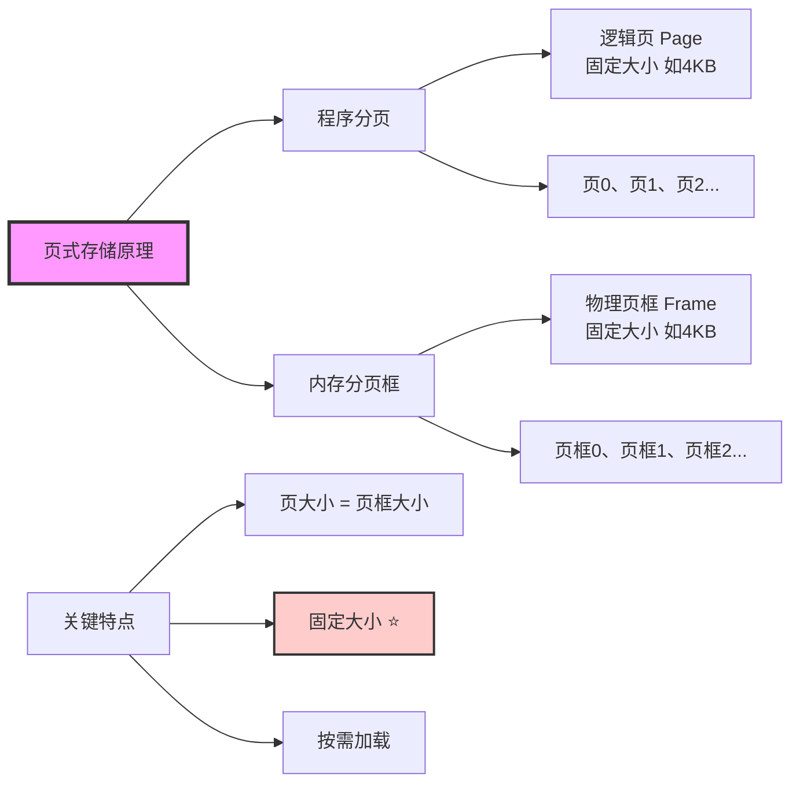

**关键点**：
1. **页大小固定**（如4KB）
2. **页大小 = 页框大小**
3. **部分加载**（不需要全部加载）

> **形象比喻**：页就像书的一页，页框就像书架的格子。书页大小和格子大小一样，可以灵活摆放。

---

### 页地址的组成 ⭐⭐⭐（必考）

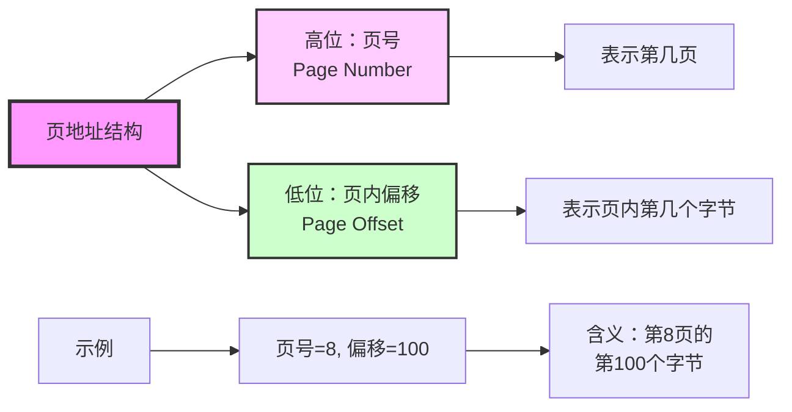

---

### 逻辑地址到物理地址的转换 ⭐⭐⭐（核心考点）

**转换流程**：

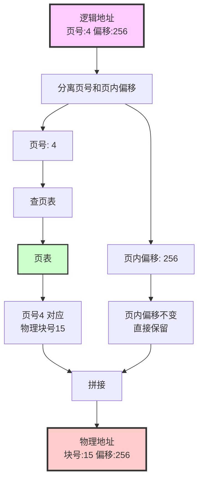

---

**详细步骤**：

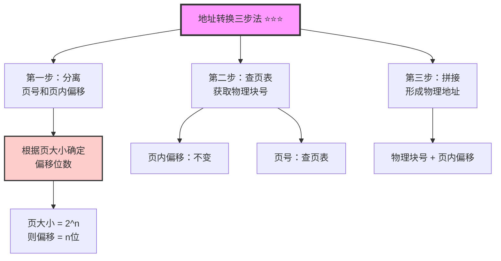

---

### 如何分离页号和页内偏移？⭐⭐⭐（考试技巧）

**核心公式**：页大小 = 2^n，则页内偏移占 n 位

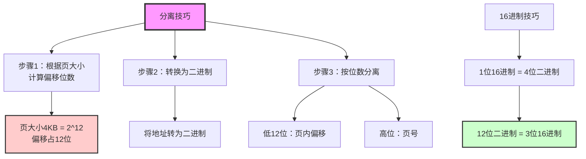

---

**示例分析**：

```
题目：页大小4KB，逻辑地址为 1A2BH（16进制），求物理地址。

第一步：计算页内偏移位数
- 页大小 = 4KB = 4096B = 2^12B
- 页内偏移 = 12位二进制 = 3位16进制

第二步：分离
- 地址 1A2BH = 1 | A2B
- 高位（页号）：1
- 低3位（页内偏移）：A2B

第三步：查页表（假设页表显示页号1对应物理块号5）
- 页号 1 → 物理块号 5

第四步：拼接
- 物理地址 = 5A2BH
```

---

### 页面置换算法 ⭐⭐

当内存中的页框满了，需要调入新页时，需要**淘汰**旧页。

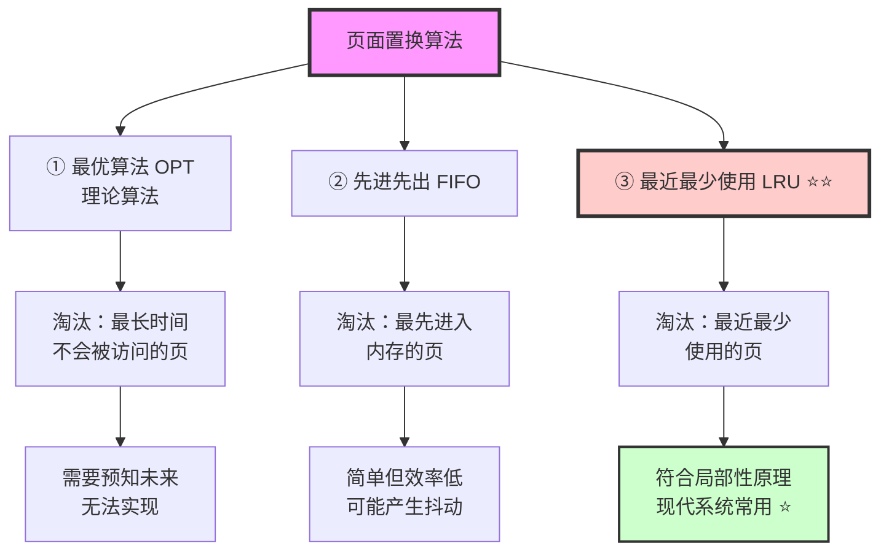

---

### 最近最少使用（LRU）算法详解 ⭐⭐⭐

**核心原理**：基于**局部性原理**

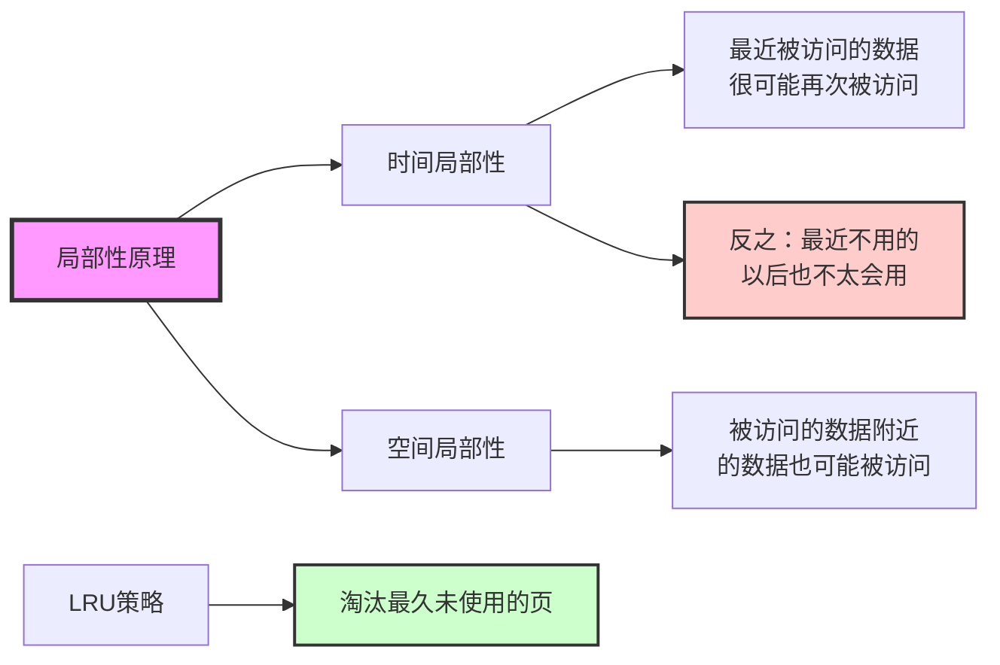

**淘汰优先级**（默认规则）：

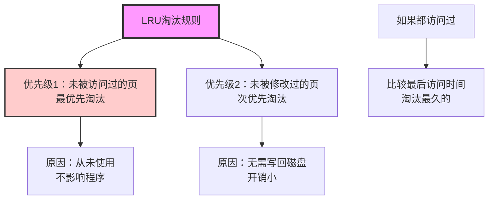

> **考试技巧**：如果题目未指定算法，默认使用LRU；优先淘汰未访问的，其次未修改的。

---

### 快表（TLB）技术 ⭐

**问题**：每次地址转换都要访问内存中的页表，效率低。

**解决方案**：快表（Translation Lookaside Buffer, TLB）

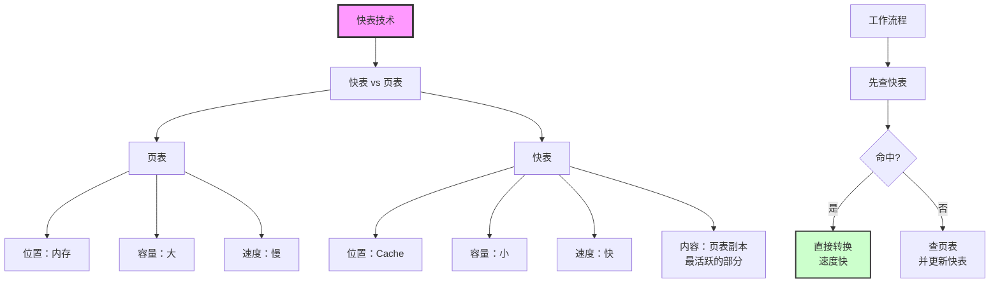

**类比**：快表 vs 页表 = Cache vs 内存

---

## 3.3 段式存储管理 ⭐

### 段式存储基本原理

**核心思想**：按照程序的**逻辑功能**划分段。

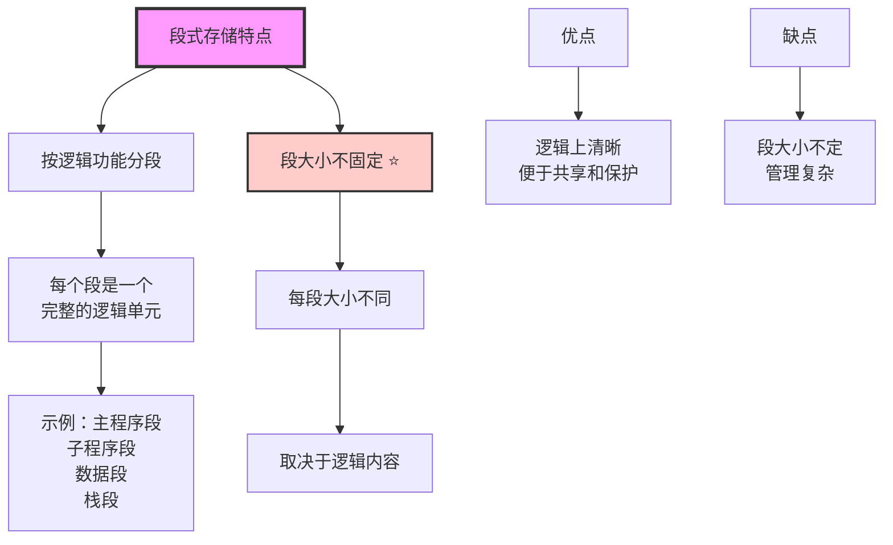

---

### 页式 vs 段式对比 ⭐⭐

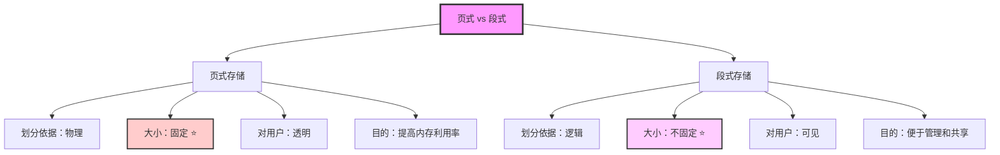

| 特性 | 页式存储 | 段式存储 |
|------|---------|---------|
| **划分依据** | 物理（固定大小） | 逻辑（功能模块） |
| **大小** | 固定（如4KB） | 可变 |
| **对用户** | 透明 | 可见 |
| **碎片** | 内部碎片 | 外部碎片 |
| **地址结构** | 页号+页内偏移 | 段号+段内偏移 |

---

### 段地址结构

```mermaid
graph LR
    A[段地址结构] --> B[高位：段号<br/>Segment Number]
    A --> C[低位：段内偏移<br/>Segment Offset]

    D[段表内容] --> E[段号]
    D --> F[段长<br/>防止越界]
    D --> G[基地址<br/>起始位置]

    style A fill:#f9f,stroke:#333,stroke-width:3px
```

**地址转换**（与页式类似但需检查越界）：

```mermaid
flowchart TD
    A[段地址] --> B[分离段号和段内偏移]
    B --> C[查段表]
    C --> D{段内偏移 < 段长?}
    D -->|是| E[基地址 + 段内偏移<br/>= 物理地址]
    D -->|否| F[越界错误]

    style A fill:#fcf,stroke:#333,stroke-width:2px
    style F fill:#fcc,stroke:#333,stroke-width:2px
    style E fill:#cfc,stroke:#333,stroke-width:2px
```

> **关键区别**：段式需要检查**越界**，页式不需要（因为页大小固定）。

---

## 3.4 段页式存储管理 ⭐

### 基本原理

**核心思想**：**先分段，后分页**（按名字顺序）

```mermaid
graph TB
    A[段页式存储] --> B[第一层：按逻辑分段]
    B --> C[第二层：段内分页]

    B --> B1[段1<br/>主程序]
    B --> B2[段2<br/>子程序]
    B --> B3[段3<br/>数据段]

    C --> C1[段1内：页0、页1、页2...]
    C --> C2[段2内：页0、页1、页2...]
    C --> C3[段3内：页0、页1、页2...]

    style A fill:#f9f,stroke:#333,stroke-width:3px
    style B fill:#fcf,stroke:#333,stroke-width:2px
    style C fill:#cfc,stroke:#333,stroke-width:2px
```

---

### 段页式地址结构

```mermaid
graph LR
    A[段页式地址<br/>三个字段] --> B[段号<br/>Segment]
    A --> C[段内页号<br/>Page in Segment]
    A --> D[页内偏移<br/>Offset in Page]

    E[地址转换] --> F[段号 → 查段表]
    F --> G[段内页号 → 查页表]
    G --> H[页内偏移 → 不变]
    H --> I[拼接成物理地址]

    style A fill:#f9f,stroke:#333,stroke-width:3px
```

**优点**：
- 结合了段式和页式的优点
- 逻辑清晰 + 内存利用率高

**缺点**：
- 地址转换复杂（需要两次查表）
- 管理开销大

> **记忆技巧**：段页式 = 先段后页，地址也是按这个顺序：段号 → 段内页号 → 页内偏移

---

## 第四部分：设备管理 ⭐

> **核心提示**：设备管理主要管理**外部设备（IO设备）**，考试频率相对较低，了解核心概念即可。

---

## 4.1 IO控制方式 ⭐⭐

### IO控制的四种方式

```mermaid
graph TB
    A[IO控制方式演进] --> B[① 程序控制方式]
    A --> C[② 中断控制方式]
    A --> D[③ DMA方式 ⭐]
    A --> E[④ 通道控制方式]

    B --> B1[CPU轮询检查]
    B1 --> B11[效率最低<br/>CPU利用率低]

    C --> C1[设备完成时中断CPU]
    C1 --> C11[CPU利用率提高<br/>仍需CPU干预]

    D --> D1[DMA控制器<br/>直接访问内存]
    D1 --> D11[CPU几乎不干预<br/>效率高 ⭐]

    E --> E1[IO处理机<br/>独立处理IO]
    E1 --> E11[CPU完全解放<br/>适合大型机]

    style A fill:#f9f,stroke:#333,stroke-width:3px
    style D fill:#fcc,stroke:#333,stroke-width:2px
```

---

### 方式对比

```mermaid
graph TB
    A[四种方式对比] --> B[CPU参与程度]
    A --> C[数据传输单位]
    A --> D[效率]

    B --> B1[程序控制：全程参与]
    B --> B2[中断方式：部分参与]
    B --> B3[DMA：几乎不参与 ⭐]
    B --> B4[通道：完全不参与]

    C --> C1[程序控制：字节]
    C --> C2[中断方式：字节]
    C --> C3[DMA：数据块 ⭐]
    C --> C4[通道：数据块]

    D --> D1[程序控制 < 中断 < DMA < 通道]

    style A fill:#f9f,stroke:#333,stroke-width:3px
    style B3 fill:#fcc,stroke:#333,stroke-width:2px
    style C3 fill:#fcc,stroke:#333,stroke-width:2px
```

| 方式 | CPU参与度 | 传输单位 | 适用场景 |
|------|----------|---------|---------|
| **程序控制** | 全程 | 字节 | 低速设备 |
| **中断方式** | 部分 | 字节 | 一般速度设备 |
| **DMA方式** ⭐ | 极少 | 数据块 | 高速设备（磁盘） |
| **通道方式** | 无 | 数据块 | 大型机、多设备 |

---

### DMA方式详解 ⭐⭐

**DMA（Direct Memory Access）**：直接内存访问

```mermaid
graph LR
    A[DMA工作流程] --> B[CPU发起IO请求]
    B --> C[DMA控制器接管]
    C --> D[DMA直接与内存<br/>交换数据]
    D --> E[传输完成后<br/>中断CPU]

    F[关键特点] --> G[数据不经过CPU]
    F --> H[以数据块为单位]
    F --> I[CPU可并行处理]

    style A fill:#f9f,stroke:#333,stroke-width:3px
    style G fill:#cfc,stroke:#333,stroke-width:2px
```

**优势**：
- CPU利用率高
- 传输效率高
- 适合大量数据传输

---

## 4.2 设备分配 ⭐

### 设备分类

```mermaid
graph TB
    A[按使用特性分类] --> B[独占设备]
    A --> C[共享设备]
    A --> D[虚拟设备]

    B --> B1[一次只能一个进程使用]
    B1 --> B11[例如：打印机<br/>磁带机]

    C --> C1[多个进程可以共享]
    C1 --> C11[例如：磁盘<br/>显示器]

    D --> D1[物理独占<br/>逻辑共享]
    D1 --> D11[通过SPOOLING技术实现]

    style A fill:#f9f,stroke:#333,stroke-width:3px
```

---

### 设备分配策略

```mermaid
graph TB
    A[设备分配策略] --> B[先请求先服务<br/>FCFS]
    A --> C[优先级调度]

    B --> B1[按请求顺序分配]
    B1 --> B11[公平但可能效率低]

    C --> C1[高优先级优先]
    C1 --> C11[效率高但可能饥饿]

    style A fill:#f9f,stroke:#333,stroke-width:3px
```

---

## 4.3 缓冲技术 ⭐

### 缓冲的作用

```mermaid
graph TB
    A[缓冲技术作用] --> B[缓和速度矛盾]
    A --> C[提高CPU和设备利用率]
    A --> D[减少中断次数]

    B --> B1[CPU速度快<br/>设备速度慢]
    B1 --> B11[通过缓冲区<br/>协调速度差异]

    style A fill:#f9f,stroke:#333,stroke-width:3px
```

### 缓冲的类型

```mermaid
graph TB
    A[缓冲类型] --> B[单缓冲]
    A --> C[双缓冲 ⭐]
    A --> D[循环缓冲]
    A --> E[缓冲池]

    B --> B1[一个缓冲区<br/>简单但效率低]

    C --> C1[两个缓冲区<br/>轮流使用]
    C1 --> C11[一个输入<br/>一个处理]
    C11 --> C111[效率高 ⭐]

    D --> D1[多个缓冲区<br/>形成队列]

    E --> E1[公共缓冲池<br/>动态分配]

    style A fill:#f9f,stroke:#333,stroke-width:3px
    style C fill:#fcc,stroke:#333,stroke-width:2px
```

---

## 4.4 SPOOLING技术 ⭐

### 什么是SPOOLING？

**SPOOLING（Simultaneous Peripheral Operations On-Line）**：假脱机技术

```mermaid
graph LR
    A[SPOOLING技术] --> B[将独占设备<br/>虚拟化为共享设备]

    C[经典应用] --> D[虚拟打印机]

    D --> E[物理：1台打印机]
    D --> F[逻辑：每个用户都有<br/>一台打印机]

    G[实现原理] --> H[输出井<br/>磁盘缓冲区]
    H --> I[输出进程<br/>统一调度打印]

    style A fill:#f9f,stroke:#333,stroke-width:3px
    style D fill:#fcf,stroke:#333,stroke-width:2px
```

---

### SPOOLING工作流程

```mermaid
sequenceDiagram
    participant 用户进程
    participant 输出井
    participant 输出进程
    participant 打印机

    用户进程->>输出井: 将打印数据<br/>写入输出井
    Note over 用户进程: 立即返回<br/>无需等待

    输出进程->>输出井: 读取打印数据
    输出进程->>打印机: 控制打印
    打印机->>输出进程: 打印完成

    Note over 输出进程: 继续处理<br/>下一个任务
```

**优点**：
- 提高设备利用率
- 用户无需等待
- 实现设备共享

> **回顾**：还记得操作系统四大特征中的"虚拟性"吗？SPOOLING就是虚拟性的经典实现！

---

## 💡 学习建议

### 本部分学习重点

**存储管理** ⭐⭐⭐：

1. **⭐⭐⭐ 必须掌握**（必考内容）：
   - 页式存储的逻辑地址转换（如何分离页号和偏移）
   - 页面置换算法（特别是LRU）
   - 页式、段式的区别

2. **⭐⭐ 重点理解**（高频考点）：
   - 内部碎片 vs 外部碎片
   - 快表技术
   - 段页式存储

3. **⭐ 了解层面**（偶尔考到）：
   - 分区存储管理
   - 段地址转换

**设备管理** ⭐：

1. **⭐⭐ 重点理解**：
   - IO控制方式（特别是DMA）
   - 缓冲技术

2. **⭐ 了解层面**：
   - 设备分配
   - SPOOLING技术

---

### 考试题型预测

| 知识点 | 题型 | 分值 | 难度 | 频率 |
|-------|------|------|------|------|
| 页式地址转换 | 计算题 | 2-3分 | ⭐⭐⭐ | 很高 |
| 页面置换算法 | 选择/计算 | 1-2分 | ⭐⭐ | 高 |
| 页式vs段式 | 选择题 | 1分 | ⭐⭐ | 中 |
| IO控制方式 | 选择题 | 1分 | ⭐⭐ | 中 |
| 碎片类型 | 选择题 | 1分 | ⭐ | 低 |

---

### 记忆技巧

1. **页式存储**：固定大小，物理划分
2. **段式存储**：可变大小，逻辑划分
3. **段页式**：先段后页（名字顺序）
4. **碎片**：内（内部）固（固定分区），外（外部）变（可变分区）
5. **IO方式**：程→中→DMA→通道（效率递增）
6. **地址转换**：页内偏移永远不变！

---

## ✅ 自测题

### 选择题

1. 以下哪种存储管理方式会产生内部碎片？
   - A. 可变分区
   - B. 固定分区 ✓
   - C. 页式存储
   - D. 段式存储

2. 页式存储管理中，逻辑地址到物理地址转换时，哪部分地址需要改变？
   - A. 页内偏移
   - B. 页号 ✓
   - C. 两者都改变
   - D. 两者都不变

3. 以下哪种IO控制方式效率最高？
   - A. 程序控制方式
   - B. 中断方式
   - C. DMA方式 ✓
   - D. 它们效率相同

4. 最近最少使用（LRU）页面置换算法基于什么原理？
   - A. 先进先出
   - B. 局部性原理 ✓
   - C. 随机原理
   - D. 最优原理

5. 段式存储和页式存储的主要区别是什么？
   - A. 段大小可变，页大小固定 ✓
   - B. 段大小固定，页大小可变
   - C. 两者都固定
   - D. 两者都可变

---

### 计算题

**题目1**：某计算机系统页面大小为4KB，进程的逻辑地址为十六进制的2A3CH，页表如下所示。请计算该逻辑地址对应的物理地址（十六进制）。

| 页号 | 物理块号 |
|------|---------|
| 0 | 5 |
| 1 | 8 |
| 2 | 3 |
| 3 | 7 |

<details>
<summary>点击查看答案</summary>

**解答过程**：

**第一步**：计算页内偏移位数
- 页大小 = 4KB = 4096B = 2^12B
- 页内偏移 = 12位二进制 = 3位十六进制

**第二步**：分离页号和页内偏移
- 逻辑地址 = 2A3CH
- 低3位（页内偏移）= A3C
- 高位（页号）= 2

**第三步**：查页表
- 页号 2 → 物理块号 3

**第四步**：拼接物理地址
- 物理地址 = 3A3CH

**答案**：3A3CH

</details>

---

**题目2**：系统有3个物理页框，页面访问序列为：1, 2, 3, 4, 1, 2, 5, 1, 2, 3, 4, 5。采用LRU页面置换算法，计算缺页次数。

<details>
<summary>点击查看答案</summary>

**解答过程**（用表格记录）：

| 访问页面 | 页框1 | 页框2 | 页框3 | 是否缺页 |
|---------|-------|-------|-------|---------|
| 1 | 1 | - | - | 是 |
| 2 | 1 | 2 | - | 是 |
| 3 | 1 | 2 | 3 | 是 |
| 4 | 4 | 2 | 3 | 是（淘汰1） |
| 1 | 4 | 1 | 3 | 是（淘汰2） |
| 2 | 4 | 1 | 2 | 是（淘汰3） |
| 5 | 5 | 1 | 2 | 是（淘汰4） |
| 1 | 5 | 1 | 2 | 否（命中） |
| 2 | 5 | 1 | 2 | 否（命中） |
| 3 | 3 | 1 | 2 | 是（淘汰5） |
| 4 | 3 | 4 | 2 | 是（淘汰1） |
| 5 | 3 | 4 | 5 | 是（淘汰2） |

**答案**：缺页次数 = 10次

</details>

---

### 简答题

1. **请说明内部碎片和外部碎片的区别，并指出它们分别在哪种存储管理方式中产生。**

<details>
<summary>点击查看答案</summary>

**内部碎片**：
- **定义**：分区内部未被利用的空间
- **原因**：分配单位大于实际需求
- **产生于**：固定分区存储
- **示例**：分区10MB，进程只需9MB，浪费1MB

**外部碎片**：
- **定义**：分区之间产生的、无法利用的小空闲块
- **原因**：反复分配和回收导致内存碎片化
- **产生于**：可变分区存储
- **示例**：内存中散布多个小空闲块，单个太小无法分配

**解决方法**：
- 内部碎片：减小分区单位
- 外部碎片：碎片整理（紧缩）

</details>

---

2. **请说明页式存储和段式存储的主要区别。**

<details>
<summary>点击查看答案</summary>

| 特性 | 页式存储 | 段式存储 |
|------|---------|---------|
| **划分依据** | 物理（按固定大小） | 逻辑（按功能模块） |
| **大小** | 固定（如4KB） | 可变 |
| **对用户** | 透明（用户不感知） | 可见（用户可操作） |
| **目的** | 提高内存利用率 | 便于管理和共享 |
| **碎片** | 可能有内部碎片 | 可能有外部碎片 |
| **地址结构** | 页号 + 页内偏移 | 段号 + 段内偏移 |
| **保护** | 较难实现 | 容易实现 |

**核心区别**：
- 页式：固定大小，物理划分
- 段式：可变大小，逻辑划分

</details>

---

3. **请说明DMA方式相比中断方式的优势。**

<details>
<summary>点击查看答案</summary>

**DMA方式的优势**：

1. **CPU参与度低**：
   - 中断方式：每传输一个字节都需要CPU干预
   - DMA方式：只在传输开始和结束时需要CPU

2. **传输效率高**：
   - 中断方式：以字节为单位传输
   - DMA方式：以数据块为单位传输

3. **CPU利用率高**：
   - DMA控制器直接与内存交换数据
   - CPU可以并行处理其他任务

4. **适用场景**：
   - DMA特别适合高速设备（如磁盘）
   - 能够满足大量数据快速传输的需求

**工作流程**：
1. CPU发起IO请求，设置DMA控制器
2. DMA控制器接管，直接与内存交换数据
3. 传输完成后，DMA控制器中断CPU
4. CPU只需处理开始和结束，期间可做其他工作

</details>

---

## 📚 相关文档

- **前序文档**：
  - [第二章-1-操作系统概述](./第二章-1-操作系统概述.md)
  - [第二章-2-进程管理](./第二章-2-进程管理.md)
- **扩展阅读**：《操作系统概念》第8-9章、第13章

---

## 📝 本部分总结

本部分作为操作系统知识的**重要组成**，主要介绍了：

**存储管理** ⭐⭐⭐：
1. **分区存储**：整存整取，产生碎片
2. **页式存储**（核心考点）：
   - 固定大小分页
   - 逻辑地址到物理地址转换
   - 页面置换算法（LRU）
   - 快表技术
3. **段式存储**：按逻辑功能分段，大小可变
4. **段页式存储**：先段后页，结合两者优点

**设备管理** ⭐：
1. **IO控制方式**：程序控制、中断、DMA、通道
2. **设备分配**：独占、共享、虚拟设备
3. **缓冲技术**：单缓冲、双缓冲、循环缓冲
4. **SPOOLING技术**：虚拟化独占设备

**考试分值**：本部分内容在考试中占2-3分，页式存储的地址转换是必考内容。

**重点掌握**：页式存储的逻辑地址转换、页面置换算法、IO控制方式。

---

> **文档生成信息**
> 📅 生成时间：2026-02-06
> 🤖 生成方式：基于思维导图、课程文稿、PDF系统化梳理（Mermaid图解版）
> 📖 适用对象：软考高级系统架构师考试备考
> ✍️ 建议：重点掌握页式存储地址转换，反复练习计算题
> 🎨 图形工具：使用Mermaid绘制，支持在线预览和导出
