# 第二章 操作系统知识 - 第四部分：文件管理 ⭐⭐

> **学习提示**：文件管理是操作系统的重要组成部分，主要管理外存（硬盘）上的文件资源。本部分包含重要的计算题（索引节点、位示图），需要熟练掌握计算方法。

---

## 📚 本部分内容导览

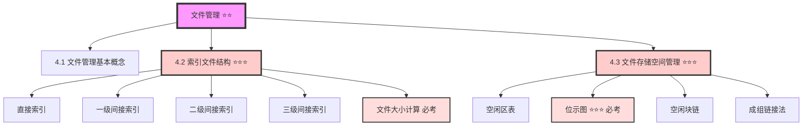

**重点标注**：
- ⭐ 基础了解（偶尔考察）
- ⭐⭐ 重要考点（需要理解掌握）
- ⭐⭐⭐ 核心考点（必考内容，需熟练掌握）

---

## 4.1 文件管理基本概念

### 什么是文件管理？

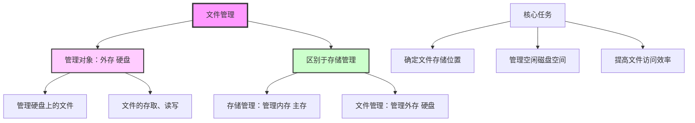

> **关键区分**：
> - **存储管理** = 管理内存（RAM）
> - **文件管理** = 管理外存（硬盘/SSD）

---

### 文件的基本概念

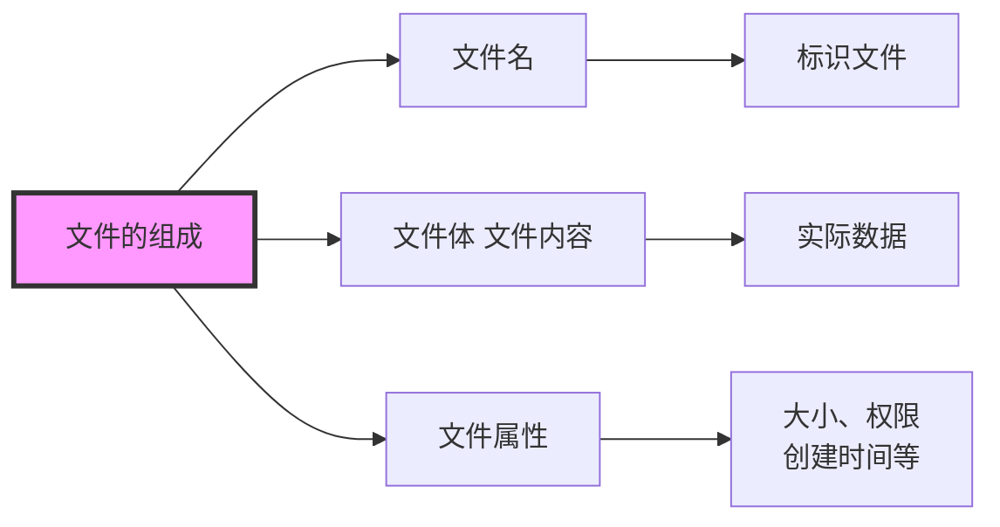

---

## 4.2 索引文件结构 ⭐⭐⭐（计算题核心）

### 为什么需要索引？

**问题**：如何快速定位文件在磁盘上的存储位置？

**解决方案**：使用**索引节点**（Index Node）记录文件的物理块位置。

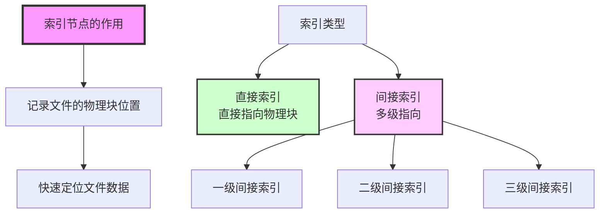

---

### 索引节点的结构

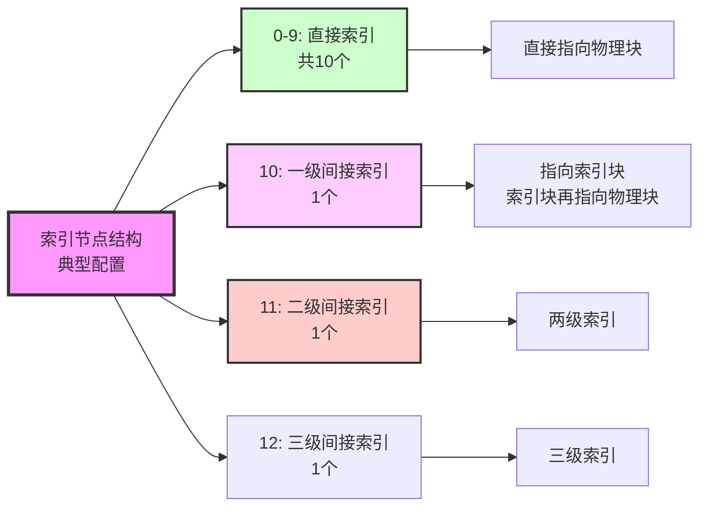

---

### 直接索引 ⭐⭐

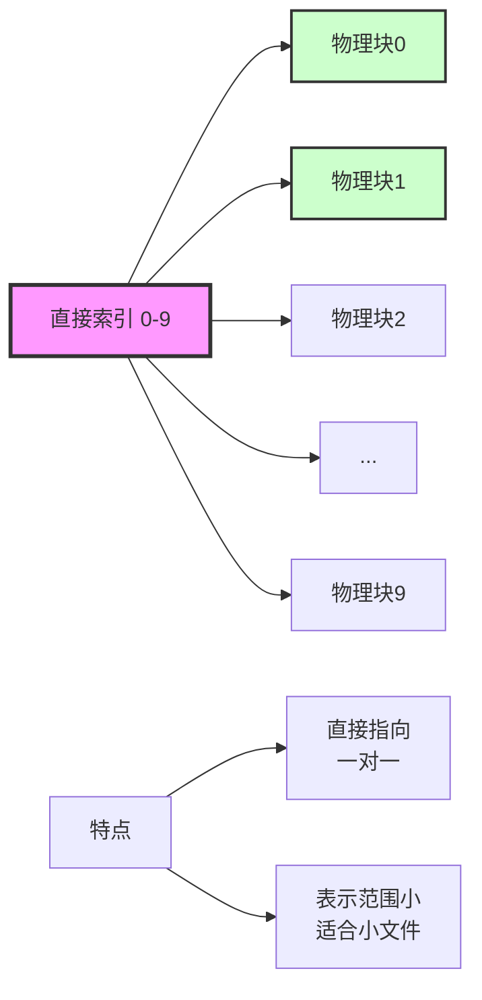

**计算公式**：

```
直接索引可表示的文件大小 = 直接索引个数 × 物理块大小

示例：
- 直接索引个数：10个
- 物理块大小：4KB
- 可表示文件大小：10 × 4KB = 40KB
```

---

### 一级间接索引 ⭐⭐⭐（必考）

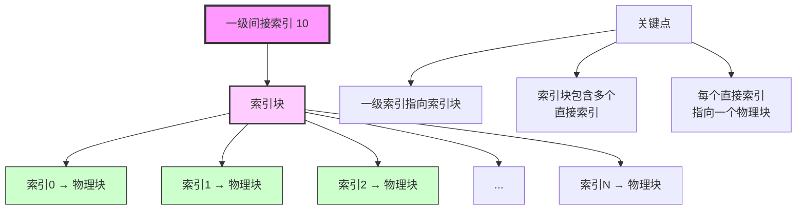

**计算步骤**：

```
第一步：计算索引块中有多少个索引节点
索引节点个数 = 索引块大小 ÷ 索引节点大小

第二步：计算一级索引可表示的文件大小
文件大小 = 索引节点个数 × 物理块大小

示例：
- 索引块大小：4KB
- 索引节点大小：4字节
- 物理块大小：4KB

计算：
- 索引节点个数 = 4KB ÷ 4B = 4096 ÷ 4 = 1024个
- 文件大小 = 1024 × 4KB = 4096KB = 4MB
```

---

### 二级间接索引 ⭐⭐⭐（常考）

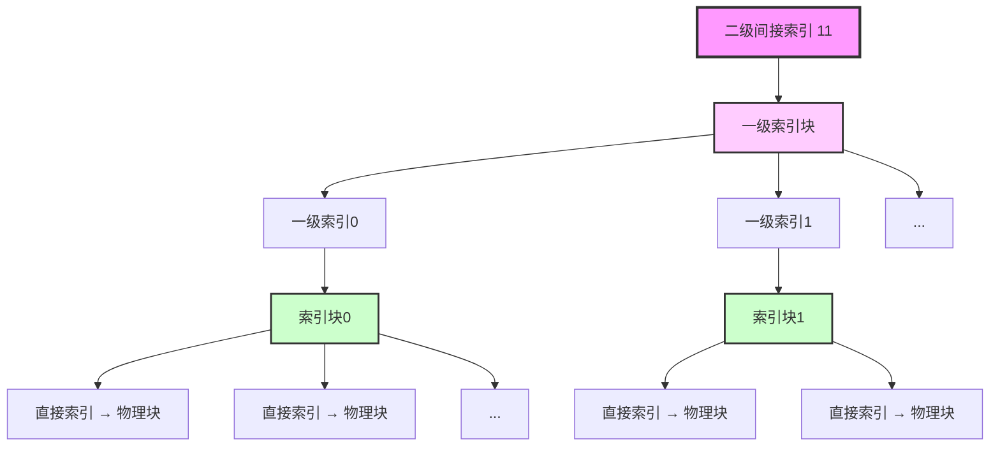

**计算公式**：

```
二级间接索引可表示的文件大小 =
    (索引块大小 ÷ 索引节点大小) ×
    (索引块大小 ÷ 索引节点大小) ×
    物理块大小

简化公式：
文件大小 = (索引块大小 ÷ 索引节点大小)² × 物理块大小

示例：
- 索引块大小：4KB
- 索引节点大小：4字节
- 物理块大小：4KB

计算：
- 一级索引个数 = 4KB ÷ 4B = 1024个
- 每个一级索引指向的直接索引个数 = 1024个
- 文件大小 = 1024 × 1024 × 4KB = 4GB
```

---

### 三级间接索引

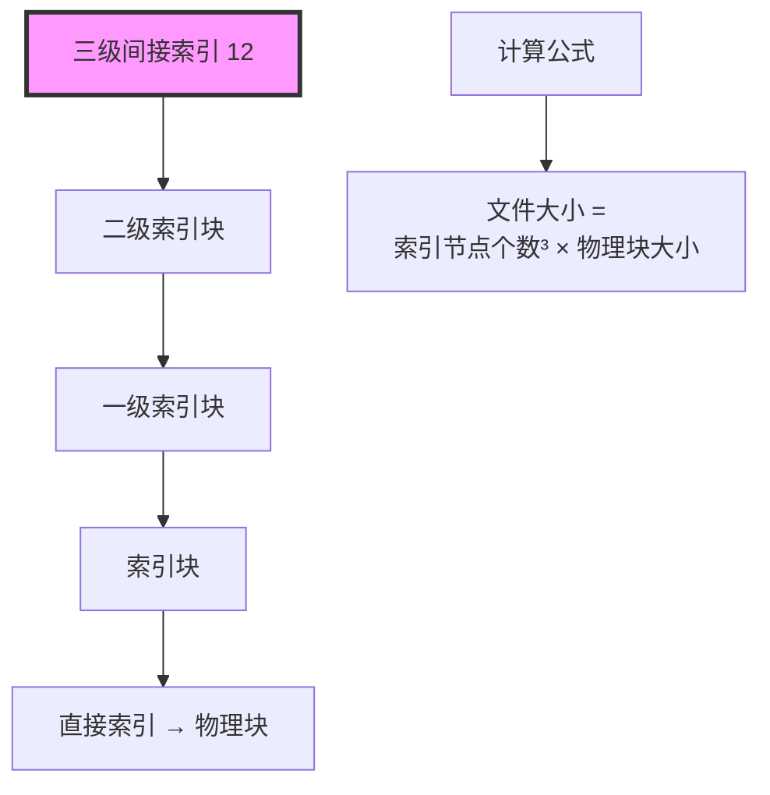

**计算公式**：

```
三级间接索引可表示的文件大小 =
    (索引块大小 ÷ 索引节点大小)³ × 物理块大小
```

---

### 索引节点计算题示例 ⭐⭐⭐

**真题示例**：

```
题目：
设文件索引节点中有8个地址项，每个地址项的大小是4字节。
其中5个地址项为直接地址索引，2个地址项是一级间接索引，
1个地址项是二级间接索引。磁盘索引块和数据块的大小均为1KB。

问题1：如果要访问的文件逻辑块号是5和518，系统应该分别采用什么方式？
问题2：可以表示的单个文件的最大长度是多少KB？
```

**解答过程**：

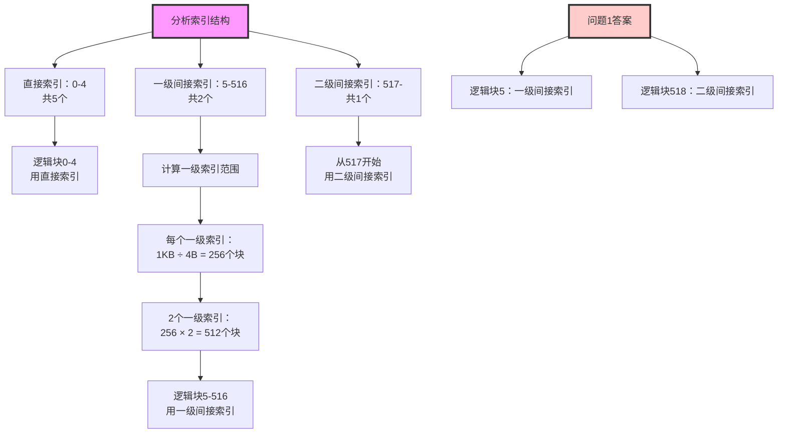

**详细计算**：

```
第一步：确定逻辑块编号范围

1. 直接索引（0-4号地址项）：
   - 逻辑块编号：0-4
   - 共5个物理块

2. 一级间接索引（5-6号地址项）：
   - 每个一级索引包含的直接索引个数 = 1KB ÷ 4B = 256个
   - 2个一级索引 = 256 × 2 = 512个物理块
   - 逻辑块编号：5 ~ (5 + 512 - 1) = 5 ~ 516

3. 二级间接索引（7号地址项）：
   - 从517开始
   - 逻辑块编号：517 ~ ...

第二步：回答问题1

- 逻辑块号5：在一级间接索引范围内（5-516）→ 一级间接索引
- 逻辑块号518：在二级间接索引范围内（517-）→ 二级间接索引

第三步：计算问题2（最大文件长度）

最大长度 = 直接索引 + 一级间接索引 + 二级间接索引

1. 直接索引：5个块
2. 一级间接索引：2 × 256 = 512个块
3. 二级间接索引：256 × 256 = 65536个块

总块数 = 5 + 512 + 65536 = 66053个块
最大文件长度 = 66053 × 1KB = 66053KB

答案：66053KB
```

---

## 4.3 文件存储空间管理 ⭐⭐⭐

### 为什么需要管理存储空间？

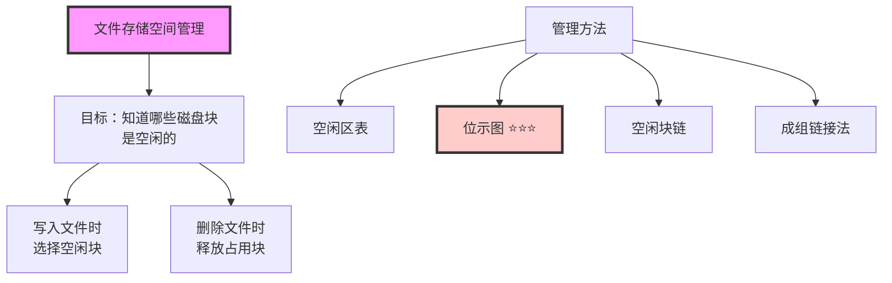

---

### 方法1：空闲区表

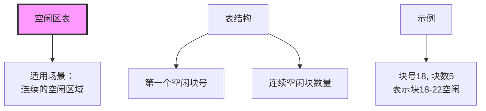

**示例表格**：

| 第一个空闲块号 | 空闲块数量 | 说明 |
|--------------|----------|------|
| 18 | 5 | 块18、19、20、21、22空闲 |
| 50 | 3 | 块50、51、52空闲 |
| 100 | 10 | 块100-109空闲 |

**特点**：
- ✅ 简单直观
- ✅ 适合连续空闲区域
- ❌ 不适合碎片化的空闲空间

---

### 方法2：位示图 ⭐⭐⭐（必考计算题）

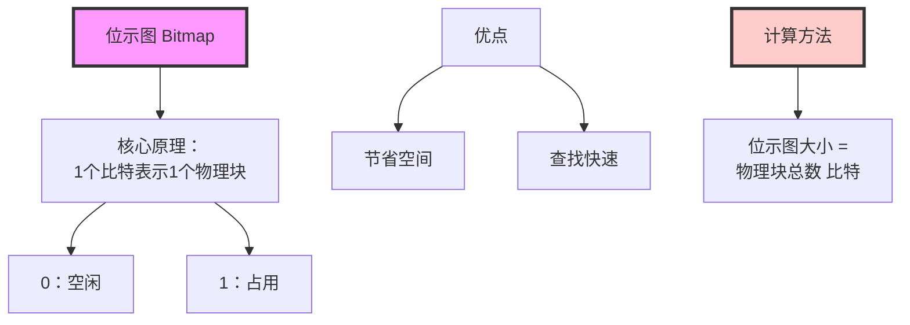

---

### 位示图原理详解

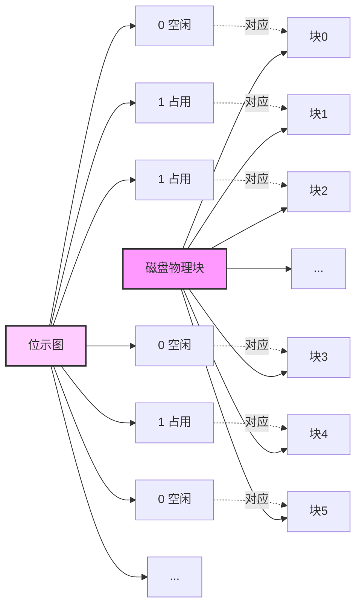

---

### 位示图计算 ⭐⭐⭐（必考）

**核心公式**：

```
位示图大小（比特） = 磁盘总容量 ÷ 每页大小

位示图大小（字节） = 位示图大小（比特） ÷ 8

位示图大小（KB） = 位示图大小（字节） ÷ 1024
```

---

### 位示图计算题示例（真题）

**题目**：

```
某系统中对空闲存储空间管理采用位示图的方式，
其中每页的大小是4KB，总存储容量是16GB，
则位示图的大小是多少KB？
```

**解答过程**：

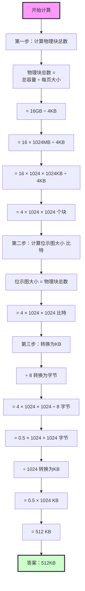

**详细计算步骤**：

```
步骤1：计算物理块总数

总容量 = 16GB
每页大小 = 4KB

物理块总数 = 16GB ÷ 4KB
           = 16 × 1024 × 1024KB ÷ 4KB
           = 4 × 1024 × 1024
           = 4194304 个块

步骤2：计算位示图大小（比特）

位示图大小 = 4194304 比特

步骤3：转换单位

转换为字节：
4194304 比特 ÷ 8 = 524288 字节

转换为KB：
524288 字节 ÷ 1024 = 512 KB

答案：512KB
```

---

### 单位转换技巧 ⭐⭐⭐

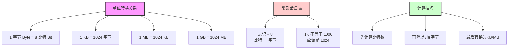

**关键记忆**：
- 1 Byte = 8 Bit
- 1 KB = 1024 Byte（不是1000）
- 1 MB = 1024 KB
- 1 GB = 1024 MB

---

### 位示图示例

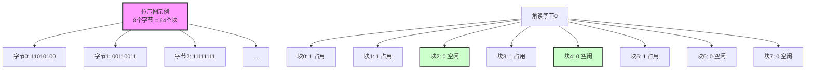

---

### 方法3：空闲块链

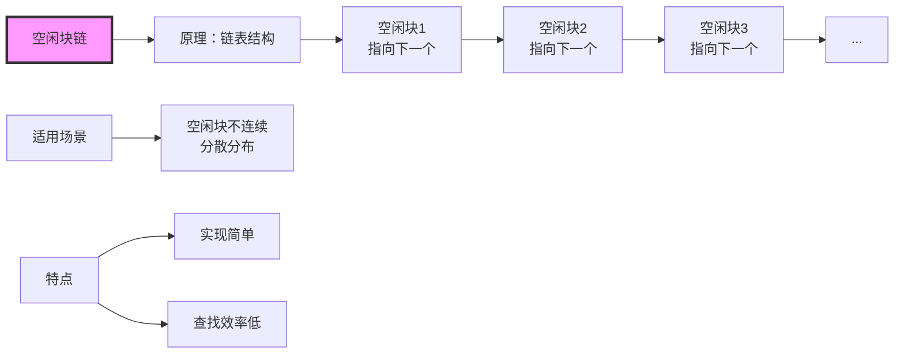

**特点**：
- ✅ 适合不连续的空闲块
- ✅ 链表结构灵活
- ❌ 查找效率低（需要遍历）

---

### 方法4：成组链接法

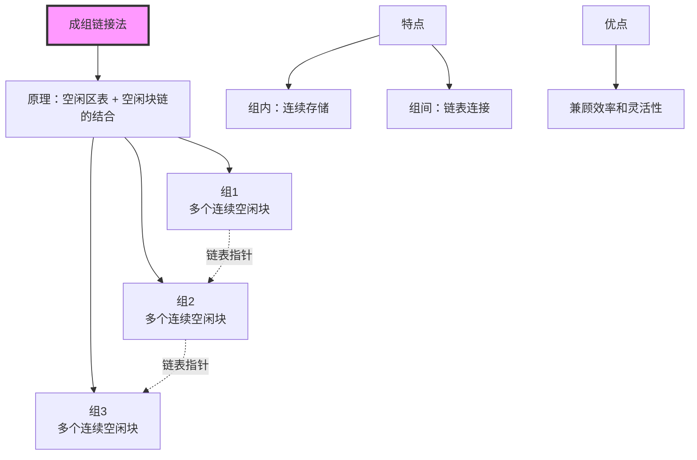

**工作原理**：
1. 将连续的空闲块组成一组
2. 各组之间用链表连接
3. 既有连续性（组内），又有灵活性（组间）

---

## 💡 学习建议

### 本部分学习重点

**⭐⭐⭐ 必须掌握**（必考内容）：

1. **索引节点计算**：
   - 直接索引、一级间接索引、二级间接索引
   - 逻辑块号的判断
   - 最大文件长度的计算

2. **位示图计算**：
   - 位示图大小的计算
   - 单位转换（比特→字节→KB）

**⭐⭐ 重点理解**（高频考点）：
- 空闲区表的使用
- 空闲块链的原理
- 成组链接法的优势

**⭐ 了解层面**（偶尔考到）：
- 文件的逻辑结构和物理结构
- 文件的存取方法

---

### 考试题型预测

| 知识点 | 题型 | 分值 | 难度 | 频率 |
|-------|------|------|------|------|
| 索引节点计算 | 计算题 | 3-4分 | ⭐⭐⭐ | 很高 |
| 位示图计算 | 计算题 | 2-3分 | ⭐⭐⭐ | 很高 |
| 文件管理方法对比 | 选择题 | 1分 | ⭐⭐ | 中 |

---

### 记忆技巧

1. **索引层级**：直接（1）→ 一级（256）→ 二级（256²）→ 三级（256³）
2. **位示图**：1比特 = 1块，要除以8转字节
3. **单位换算**：记住1024，不是1000
4. **空闲块管理**：表（连续）、链（分散）、成组（结合）

---

## ✅ 自测题

### 选择题

1. 以下哪种文件存储空间管理方法最节省空间？
   - A. 空闲区表
   - B. 位示图 ✓
   - C. 空闲块链
   - D. 成组链接法

2. 索引节点中，一级间接索引相比直接索引的优势是？
   - A. 访问速度更快
   - B. 可以表示更大的文件 ✓
   - C. 实现更简单
   - D. 占用空间更小

---

### 计算题

**题目1**：某系统采用位示图管理空闲磁盘块，磁盘总容量为32GB，每个物理块大小为8KB，请计算位示图的大小（单位：KB）。

<details>
<summary>点击查看答案</summary>

**解答过程**：

```
步骤1：计算物理块总数

物理块总数 = 总容量 ÷ 块大小
           = 32GB ÷ 8KB
           = 32 × 1024 × 1024KB ÷ 8KB
           = 4 × 1024 × 1024
           = 4194304 个块

步骤2：计算位示图大小（比特）

位示图大小 = 4194304 比特

步骤3：转换单位

转换为字节：
4194304 比特 ÷ 8 = 524288 字节

转换为KB：
524288 字节 ÷ 1024 = 512 KB

答案：512KB
```

</details>

---

**题目2**（2025年真题改编）：

设文件索引节点中有8个地址项，每个地址项大小为4字节。其中：
- 5个地址项为直接索引
- 2个地址项为一级间接索引
- 1个地址项为二级间接索引

磁盘索引块和数据块大小均为1KB。

问题：
1. 访问逻辑块号为5和518的块，分别采用什么索引方式？
2. 该索引结构可以表示的单个文件最大长度是多少KB？

<details>
<summary>点击查看答案</summary>

**问题1答案**：

```
步骤1：确定各索引范围

1. 直接索引（0-4）：
   - 逻辑块编号：0-4
   - 共5个块

2. 一级间接索引（5-6）：
   - 每个一级索引：1KB ÷ 4B = 256个块
   - 2个一级索引：256 × 2 = 512个块
   - 逻辑块编号：5 ~ 516

3. 二级间接索引（7）：
   - 逻辑块编号：517 ~ ...

步骤2：判断

- 逻辑块5：在一级间接索引范围内（5-516）
  答案：一级间接索引

- 逻辑块518：在二级间接索引范围内（517-）
  答案：二级间接索引
```

**问题2答案**：

```
最大文件长度 = 直接索引 + 一级间接索引 + 二级间接索引

1. 直接索引：
   5 × 1KB = 5KB

2. 一级间接索引：
   2 × 256 × 1KB = 512KB

3. 二级间接索引：
   256 × 256 × 1KB = 65536KB

总计：5 + 512 + 65536 = 66053KB

答案：66053KB
```

</details>

---

### 简答题

1. **请说明位示图相比空闲区表的优势。**

<details>
<summary>点击查看答案</summary>

**位示图的优势**：

1. **空间效率高**：
   - 1个比特表示1个物理块
   - 空闲区表需要存储块号和块数（至少2个字段）
   - 位示图只需要1个比特，空间占用最小

2. **查找速度快**：
   - 可以通过位运算快速查找空闲块
   - 连续空闲块的查找也很高效

3. **适用性广**：
   - 适合连续和分散的空闲块
   - 空闲区表只适合连续空闲区域

**缺点**：
- 对于大磁盘，位示图本身也会占用一定空间
- 需要在内存中维护位示图

</details>

---

2. **请说明一级间接索引和二级间接索引的区别及适用场景。**

<details>
<summary>点击查看答案</summary>

**一级间接索引**：

- **结构**：索引节点 → 索引块 → 物理块（2级）
- **表示能力**：中等（如256×4KB = 1MB）
- **访问速度**：较快（2次间接访问）
- **适用场景**：中小型文件（几百KB到几MB）

**二级间接索引**：

- **结构**：索引节点 → 一级索引块 → 索引块 → 物理块（3级）
- **表示能力**：强（如256×256×4KB = 256MB）
- **访问速度**：较慢（3次间接访问）
- **适用场景**：大型文件（几十MB到几百MB）

**选择原则**：
- 小文件：直接索引
- 中等文件：一级间接索引
- 大文件：二级或三级间接索引

**权衡**：
- 表示能力 ↑ → 访问速度 ↓
- 需要根据实际文件大小选择合适的索引级别

</details>

---

## 📚 相关文档

- **前序文档**：
  - [第二章-1-操作系统概述](./第二章-1-操作系统概述.md)
  - [第二章-2-进程管理](./第二章-2-进程管理.md)
  - [第二章-3-存储管理与设备管理](./第二章-3-存储管理与设备管理.md)
- **扩展阅读**：《操作系统概念》第10-11章

---

## 📝 本部分总结

本部分作为操作系统知识的**重要组成**，主要介绍了：

**文件管理核心内容**：

1. **索引文件结构**（⭐⭐⭐核心考点）：
   - 直接索引、一级间接索引、二级间接索引、三级间接索引
   - 逻辑块号的判断方法
   - 最大文件长度的计算

2. **文件存储空间管理**（⭐⭐⭐核心考点）：
   - 空闲区表：连续空闲区域
   - 位示图：1比特表示1块（必考计算）
   - 空闲块链：链表结构
   - 成组链接法：表+链的结合

**考试分值**：本部分内容在考试中占2-3分，索引节点计算和位示图计算是必考内容。

**重点掌握**：
- 索引节点的计算方法（特别是一级、二级间接索引）
- 位示图大小的计算（单位转换是关键）

---

> **文档生成信息**
> 📅 生成时间：2026-02-06
> 🤖 生成方式：基于思维导图、课程文稿系统化梳理（Mermaid图解版）
> 📖 适用对象：软考高级系统架构师考试备考
> ✍️ 建议：重点掌握计算题，反复练习索引节点和位示图计算
> 🎨 图形工具：使用Mermaid绘制，支持在线预览和导出
